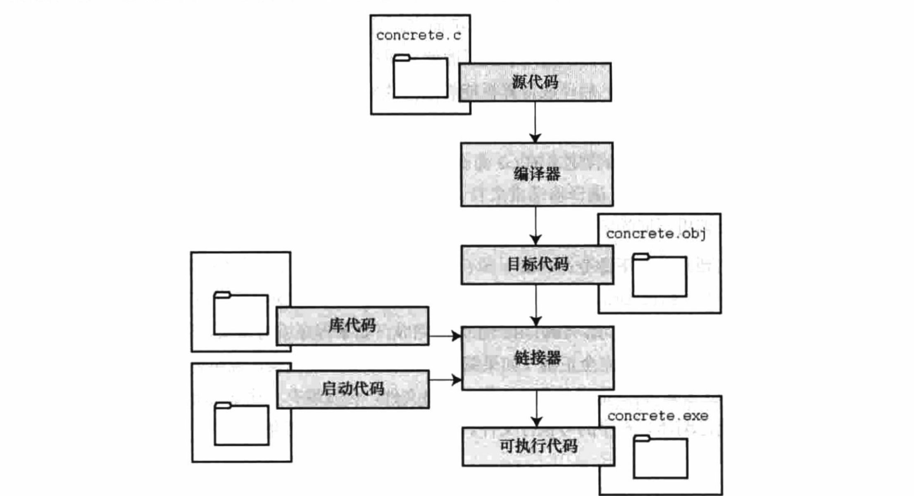
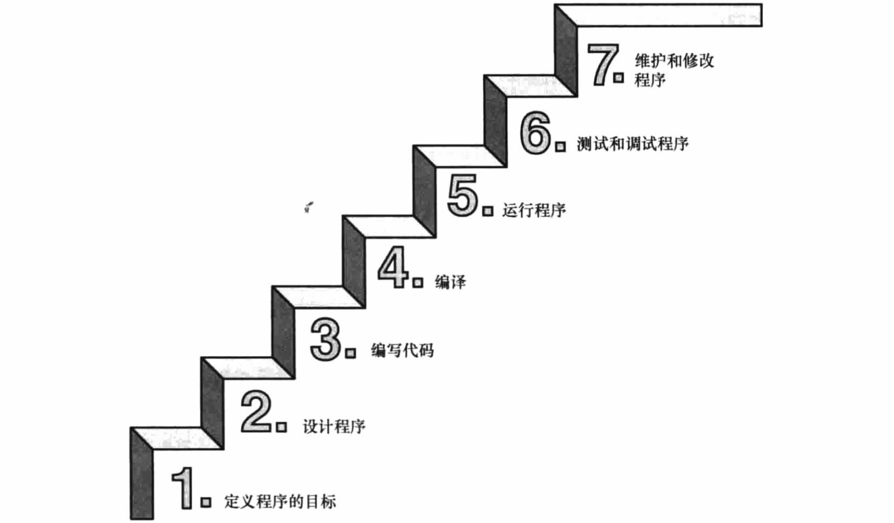

----

* [什么是编程?](#什么是编程?)
* [前机器语言](#前机器语言)
* [C语言的诞生?](#C语言的诞生?)
* [为什么C语言?](#为什么C语言?)
* [C语言的缺点](#C语言的缺点)
* [常规编程流程](#常规编程流程)
* [本章习题](#本章习题)

----

# 什么是编程?

> 编程即将自然语言的逻辑转换为对应编程语言的过程

# 前机器语言

> 机器语言故名思义就是机器能直接识别的语言,可以算是最底层的语言,更准确的说应该叫做机器语言指令集

* 现代计算机主要由CPU(中央处理单元,主要承担运算工作),RAM(随机存取存储器,主要承担数据交换,零时存储),永久存储设备以及各种外围设备组成
* CPU的工作本质上很简单,从RAM中获取并执行指令,然后再从RAM中获取并执行下一条指令,指令以及下一条指令的地址是存储在CPU的寄存器上,每秒大概能有10亿次类似操作
* CPU的不同也意味着能理解的指令不同,也就是常说的CPU指令集
* CPU要计算1 + 1 = 2,如果用机器语言描述即首先让CPU从RAM中1对应的内存地址把1拷贝到寄存器1,再让CPU从RAM中2对应的内存地址把2拷贝到寄存器2,然后让CPU把寄存器2的值与寄存器2的值相加并把结果存储到寄存器1中,再把寄存器1中的值拷贝到预先分配的内存地址去

# C语言的诞生?

> 首款为程序员设计开发的编程语言,现今已成为底层编程首选的语言

* 正是由于机器语言描述如此复杂且繁琐,所以C语言应运而生,简化了编程,而无需考虑CPU是如何处理的
* 但机器只能识别机器语言指令集,对于C语言就需要编译器将源代码编译成中间代码再由链接器把中间代码与其它代码合并生成CPU能理解的机器语言指令集的二进制程序

# 为什么C语言?

> 通常越接近底层的语言开发的程序与生俱来占据性能优势,C语言亦是如此,不仅高效而且可移植

* 对于新手来说更适合作为进入编程世界的入口,由于一切高级语言都源于C语言
* 对于老手来说更适合作为提升内功的重要途径,由于所及高度取决于底层的理解

# C语言的缺点

> 想拥有自由就必须时刻保持警惕,这句话用在C语言编程上再合适不过,C语言中涉及指针的编程会导致错误往往难以察觉

# 常规编程流程

# 本章习题

1. 对于编程而言, 可移植性意味着什么？

* 意味着同一份代码可以被编译链接运行于不同的平台

2. 解释源代码文件,目标代码文件和可执行文件有什么区别? 编译器和链接器分别什么作用?

* 源代码文件内包含的是C语言编写的有效代码,本质上是文本
* 编译器将源代码编译为目标代码文件,本质上是二进制机器指令集程序,但不可执行
* 链接器将目标代码文件与库代码以及启动代码合并生成可执行程序,本质上是可执行的二进制机器指令集程序

