----

* [简单概述](#简单概述)
* [创建后台管理](#创建后台管理)
* [启动开发服务器](#启动开发服务器)
* [进入到登陆界面](#进入到登陆界面)
* [进入到管理站点](#进入到管理站点)
* [添加polls到管理站点](#添加polls到管理站点)
* [管理站点增删改查](#管理站点增删改查)
* [自定义站点模型表单](#自定义站点模型表单)
  * [限制表单字段显示及顺序](#限制表单字段显示及顺序)
  * [限制表单字段分组及顺序](#限制表单字段分组及顺序)
  * [创建对象时批量创建关联对象-堆叠](#创建对象时批量创建关联对象-堆叠)
  * [创建对象时批量创建关联对象-表格](#创建对象时批量创建关联对象-表格)
* [自定义站点变更列表](#自定义站点变更列表)
  * [限制变更列表字段显示及顺序](#限制变更列表字段显示及顺序)
  * [限制变更列表字段过滤及顺序](#限制变更列表字段过滤及顺序)
  * [限制变更列表字段搜索及顺序](#限制变更列表字段搜索及顺序)
  * [限制变更列表数据分页及数量](#限制变更列表数据分页及数量)
* [自定义管理站点外观](#自定义管理站点外观)
  * [自定义管理站点顶部标题](#自定义管理站点顶部标题)

----

# 简单概述

> 为基本投票应用添加可深度定制+自动生成的管理界面,遵循KISS原则

# 创建后台管理

> python manage.py createsuperuser

```
Username (leave blank to use 'manmanli'): limanman
Email address: forcemain@163.com
Password: 
Password (again): 
Superuser created successfully.
```

# 启动开发服务器

> python manage.py runserver

```
Performing system checks...

System check identified no issues (0 silenced).
December 30, 2018 - 00:11:46
Django version 1.11.5, using settings 'mysite.settings'
Starting development server at http://127.0.0.1:8000/
Quit the server with CONTROL-C.
```

# 进入到登陆界面

> http://127.0.0.1:8000/admin/


# 进入到管理站点


* 如上默认的Groups和Users可编辑模型都是由django.contrib.auth这个内置app提供,非常灵活的认证授权框架

# 添加polls到管理站点

> cd mysite
>
> vim polls/admin/question.py

```python
#! -*- coding: utf-8 -*-


# author: forcemain@163.com


from django.contrib import admin


from .. import models


admin.site.register(models.Question)
```

* 由于django.contrib.admin内置管理站点框架支持对每个模型灵活定制,所以强烈推荐模型以文件形式独立

> cd mysite
>
> vim polls/admin/choice.py

```python
#! -*- coding: utf-8 -*-


# author: forcemain@163.com


from django.contrib import admin


from .. import models


admin.site.register(models.Choice)
```

* 由于django.contrib.admin内置管理站点框架支持对每个模型灵活定制,所以强烈推荐模型以文件形式独立

> cd mysite
>
> vim polls/admin/\_\_init\_\_.py

```python
#! -*- coding: utf-8 -*-


# author: forcemain@163.com


from functools import partial
from utils.module_loading import autodiscovery_modules


modules = autodiscovery_modules(__name__, __file__)


# inject globals
g_data = {}
map(lambda m: g_data.update(m.__dict__), modules)
globals().update(g_data)

autodiscovery = partial(autodiscovery_modules,__name__, __file__)
```

- 由于在自定义应用polls中将admin.py规范为admin包,又希望Django能够自动递归加载此包下面独立的模型包或文件中的模型,通过由下而上递归注入环境变量给顶层包
- 此方式的优势在于不用手动维护admin包下\_\_init\_\_.py中大量from .xxoo import *
- 此方式的劣势在于由于依赖环境变量注入,所以尽量不要声明同名对象同时配合\_\_all\_\_和\_\_solts\_\_使用

> http://127.0.0.1:8000/admin/


# 管理站点增删改查

* 如下操作表单根据对应模型自动生成,模型中不同的字段对应不同的Html控件

> 增


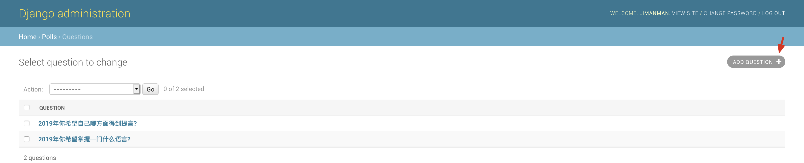


> 改

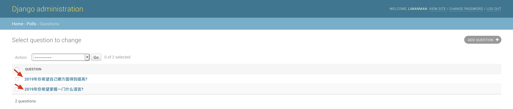

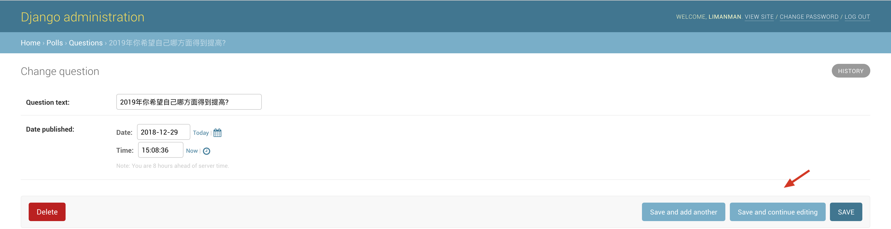

> 删

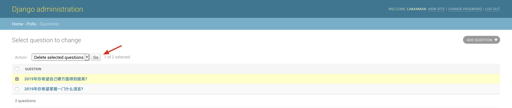

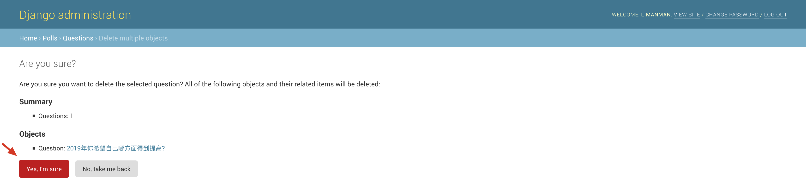

> 查

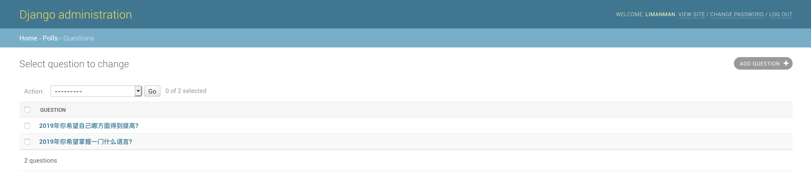

# 自定义站点模型表单

> 通过继承django.contrib.admin.ModelAdmin创建一个模型管理对象,并将其与模型通过django.contrib.admin.site.register或@django.contrib.admin.register注册到站点管理

## 限制表单字段显示及顺序

> cd mysite
>
> vim polls/admin/question.py

```python
#! -*- coding: utf-8 -*-


# author: forcemain@163.com


from django.contrib import admin


from .. import models


class QuestionAdmin(admin.ModelAdmin):
    fields = ['pub_date', 'question_text']
    # fields = [('pub_date', 'question_text'),]

admin.site.register(models.Question, QuestionAdmin)
```

* 通过fields属性可限制表单中字段显示及顺序,内部元组将并排显示,通常在管理多字段表单时比较有用

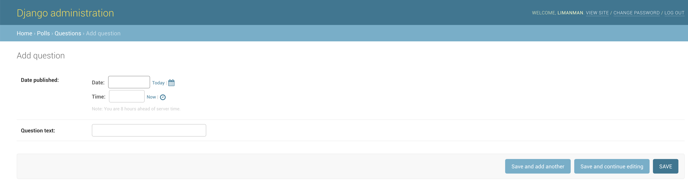

## 限制表单字段分组及顺序

>cd mysite
>
>vim polls/admin/question.py

```python
#! -*- coding: utf-8 -*-


# author: forcemain@163.com


from django.contrib import admin


from .. import models


class QuestionAdmin(admin.ModelAdmin):
    fieldsets = [
        (None, {'fields': ['question_text']}),
        ('Date infomation', {'fields': ['pub_date'], 'classes': ['collapse'], 
                             'description': u'additional descriptive information'})
    ]


admin.site.register(models.Question, QuestionAdmin)
```

* 通过fieldsets属性可限制表单中字段分组及顺序,内部二元元组前者为分组名称,None则表示不分组,后者为分组设置,fields内部元组将并排显示,classes为默认样式,description为附加描述,通常在管理多字段表单时比较有用

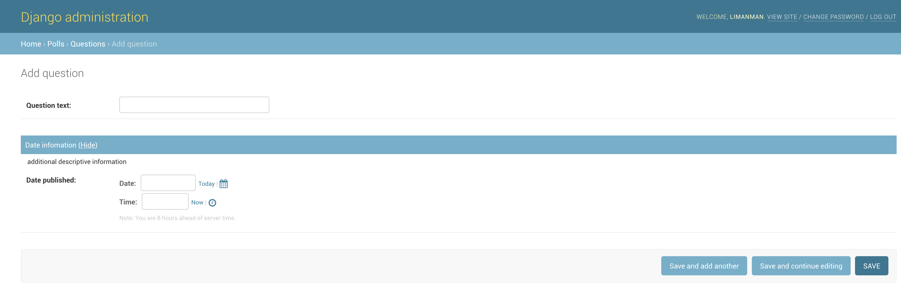

## 创建对象时批量创建关联对象-堆叠

> cd mysite
>
> vim polls/admin/question.py

```python
#! -*- coding: utf-8 -*-


# author: forcemain@163.com


from django.contrib import admin


from .. import models


class ChoiceInline(admin.StackedInline):
    model = models.Choice
    classes = ['collapse']
    extra = 3


class QuestionAdmin(admin.ModelAdmin):
    fieldsets = [
        (None, {'fields': ['question_text']}),
        ('Date infomation', {'fields': ['pub_date'], 'classes': ['collapse'],
                             'description': u'additional descriptive information'})
    ]
    inlines = [ChoiceInline]


admin.site.register(models.Question, QuestionAdmin)
```

* 通过inlines属性可以限制创建对象时关联对象的创建方式,StackedInline为堆叠显示类,需要指定model为关联对象的模型类,extra为默认显示个数,classes为默认样式,通常在管理多关联字段表单时比较有用

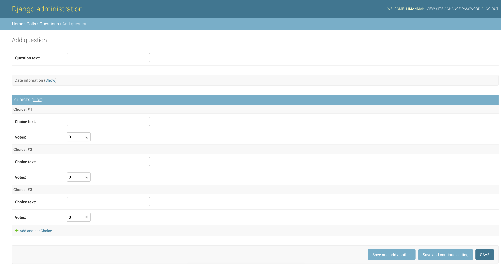

## 创建对象时批量创建关联对象-表格

> cd mysite
>
> vim polls/admin/question.py

```python
#! -*- coding: utf-8 -*-


# author: forcemain@163.com


from django.contrib import admin


from .. import models


class ChoiceInline(admin.TabularInline):
    model = models.Choice
    classes = ['collapse']
    extra = 3


class QuestionAdmin(admin.ModelAdmin):
    fieldsets = [
        (None, {'fields': ['question_text']}),
        ('Date infomation', {'fields': ['pub_date'], 'classes': ['collapse'],
                             'description': u'additional descriptive information'})
    ]
    inlines = [ChoiceInline]


admin.site.register(models.Question, QuestionAdmin)
```

* 通过inlines属性可以限制创建对象时关联对象的创建方式,TabularInline为表格显示类,需要指定model为关联对象的模型类,extra为默认显示个数,classes为默认样式,通常在管理多关联字段表单时比较有用

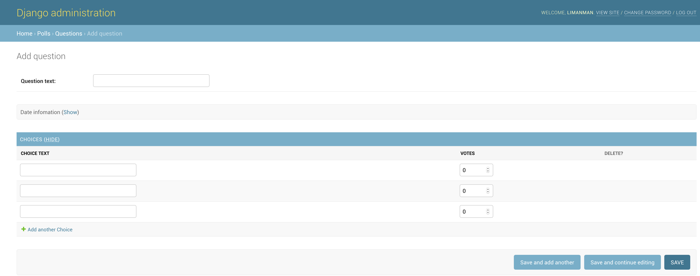

# 自定义站点变更列表

## 限制变更列表字段显示及顺序

> cd mysite
>
> vim polls/admin/question.py

```python
#! -*- coding: utf-8 -*-


# author: forcemain@163.com


from django.contrib import admin


from .. import models


class ChoiceInline(admin.TabularInline):
    model = models.Choice
    classes = ['collapse']
    extra = 3


class QuestionAdmin(admin.ModelAdmin):
    list_display = ['pk', 'question_text', 'pub_date', 'was_published_recently']
    fieldsets = [
        (None, {'fields': ['question_text']}),
        ('Date infomation', {'fields': ['pub_date'], 'classes': ['collapse'],
                             'description': u'additional descriptive information'})
    ]
    inlines = [ChoiceInline]


admin.site.register(models.Question, QuestionAdmin)
```

* 通过list_display属性可以限制变更列表中字段(默认字段/自定义字段,如果为无参可调用方法将默认尝试将函数名作为字段名调用结果作为字段值)显示及顺序,通常在管理多字段时比较有用

> cd mysite
>
> vim polls/models/question.py

```python
#! -*- coding: utf-8 -*-


# author: forcemain@163.com


from __future__ import unicode_literals


from django.db import models
from django.utils import timezone


class Question(models.Model):
    question_text = models.CharField(max_length=200)
    pub_date = models.DateTimeField('date published')

    def __unicode__(self):
        return self.question_text

    def was_published_recently(self):
        return timezone.now() - self.pub_date < timezone.timedelta(days=1)
    was_published_recently.admin_order_field = 'pub_date'
    was_published_recently.boolean = True
    was_published_recently.short_description = 'Published recently?'
```

* list_display属性中如果为自定义可调用字段,则可自定义其显示样式,admin_order_field为点击表头字段时后端排序字段,boolean为此字段为布尔字段会显示美化版的图标,short_description为自定义表头字段

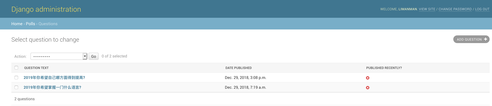

> cd mysite
>
> vim polls/models/question.py

```python
#! -*- coding: utf-8 -*-


# author: forcemain@163.com


from __future__ import unicode_literals


from django.db import models
from django.utils import timezone
from django.utils.html import format_html


class Question(models.Model):
    question_text = models.CharField(max_length=200)
    pub_date = models.DateTimeField('date published')

    def __unicode__(self):
        return self.question_text

    def was_published_recently(self):
        r = timezone.now() - self.pub_date < timezone.timedelta(days=1)
        s = '<span style="color: {0}">{1}</span>'.format('green' if r else 'black', u'是' if r else '否')
        return format_html(s)
    was_published_recently.admin_order_field = 'pub_date'
    was_published_recently.allow_tags = True
    was_published_recently.short_description = 'Published recently?'
```

* list_display属性中如果为自定义可调用字段,则可自定义其显示样式,admin_order_field为点击表头字段时后端排序字段,allow_tags告诉模版渲染器不要Html转义此方法的输出结果,但需要注意的是内部组装html字符串时时一定要要使用django.utils.html.format_html转义,防止XSS漏洞攻击,short_description为自定义表头字段

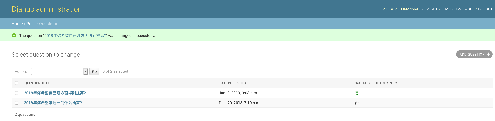

## 限制变更列表字段过滤及顺序

> cd mysite
>
> vim polls/admin/question.py

```python
#! -*- coding: utf-8 -*-


# author: forcemain@163.com


from django.contrib import admin


from .. import models


class ChoiceInline(admin.TabularInline):
    model = models.Choice
    classes = ['collapse']
    extra = 3


class QuestionAdmin(admin.ModelAdmin):
    list_filter = ['pub_date']
    list_display = ['pk', 'question_text', 'pub_date', 'was_published_recently']
    fieldsets = [
        (None, {'fields': ['question_text']}),
        ('Date infomation', {'fields': ['pub_date'], 'classes': ['collapse'],
                             'description': u'additional descriptive information'})
    ]
    inlines = [ChoiceInline]


admin.site.register(models.Question, QuestionAdmin)
```

* 通过list_filter属性可以限制变更列表字段(只能为模型字段)过滤及顺序,通常在管理多数据时比较有用

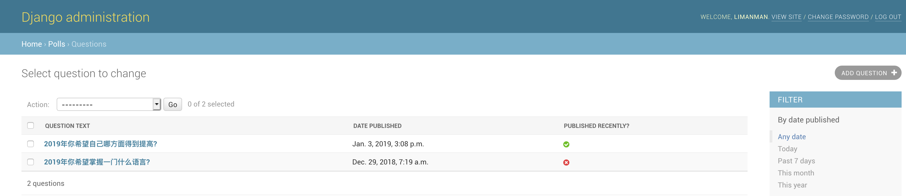

* 过滤器形式取决于list_filter属性中的字段,如上为pub_date形式的过滤器,如果多个过滤器将竖排显示

## 限制变更列表字段搜索及顺序

> cd mysite
>
> vim polls/admin/question.py

```python
#! -*- coding: utf-8 -*-


# author: forcemain@163.com


from django.contrib import admin


from .. import models


class ChoiceInline(admin.TabularInline):
    model = models.Choice
    classes = ['collapse']
    extra = 3


class QuestionAdmin(admin.ModelAdmin):
    list_filter = ['pub_date']
    search_fields = ['question_text']
    list_display = ['pk', 'question_text', 'pub_date', 'was_published_recently']
    fieldsets = [
        (None, {'fields': ['question_text']}),
        ('Date infomation', {'fields': ['pub_date'], 'classes': ['collapse'],
                             'description': u'additional descriptive information'})
    ]
    inlines = [ChoiceInline]


admin.site.register(models.Question, QuestionAdmin)
```

* 通过search_fields属性可以限制变更列表字段(只能为模型字段)搜索及顺序,虽然可以指定多个字段但由于内部使用Like模糊匹配,所以尽量控制搜索字段数量,通常在管理多数据时比较有用

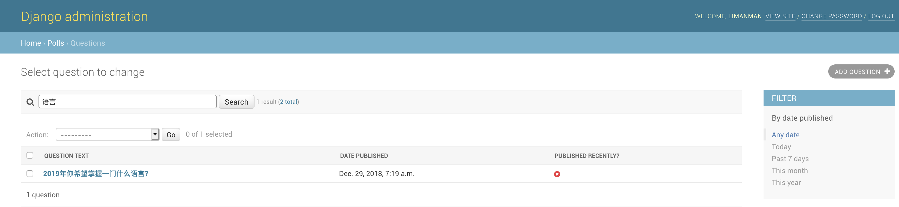

## 限制变更列表数据分页及数量

> cd mysite
>
> vim polls/admin/question.py

```python
#! -*- coding: utf-8 -*-


# author: forcemain@163.com


from django.contrib import admin


from .. import models


class ChoiceInline(admin.TabularInline):
    model = models.Choice
    classes = ['collapse']
    extra = 3


class QuestionAdmin(admin.ModelAdmin):
    list_per_page = 15
    list_filter = ['pub_date']
    search_fields = ['question_text']
    list_display = ['pk', 'question_text', 'pub_date', 'was_published_recently']
    fieldsets = [
        (None, {'fields': ['question_text']}),
        ('Date infomation', {'fields': ['pub_date'], 'classes': ['collapse'],
                             'description': u'additional descriptive information'})
    ]
    inlines = [ChoiceInline]


admin.site.register(models.Question, QuestionAdmin)
```

* 通过list_per_page属性可以限制变更列表每页显示数量,通常在管理多数据时比较有用

# 自定义管理站点外观

> Django同时提供了专用的[django.contrib.admin.AdminSite](#https://www.yiyibooks.cn/xx/django_182/ref/contrib/admin/index.html#adminsite-objects)类用于设置模版默认的这些模版渲染上下文

## 自定义管理站点顶部标题

> cd mysite
>
> vim mysite/settings.py

```python
TEMPLATES = [
    {
        'BACKEND': 'django.template.backends.django.DjangoTemplates',
        'DIRS': [os.path.join(BASE_DIR, 'templates’)],
        'APP_DIRS': True,
        'OPTIONS': {
            'context_processors': [
                'django.template.context_processors.debug',
                'django.template.context_processors.request',
                'django.contrib.auth.context_processors.auth',
                'django.contrib.messages.context_processors.messages',
            ],
        },
    },
]
```

* Django管理站点由其自身模版系统渲染,主要配置为TEMPLATES,如上DIRS为默认查找模版路径列表,如可设置[os.path.join(BASE_DIR, 'templates’)]则会从项目目录下的templates目录中查找模版文件

> cd mysite
>
> cp -rfp /Library/Python/2.7/site-packages/django/contrib/admin/templates/admin/base_site.html templates/admin/
>
> vim templates/admin/base_site.html 

```html


{{ title }} | {{ site_title|default:_('Django site admin') }}


<h1 id="site-name"><a href="">{{ _('管理站点') }}</a></h1>



```

* 默认模版查找顺序首先在定义的DIRS目录中查找然后由于设置了'APP_DIRS': True,所以会继续按照INSTALLED_APPS的顺序查找目录下的templates/admin/下的模版文件,所以其实admin模版也可以放置在其它应用模版目录,但由于admin站点是公用的,所以还是推荐放在项目下的templates/admin/下
* 修改标题只需将原来的{{ site_header|default:_('Django administration') }}改为{{ _('管理站点') }}即可