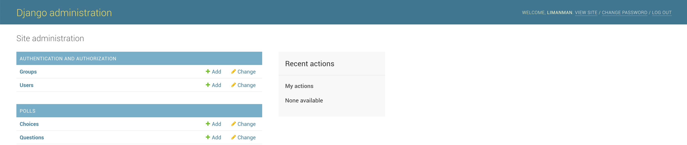
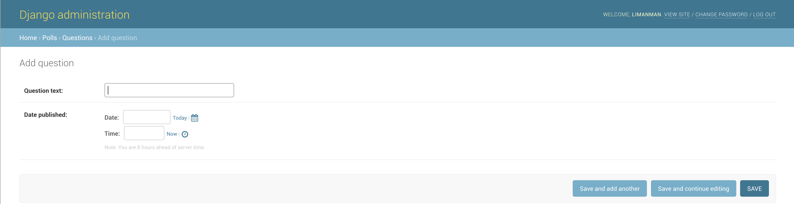

# 简单概述

> 为基本投票应用添加可深度定制+自动生成的管理界面,遵循KISS原则

# 创建后台管理

> python manage.py createsuperuser

```
Username (leave blank to use 'manmanli'): limanman
Email address: forcemain@163.com
Password: 
Password (again): 
Superuser created successfully.
```

# 启动开发服务器

> python manage.py runserver

```
Performing system checks...

System check identified no issues (0 silenced).
December 30, 2018 - 00:11:46
Django version 1.11.5, using settings 'mysite.settings'
Starting development server at http://127.0.0.1:8000/
Quit the server with CONTROL-C.
```

# 进入到登陆界面

> http://127.0.0.1:8000/admin/


# 进入到管理站点


* 如上默认的Groups和Users可编辑模型都是由django.contrib.auth这个内置app提供,非常灵活的认证授权框架

# 添加polls到管理站点

> cd mysite
>
> vim polls/admin/question.py

```python
#! -*- coding: utf-8 -*-


# author: forcemain@163.com


from django.contrib import admin


from .. import models


admin.site.register(models.Question)
```

* 由于django.contrib.admin内置管理站点框架支持对每个模型灵活定制,所以强烈推荐模型以文件形式独立

> cd mysite
>
> vim polls/admin/choice.py

```python
#! -*- coding: utf-8 -*-


# author: forcemain@163.com


from django.contrib import admin


from .. import models


admin.site.register(models.Choice)
```

* 由于django.contrib.admin内置管理站点框架支持对每个模型灵活定制,所以强烈推荐模型以文件形式独立

> cd mysite
>
> vim polls/admin/\_\_init\_\_.py

```python
#! -*- coding: utf-8 -*-


# author: forcemain@163.com


from functools import partial
from utils.module_loading import autodiscovery_modules


modules = autodiscovery_modules(__name__, __file__)


# inject globals
g_data = {}
map(lambda m: g_data.update(m.__dict__), modules)
globals().update(g_data)

autodiscovery = partial(autodiscovery_modules,__name__, __file__)
```

- 由于在自定义应用polls中将admin.py规范为admin包,又希望Django能够自动递归加载此包下面独立的模型包或文件中的模型,通过由下而上递归注入环境变量给顶层包
- 此方式的优势在于不用手动维护admin包下\_\_init\_\_.py中大量from .xxoo import *
- 此方式的劣势在于只适用于配合自动注册型场景,如装饰器或元类等

> http://127.0.0.1:8000/admin/



# 管理站点增删改查

> 增




>