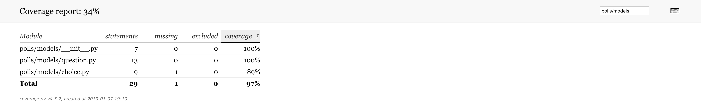
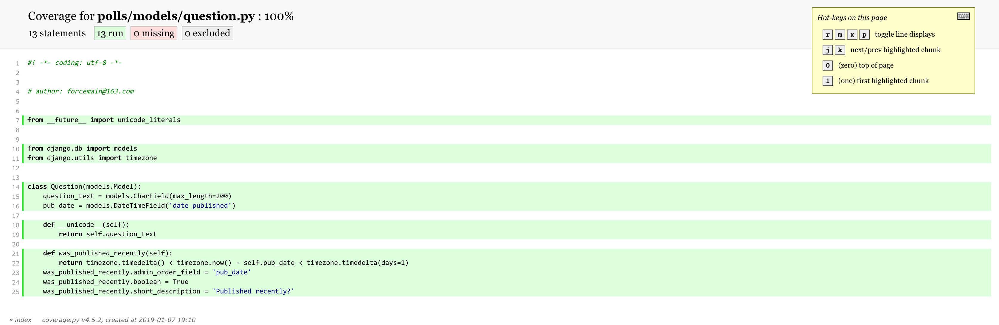
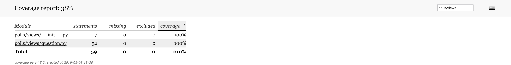
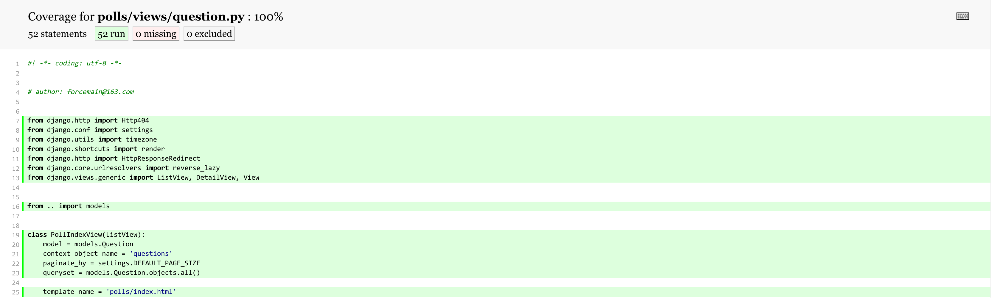

----

* [简单概述](#简单概述)
* [测试用例的尝试](#测试用例的尝试)
  * [一个隐藏已久的BUG](#一个隐藏已久的BUG)
  * [用测试用例去检测](#用测试用例去检测)
  * [尝试修复已知的BUG](#尝试修复已知的BUG)
* [更综合性的测试](#更综合性的测试)
  * [模型测试](#模型测试)
  * [视图测试](#视图测试)
  * [表单测试](#表单测试)
  * [接口测试](#接口测试)

----

# 简单概述

> 项目越大,单体功能测试越重要,试想一下一个去年的大项目突然某个功能出现了异常,如何快速定位问题?再去看代码手工构造预设数据测试显然不现实,Django提供方便的django.test轻量级测试框架用于自动化测试,解放双手

# 测试用例的尝试

## 一个隐藏已久的BUG

> cd mysite
>
> vim polls/models/question.py

```python
#! -*- coding: utf-8 -*-


# author: forcemain@163.com


from __future__ import unicode_literals


from django.db import models
from django.utils import timezone


class Question(models.Model):
    question_text = models.CharField(max_length=200)
    pub_date = models.DateTimeField('date published')

    def __unicode__(self):
        return self.question_text

    def was_published_recently(self):
        return timezone.now() - self.pub_date < timezone.timedelta(days=1)
    was_published_recently.admin_order_field = 'pub_date'
    was_published_recently.boolean = True
    was_published_recently.short_description = 'Published recently?'
```

* was_published_recently是存在明显Bug的,如果pub_date为未来时间很显然它依然会返回True,但并不是我们希望那样

## 用测试用例去检测

> cd mysite
>
> vim polls/tests/test_question.py

```python
#! -*- coding: utf-8 -*-


# author: forcemain@163.com


from django.utils import timezone
from django.test.utils import TestCase


from .. import models


class QuestionTestCase(TestCase):
    def test_was_published_recently_with_future_question(self):
        pub_date = timezone.now() + timezone.timedelta(days=30)
        question = models.Question(pub_date=pub_date)

        self.assertIs(question.was_published_recently(), False)
```

* 由于在自定义应用polls中将tests.py规范为tests包,所以内部测试模块必须以test\_开头(其实是默认自动发现规范),也强烈推荐大家按照模块区分测试用例
* 测试用例必须继承自django.test.utils.TestCase,子类中定义的以test\_开头的方法将自动注册为测试用例,测试方法内部可通过调用self.assert\<Name\>来进行各种测试结果对比

> \# 测试所有应用下的所有测试用例
>
> python manage.py test
>
> \# 测试指定应用下的所有测试用例
>
> python manage.py test polls
>
> \# 测试指定应用下的指定测试用例
>
> python manage.py test polls.tests.test_question.QuestionTestCase
>
> \# 测试指定应用下的指定测试用例的指定测试方法
>
> python manage.py test polls.tests.test_question.QuestionTestCase.test_was_published_recently_with_future_question

```python
Creating test database for alias 'default'...
System check identified no issues (0 silenced).
F
======================================================================
FAIL: test_was_published_recently_with_future_question (polls.tests.test_question.QuestionTestCase)
----------------------------------------------------------------------
Traceback (most recent call last):
  File "/Users/manmanli/Github/notes/Django/基础教程/入门相关/投票应用.codes/mysite/polls/tests/test_question.py", line 20, in test_was_published_recently_with_future_question
    return self.assertIs(question.was_published_recently(), False)
AssertionError: True != False

----------------------------------------------------------------------
Ran 1 test in 0.000s

FAILED (failures=1)
Destroying test database for alias 'default'...
```

*  test_was_published_recently_with_future_question中使用未来时间对象初始化一个Question对象然后尝试调用was_published_recently()的值与False对比,如果存在Bug必然会抛出AssertionError异常

## 尝试修复已知的BUG

> cd mysite
>
> vim polls/models/question.py

```python
#! -*- coding: utf-8 -*-


# author: forcemain@163.com


from __future__ import unicode_literals


from django.db import models
from django.utils import timezone


class Question(models.Model):
    question_text = models.CharField(max_length=200)
    pub_date = models.DateTimeField('date published')

    def __unicode__(self):
        return self.question_text

    def was_published_recently(self):
        return timezone.timedelta() < timezone.now() - self.pub_date < timezone.timedelta(days=1)
    was_published_recently.admin_order_field = 'pub_date'
    was_published_recently.boolean = True
    was_published_recently.short_description = 'Published recently?'
```

* 在was_published_recently方法中只需在原来的基础上让当前时间减去过去时间大于0即可,timezone.timedelta()其实返回的就是0

> python manage.py test polls

```
Creating test database for alias 'default'...
System check identified no issues (0 silenced).
.
----------------------------------------------------------------------
Ran 1 test in 0.000s

OK
Destroying test database for alias 'default'...
```

# 更综合性的测试

> \# 强大的伪造数据生成器
>
> sudo pip install Faker
>
> \# 代码测试覆盖率生成工具
>
> sudo pip install coverage

## 模型测试

> cd mysite
>
> vim polls/tests/test_question.py

```python
#! -*- coding: utf-8 -*-


# author: forcemain@163.com


from faker import Faker
from django.utils import timezone
from django.test.utils import TestCase


from .. import models


class QuestionTestCase(TestCase):
    faker = Faker('zh_CN')

    def create_question(self, **kwargs):
        question_text = kwargs.get('question_text', self.faker.text(max_nb_chars=200)),
        pub_date = kwargs.get('pub_date', timezone.now())

        return models.Question.objects.create(question_text=question_text, pub_date=pub_date)

    def test_create_question(self):
        question = self.create_question()

        self.assertTrue(isinstance(question, models.Question))
        self.assertIs(question.__unicode__(), question.question_text)

    def test_was_published_recently_with_old_question(self):
        pub_date = timezone.now() - timezone.timedelta(days=30)
        question = self.create_question(pub_date=pub_date)

        self.assertIs(question.was_published_recently(), False)

    def test_was_published_recently_with_future_question(self):
        pub_date = timezone.now() + timezone.timedelta(days=30)
        question = self.create_question(pub_date=pub_date)

        self.assertIs(question.was_published_recently(), False)
```

* 如上分别对Question模型的创建及was_published_recently()方法进行了综合测试

> coverage run manage.py test polls
>
> coverage html
>
> open '/Users/manmanli/Github/notes/Django/基础教程/入门相关/投票应用.codes/mysite/htmlcov/index.html'





* 由于目前只编写了test_question.py,对于Question模型的测试覆盖率已达100%,虽然覆盖率并不能说明什么但未覆盖率是绝对值得参考的

## 视图测试

> cd mysite
>
> vim polls/tests/test_question.py

```python
#! -*- coding: utf-8 -*-


# author: forcemain@163.com


from faker import Faker
from django.test import Client
from django.utils import timezone
from django.test.utils import TestCase
from django.core.urlresolvers import reverse_lazy


from .. import models


class QuestionTestCase(TestCase):
    faker = Faker('zh_CN')

    def setUp(self):
        self.client = Client(enforce_csrf_checks=True)

    def tearDown(self):
        models.Question.objects.all().delete()

    def create_question(self, **kwargs):
        question_text = kwargs.get('question_text', self.faker.text(max_nb_chars=200)),
        pub_date = kwargs.get('pub_date', timezone.now())

        return models.Question.objects.create(question_text=question_text, pub_date=pub_date)

    def test_create_question(self):
        question = self.create_question()

        self.assertTrue(isinstance(question, models.Question))
        self.assertEqual(question.__unicode__(), question.question_text)

    def test_was_published_recently_with_old_question(self):
        pub_date = timezone.now() - timezone.timedelta(days=30)
        question = self.create_question(pub_date=pub_date)

        self.assertIs(question.was_published_recently(), False)

    def test_was_published_recently_with_future_question(self):
        pub_date = timezone.now() + timezone.timedelta(days=30)
        question = self.create_question(pub_date=pub_date)

        self.assertIs(question.was_published_recently(), False)

    def test_index_view_with_no_question(self):
        url = reverse_lazy('polls:tpl-poll-index')
        response = self.client.get(url)

        self.assertEqual(response.status_code, 200)
        self.assertIn('No polls are valiable', response.content)
        questions_pk = list(response.context['questions'].values_list('pk', flat=True))
        self.assertEqual(questions_pk, [])

    def test_index_view_with_future_question(self):
        pub_date = timezone.now() + timezone.timedelta(days=30)
        self.create_question(pub_date=pub_date)
        url = reverse_lazy('polls:tpl-poll-index')
        response = self.client.get(url)

        self.assertEqual(response.status_code, 200)
        self.assertIn('No polls are valiable', response.content)
        questions_pk = list(response.context['questions'].values_list('pk', flat=True))
        # future should not display
        self.assertEqual(questions_pk, [])

    def test_index_view_with_old_question(self):
        pub_date = timezone.now() - timezone.timedelta(days=30)
        question = self.create_question(pub_date=pub_date)
        url = reverse_lazy('polls:tpl-poll-index')
        response = self.client.get(url)

        self.assertEqual(response.status_code, 200)
        self.assertNotIn('No polls are valiable', response.content)
        questions_pk = list(response.context['questions'].values_list('pk', flat=True))
        self.assertEqual(questions_pk, [question.pk])

    def test_index_view_with_future_and_old_question(self):
        future_pub_date = timezone.now() + timezone.timedelta(days=30)
        self.create_question(pub_date=future_pub_date)
        old_pub_date = timezone.now() - timezone.timedelta(days=30)
        old_question = self.create_question(pub_date=old_pub_date)
        url = reverse_lazy('polls:tpl-poll-index')
        response = self.client.get(url)

        self.assertEqual(response.status_code, 200)
        self.assertNotIn('No polls are valiable', response.content)
        questions_pk = list(response.context['questions'].values_list('pk', flat=True))
        self.assertEqual(questions_pk, [old_question.pk])

    def test_index_view_with_two_old_question(self):
        old_pub_date = timezone.now() - timezone.timedelta(days=30)
        old_questions = []
        old_questions.append(self.create_question(pub_date=old_pub_date))
        old_questions.append(self.create_question(pub_date=old_pub_date))
        url = reverse_lazy('polls:tpl-poll-index')
        response = self.client.get(url)

        self.assertEqual(response.status_code, 200)
        self.assertNotIn('No polls are valiable', response.content)
        questions_pk = list(response.context['questions'].values_list('pk', flat=True))
        self.assertEqual(questions_pk, map(lambda p: p.pk, old_questions))

    def test_detail_view_with_future_question(self):
        pub_date = timezone.now() + timezone.timedelta(days=30)
        question = self.create_question(pub_date=pub_date)
        url = reverse_lazy('polls:tpl-poll-detail', kwargs={'question_pk': question.pk})
        response = self.client.get(url)

        self.assertEqual(response.status_code, 404)

    def test_detail_view_with_old_question(self):
        pub_date = timezone.now() - timezone.timedelta(days=30)
        question = self.create_question(pub_date=pub_date)
        url = reverse_lazy('polls:tpl-poll-detail', kwargs={'question_pk': question.pk})
        response = self.client.get(url)

        self.assertEqual(response.status_code, 200)
        question_pk = response.context['question'].pk
        self.assertEqual(question_pk, question.pk)

    def test_result_view_with_future_question(self):
        pub_date = timezone.now() + timezone.timedelta(days=30)
        question = self.create_question(pub_date=pub_date)
        url = reverse_lazy('polls:tpl-poll-result', kwargs={'question_pk': question.pk})
        response = self.client.get(url)

        self.assertEqual(response.status_code, 404)

    def test_result_view_with_old_question(self):
        pub_date = timezone.now() - timezone.timedelta(days=30)
        question = self.create_question(pub_date=pub_date)
        url = reverse_lazy('polls:tpl-poll-result', kwargs={'question_pk': question.pk})
        response = self.client.get(url)

        self.assertEqual(response.status_code, 200)
        question_pk = response.context['question'].pk
        self.assertEqual(question_pk, question.pk)

    def test_vote_view_with_future_question_and_selected_choice(self):
        pub_date = timezone.now() + timezone.timedelta(days=30)
        question = self.create_question(pub_date=pub_date)
        choice = question.choice_set.create(choice_text=self.faker.text(max_nb_chars=200))

        url = reverse_lazy('polls:rdr-poll-vote', kwargs={'question_pk': question.pk})
        response = self.client.post(url, {'choice_pk': choice.pk})

        self.assertEqual(response.status_code, 404)

    def test_vote_view_with_future_question_and_no_selected_choice(self):
        pub_date = timezone.now() + timezone.timedelta(days=30)
        question = self.create_question(pub_date=pub_date)

        url = reverse_lazy('polls:rdr-poll-vote', kwargs={'question_pk': question.pk})
        response = self.client.post(url)

        self.assertEqual(response.status_code, 404)

    def test_vote_view_with_old_question_and_selected_choice(self):
        pub_date = timezone.now() - timezone.timedelta(days=30)
        question = self.create_question(pub_date=pub_date)
        choice = question.choice_set.create(choice_text=self.faker.text(max_nb_chars=200))

        url = reverse_lazy('polls:rdr-poll-vote', kwargs={'question_pk': question.pk})
        response = self.client.post(url, {'choice_pk': choice.pk})

        self.assertEqual(response.status_code, 302)
        self.assertEqual(question.choice_set.get(pk=choice.pk).votes, 1)

    def test_vote_view_with_old_question_and_no_selected_choice(self):
        pub_date = timezone.now() - timezone.timedelta(days=30)
        question = self.create_question(pub_date=pub_date)
        url = reverse_lazy('polls:rdr-poll-vote', kwargs={'question_pk': question.pk})
        response = self.client.post(url)

        self.assertEqual(response.status_code, 200)
        self.assertEqual(response.context['error_message'], 'no choice selected')
```

* setUp方法为运行每个测试用例前的钩子方法,常用于初始化,如上通过django.test.Client创建模拟浏览器的客户端
* tearDown方法为运行每个测试用例后的钩子方法,常用于清理,如上每次测试完毕后删除Question模型的所有数据
* django.test.Client(enforce_csrf_checks=False, **defaults)创建模拟浏览器的客户端,支持各种HttpMethod方法
* django.test.utils.TestCase提供非常多内置的断言方法,如上使用了常用的assertIs,assertTrue,assertEqual,分别为是否指向同一个对象,是否布尔转换为True,是否相等(会根据不同的值类型自动选择对比方法)

>coverage run manage.py test polls
>
>coverage html
>
>open '/Users/manmanli/Github/notes/Django/基础教程/入门相关/投票应用.codes/mysite/htmlcov/index.html’





> cd mysite
>
> vim polls/models/question.py

```python
#! -*- coding: utf-8 -*-


# author: forcemain@163.com


from django.http import Http404
from django.conf import settings
from django.utils import timezone
from django.shortcuts import render
from django.http import HttpResponseRedirect
from django.core.urlresolvers import reverse_lazy
from django.views.generic import ListView, DetailView, View


from .. import models


class PollIndexView(ListView):
    model = models.Question
    context_object_name = 'questions'
    paginate_by = settings.DEFAULT_PAGE_SIZE
    queryset = models.Question.objects.all()

    template_name = 'polls/index.html'

    def get_queryset(self):
        queryset = super(PollIndexView, self).get_queryset()
        return queryset.filter(
            pub_date__lte=timezone.now()
        ).order_by('-pub_date')


class PollDetailView(DetailView):
    model = models.Question
    pk_url_kwarg = 'question_pk'
    context_object_name = 'question'
    queryset = models.Question.objects.all()

    template_name = 'polls/detail.html'

    def get_queryset(self):
        queryset = super(PollDetailView, self).get_queryset()
        return queryset.filter(
            pub_date__lte=timezone.now()
        ).order_by('-pub_date')


class PollResultView(DetailView):
    model = models.Question
    pk_url_kwarg = 'question_pk'
    context_object_name = 'question'
    queryset = models.Question.objects.all()

    template_name = 'polls/result.html'

    def get_queryset(self):
        queryset = super(PollResultView, self).get_queryset()
        return queryset.filter(
            pub_date__lte=timezone.now()
        ).order_by('-pub_date')


class PollVoteView(View):
    def get_queryset(self):
        return models.Question.objects.filter(
            pub_date__lte=timezone.now()
        ).order_by('-pub_date')

    def post(self, request, question_pk):
        queryset = self.get_queryset()
        try:
            question = queryset.get(pk=question_pk)
        except models.Question.DoesNotExist as e:
            raise Http404(e)
        try:
            choice = question.choice_set.get(pk=request.POST['choice_pk'])
        except (KeyError, models.Choice.DoesNotExist):
            return render(request, 'polls/detail.html', {
                'question': question,
                'error_message': 'no choice selected'
            })
        else:
            choice.votes += 1
            choice.save()

            redirect_url = reverse_lazy('polls:tpl-poll-result', args=(question.pk,))
            return HttpResponseRedirect(redirect_url)
```

* 由于视图测试中通过断言期望不显示/不允许操作未来时间的Question,而之前一直并未修复这个BUG,如上为每个视图通过重写get_queryset来限制源数据集,这种测试方法被称为测试驱动开发,当然并不一定要求先写测试用例再实现功能代码,也可以先实现功能代码再编写测试用例

> python manage.py test polls

```
Creating test database for alias 'default'...
System check identified no issues (0 silenced).
................
----------------------------------------------------------------------
Ran 16 tests in 0.164s

OK
Destroying test database for alias 'default'...
```

## 表单测试

> [略](#https://www.yiyibooks.cn/xx/django_182/topics/testing/index.html)

## 接口测试

> [略](#https://www.yiyibooks.cn/xx/django_182/topics/testing/index.html)

