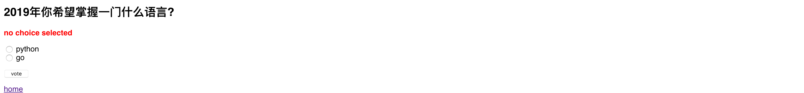
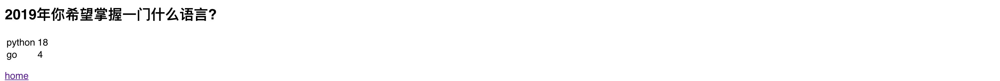

----

* [简单概述](#简单概述)
* [常规视图的套路](#常规视图的套路)
  * [编写原始视图函数](#编写原始视图函数)
  * [简单测试视图访问](#简单测试视图访问)
    * [正常请求](#正常请求)
    * [异常请求](#异常请求)
* [视图函数的优化](#视图函数的优化)
  * [首页视图自动分页](#首页视图自动分页)
  * [快捷载入填充渲染](#快捷载入填充渲染)
  * [404 错误正确姿势](#404 错误正确姿势)
  * [更优雅的 404处理](#更优雅的 404处理)
  * [移除视图中硬编码](#移除视图中硬编码)
* [模版系统的套路](#模版系统的套路)
  * [首页面视图](#首页面视图)
  * [详情页视图](#详情页视图)
  * [结果页视图](#结果页视图)

----

# 简单概述

> 为基本投票应用添加视图,通常一个视图对应一个功能,如Question首页视图(主要用于显示发布的Question列表)/详情页视图(主要用于显示指定Question及投票选项表单)/结果页视图(主要用于显示投票结果)/投票(主要用于处理用户投票逻辑)

* Django中视图通常以函数形式存在,用户请求通过URLconfs(正则和视图函数映射表)被路由到指定的视图函数处理,默认阻塞返回

# 常规视图的套路

## 编写原始视图函数

> cd mysite
>
> vim polls/views/question.py

```python
#! -*- coding: utf-8 -*-


# author: forcemain@163.com


from django.template import loader
from django.http import HttpResponse, HttpResponseRedirect


from .. import models


def index(request):
    queryset = models.Question.objects.order_by('-pub_date')
    template = loader.get_template('polls/index.html')

    return HttpResponse(template.render({'questions': queryset}, request))


def detail(request, question_pk):
    question = models.Question.objects.get(pk=question_pk)
    template = loader.get_template('polls/detail.html')

    return HttpResponse(template.render({'question': question}), request)


def result(request, question_pk):
    question = models.Question.objects.get(pk=question_pk)
    template = loader.get_template('polls/result.html')

    return HttpResponse(template.render({'question': question}, request))


def vote(request, question_pk):
    question = models.Question.objects.get(pk=question_pk)
    choice = question.choice_set.get(pk=request.POST.get('choice_pk', None))
    choice.votes += 1
    choice.save()

    return HttpResponseRedirect('/polls/')
```

* index, detail, result, vote就是视图函数,用户请求通过URLconfs被路由到这些视图函数时会以位置参数和命名参数形式传递URLmatch-groups或URLmatch-groupdict匹配结果,但需要注意的是视图函数第一个参数都是request
* index视图函数中首先获取排序后的所有Question,然后通过django.template.loader.get_template生成模版对象,最后使用模版对象的render配合上下文对象来渲染模版,最终使用django.http.HttpResponse响应给前端
* detail视图函数通过URLmatch-group传递的位置参数question_pk获取指定的Question,然后通过django.template.loader.get_template生成模版对象,最后使用模版对象的render配合上下文对象来渲染模版,最终使用django.http.HttpResponse响应给前端
* result视图函数通过URLmatch-group传递的位置参数question_pk获取指定的Question,然后通过django.template.loader.get_template生成模版对象,最后使用模版对象的render配合上下文对象来渲染模版,最终使用django.http.HttpResponse响应给前端
* vote视图函数通过URLmatch-group传递的位置参数question_pk获取指定的Question,然后根据request.POST中的choice_pk参数获取对应的Choice,使其投票数加1,保存后返回首页即可

> cd mysite
>
> vim polls/views/\_\_init\_\_.py

```python
#! -*- coding: utf-8 -*-


# author: forcemain@163.com


from functools import partial
from utils.module_loading import autodiscovery_modules


modules = autodiscovery_modules(__name__, __file__)


# inject globals
g_data = {}
map(lambda m: g_data.update(m.__dict__), modules)
globals().update(g_data)

autodiscovery = partial(autodiscovery_modules,__name__, __file__)

```

* 由于在自定义应用polls中将views.py规范为views包,又希望Django能够自动递归加载此包下面独立的模型包或文件中的模型,通过由下而上递归注入环境变量给顶层包
* 此方式的优势在于不用手动维护views包下\_\_init\_\_.py中大量from .xxoo import *
* 此方式的劣势在于由于依赖环境变量注入,所以尽量不要声明同名对象同时配合\_\_all\_\_和\_\_solts\_\_使用

> cd mysite
>
> vim polls/urls.py

```python
#! -*- coding: utf-8 -*-


# author: forcemain@163.com


from django.conf.urls import url


from . import views


app_name = 'polls'

urlpatterns = [
    url('^$', views.question.index, name='tpl-poll-index'),
    url('(?P<question_pk>[0-9]+)/$', views.question.detail, name='tpl-poll-detail'),
    url('(?P<question_pk>[0-9]+)/vote/$', views.question.vote, name='rdr-poll-vote'),
    url('(?P<question_pk>[0-9]+)/result/$', views.question.result, name='tpl-poll-result')
]
```

* Django中约定俗成的URLconfs为应用下urls.py,当然也可以自定义其它名称,但内部需要包含urlpatterns数组,数组内部为通过django.conf.urls.url创建的路由映射,app_name应用标识,推荐设置, 主要用于区分应用,当然其实是可选的
* django.conf.urls.url(regex, view, kwargs=None, name=None),regex为uri正则,view为视图函数(支持视图函数或元组/列表,后者格式为([urlconf_module|urlpatterns], app_name, namespace)),kwargs为其它命名参数字典,name为视图函数唯一标识

> cd mysite
>
> vim mysite/urls.py

```python
#! -*- coding: utf-8 -*-


# author: forcemain@163.com


"""mysite URL Configuration

The `urlpatterns` list routes URLs to views. For more information please see:
    https://docs.djangoproject.com/en/1.11/topics/http/urls/
Examples:
Function views
    1. Add an import:  from my_app import views
    2. Add a URL to urlpatterns:  url(r'^$', views.home, name='home')
Class-based views
    1. Add an import:  from other_app.views import Home
    2. Add a URL to urlpatterns:  url(r'^$', Home.as_view(), name='home')
Including another URLconf
    1. Import the include() function: from django.conf.urls import url, include
    2. Add a URL to urlpatterns:  url(r'^blog/', include('blog.urls'))
"""
from django.contrib import admin
from django.conf.urls import url, include


urlpatterns = [
    url(r'^polls/', include('polls.urls')),
]


urlpatterns += [
    url(r'^admin/', admin.site.urls),
]
```

* Django默认加载项目配置mysite/mysite/settings.py中ROOT_URLCONF,而其默认指向mysite.urls,所以需要编辑此文件将其它应用的URLconfs包含进来
* django.conf.urls.include(arg, namespace=None, app_name=None),arg如果为dotpath将尝试导入,如果为([urlconf_module|urlpatterns], app_name, namespace)则尝试合并,最终返回(urlconf_module, app_name, namespace)作为view参数传递给django.conf.urls.url,也就是说urlconf_module可以为应用的urls模块,也可为应用的urls模块中的urlpatterns写法,设计非常巧妙,具体参考源码
* 需要注意的是只要是django.conf.urls.url的view参数为元组或列表则表示其包含多个子路由配置,所第一个参数regexp不要以$结尾

> cd mysite
>
> vim polls/templates/polls/index.html

```html
index
```

> cd mysite
>
> vim polls/templates/polls/detail.html

````html
detal
````

> cd mysite
>
> vim polls/templates/polls/result.html

```python
result
```

## 简单测试视图访问

### 正常请求

> http http://127.0.0.1:8000/polls/

```
HTTP/1.0 200 OK
Content-Length: 5
Content-Type: text/html; charset=utf-8
Date: Fri, 04 Jan 2019 07:21:42 GMT
Server: WSGIServer/0.1 Python/2.7.10
X-Frame-Options: SAMEORIGIN

index
```

> http http://127.0.0.1:8000/polls/4/

```
HTTP/1.0 200 OK
Content-Length: 6
Content-Type: <WSGIRequest: GET '/polls/4/'>
Date: Fri, 04 Jan 2019 07:22:27 GMT
Server: WSGIServer/0.1 Python/2.7.10
X-Frame-Options: SAMEORIGIN

detail
```

> http http://127.0.0.1:8000/polls/4/result/

```
HTTP/1.0 200 OK
Content-Length: 6
Content-Type: text/html; charset=utf-8
Date: Fri, 04 Jan 2019 07:23:10 GMT
Server: WSGIServer/0.1 Python/2.7.10
X-Frame-Options: SAMEORIGIN

result
```

> http --form  POST http://127.0.0.1:8000/polls/4/vote/ choice_pk=1

```
HTTP/1.0 302 Found
Content-Length: 0
Content-Type: text/html; charset=utf-8
Date: Fri, 04 Jan 2019 08:24:19 GMT
Location: /polls/
Server: WSGIServer/0.1 Python/2.7.10
X-Frame-Options: SAMEORIGIN
```

### 异常请求

> http http://127.0.0.1:8000/polls/1/ --header

```
HTTP/1.0 500 Internal Server Error
Content-Length: 72073
Content-Type: text/html
Date: Fri, 04 Jan 2019 08:27:51 GMT
Server: WSGIServer/0.1 Python/2.7.10
Vary: Cookie
X-Frame-Options: SAMEORIGIN
```

* 由于数据库中并不存在主键为1的Question实例,导致服务端抛出DoesNotExist: Question matching query does not exist的异常,但此类型错误并非归类为500异常,而应该归类为404请求的资源未找到

# 视图函数的优化

## 首页视图自动分页

```python
#! -*- coding: utf-8 -*-


# author: forcemain@163.com


from django.conf import settings
from django.template import loader
from django.http import HttpResponse, HttpResponseRedirect
from django.core.paginator import Paginator, PageNotAnInteger, EmptyPage


from .. import models


def index(request):
    page = request.GET.get('page', 1)

    queryset = models.Question.objects.order_by('-pub_date')
    paginator = Paginator(queryset, per_page=settings.DEFAULT_PAGE_SIZE)
    try:
        questions = paginator.page(page)
    except PageNotAnInteger:
        questions = paginator.page(1)
    except EmptyPage:
        questions = paginator.page(paginator.num_pages)

    template = loader.get_template('polls/index.html')

    return HttpResponse(template.render({'questions': questions}), request)


def detail(request, question_pk):
    question = models.Question.objects.get(pk=question_pk)
    template = loader.get_template('polls/detail.html')

    return HttpResponse(template.render({'question': question}), request)


def result(request, question_pk):
    question = models.Question.objects.get(pk=question_pk)
    template = loader.get_template('polls/result.html')

    return HttpResponse(template.render({'question': question}, request))


def vote(request, question_pk):
    question = models.Question.objects.get(pk=question_pk)
    choice = question.choice_set.get(pk=request.POST.get('choice_pk', None))
    choice.votes += 1
    choice.save()

    return HttpResponseRedirect('/polls/')
```

* index视图函数借助django.core.paginator.Paginator(object_list, per_page, orphans=0, allow_empty_first_page=True)实现分页,其中object_list支持元组,列表或查询集,per_page为每页显示数量,通过paginator.page方法获取分页对象,当GET方式传递的page参数不是整型则抛出PageNotAnInteger异常,如果GET方式传递的page参数是整型但可能由于page太大则抛出EmptyPage异常

## 快捷载入填充渲染

> cd mysite
>
> vim polls/views/questions.py

```python
#! -*- coding: utf-8 -*-


# author: forcemain@163.com


from django.conf import settings
from django.shortcuts import render
from django.http import HttpResponseRedirect
from django.core.paginator import Paginator, PageNotAnInteger, EmptyPage


from .. import models


def index(request):
    page = request.GET.get('page', 1)

    queryset = models.Question.objects.order_by('-pub_date')
    paginator = Paginator(queryset, per_page=settings.DEFAULT_PAGE_SIZE)
    try:
        questions = paginator.page(page)
    except PageNotAnInteger:
        questions = paginator.page(1)
    except EmptyPage:
        questions = paginator.page(paginator.num_pages)

    return render(request, 'polls/index.html', {'questions': questions})


def detail(request, question_pk):
    question = models.Question.objects.get(pk=question_pk)

    return render(request, 'polls/detail.html', {'question': question})


def result(request, question_pk):
    question = models.Question.objects.get(pk=question_pk)

    return render(request, 'polls/result.html', {'question': question})


def vote(request, question_pk):
    question = models.Question.objects.get(pk=question_pk)
    choice = question.choice_set.get(pk=request.POST.get('choice_pk', None))
    choice.votes += 1
    choice.save()

    return HttpResponseRedirect('/polls/')
```

* index, detail, result视图函数内部处理逻辑都是渲染模版,Django对于此行为提供了更便捷的方式django.shortcuts.render(request, template_name, context=None, content_type=None, status=None, using=None),至此无需再使用django.template.loader载入填充渲染

## 404 错误正确姿势

> cd mysite
>
> vim polls/views/questions.py

```python
#! -*- coding: utf-8 -*-


# author: forcemain@163.com


from django.conf import settings
from django.shortcuts import render
from django.http import HttpResponseRedirect, HttpResponseNotFound
from django.core.paginator import Paginator, PageNotAnInteger, EmptyPage


from .. import models


def index(request):
    page = request.GET.get('page', 1)

    queryset = models.Question.objects.order_by('-pub_date')
    paginator = Paginator(queryset, per_page=settings.DEFAULT_PAGE_SIZE)
    try:
        questions = paginator.page(page)
    except PageNotAnInteger:
        questions = paginator.page(1)
    except EmptyPage:
        questions = paginator.page(paginator.num_pages)

    return render(request, 'polls/index.html', {'questions': questions})


def detail(request, question_pk):
    try:
        question = models.Question.objects.get(pk=question_pk)
    except models.Question.DoesNotExist:
        return HttpResponseNotFound()

    return render(request, 'polls/detail.html', {'question': question})


def result(request, question_pk):
    try:
        question = models.Question.objects.get(pk=question_pk)
    except models.Question.DoesNotExist:
        return HttpResponseNotFound()
    
    return render(request, 'polls/result.html', {'question': question})


def vote(request, question_pk):
    try:
        question = models.Question.objects.get(pk=question_pk)
        choice = question.choice_set.get(pk=request.POST.get('choice_pk', None))
    except (models.Question.DoesNotExist, models.Choice.DoesNotExist):
        return HttpResponseNotFound()
    else:
        choice.votes += 1
        choice.save()

    return HttpResponseRedirect('/polls/')
```

* 默认情况下如果请求的资源不存在则会抛出\<model\>.DoesNotExist异常,但此异常是Exception的子类,并非django.core.handlers.exception.convert_exception_to_response所能识别的异常,所以会统一抛出500错误,对于404错误它只识别django.http.Http404,所以你也可以捕捉DoesNotExist再抛出Http404异常实现同样的效果
* detail, result, vote视图函数都根据question_pk来获取Question实例,对于可能出现DoesNotExist异常的地方都捕捉直接返回HttpResponseNotFound()响应

## 更优雅的 404处理

> cd mysite
>
> vim polls/views/questions.py

```python
#! -*- coding: utf-8 -*-


# author: forcemain@163.com


from django.conf import settings
from django.http import HttpResponseRedirect
from django.shortcuts import render, get_object_or_404
from django.core.paginator import Paginator, PageNotAnInteger, EmptyPage


from .. import models


def index(request):
    page = request.GET.get('page', 1)

    queryset = models.Question.objects.order_by('-pub_date')
    paginator = Paginator(queryset, per_page=settings.DEFAULT_PAGE_SIZE)
    try:
        questions = paginator.page(page)
    except PageNotAnInteger:
        questions = paginator.page(1)
    except EmptyPage:
        questions = paginator.page(paginator.num_pages)

    return render(request, 'polls/index.html', {'questions': questions})


def detail(request, question_pk):
    question = get_object_or_404(models.Question, pk=question_pk)

    return render(request, 'polls/detail.html', {'question': question})


def result(request, question_pk):
    question = get_object_or_404(models.Question, pk=question_pk)

    return render(request, 'polls/result.html', {'question': question})


def vote(request, question_pk):
    question = get_object_or_404(models.Question, pk=question_pk)
    choice = get_object_or_404(question.choice_set, pk=request.POST.get('choice_pk', None))
    choice.votes += 1
    choice.save()

    return HttpResponseRedirect('/polls/')
```

* detail, result, vote视图函数都根据question_pk来获取Question实例,对于对于可能出现DoesNotExist异常的地方都捕捉直接返回HttpResponseNotFound()响应,Django对于此行为提供了更优雅的方式django.shortcuts.get_object_or_404(klass, *args, **kwargs),它尝试捕捉DoesNotExist异常并重新抛出django.http.Http404异常最终被 django.core.handlers.exception优雅处理,具体可以参考源码

## 移除视图中硬编码

> cd mysite
>
> vim polls/views/questions.py

```python
#! -*- coding: utf-8 -*-


# author: forcemain@163.com


from django.conf import settings
from django.http import HttpResponseRedirect
from django.core.urlresolvers import reverse_lazy
from django.shortcuts import render, get_object_or_404
from django.core.paginator import Paginator, PageNotAnInteger, EmptyPage


from .. import models


def index(request):
    page = request.GET.get('page', 1)

    queryset = models.Question.objects.order_by('-pub_date')
    paginator = Paginator(queryset, per_page=settings.DEFAULT_PAGE_SIZE)
    try:
        questions = paginator.page(page)
    except PageNotAnInteger:
        questions = paginator.page(1)
    except EmptyPage:
        questions = paginator.page(paginator.num_pages)

    return render(request, 'polls/index.html', {'questions': questions})


def detail(request, question_pk):
    question = get_object_or_404(models.Question, pk=question_pk)

    return render(request, 'polls/detail.html', {'question': question})


def result(request, question_pk):
    question = get_object_or_404(models.Question, pk=question_pk)

    return render(request, 'polls/result.html', {'question': question})


def vote(request, question_pk):
    question = get_object_or_404(models.Question, pk=question_pk)
    choice = get_object_or_404(question.choice_set, pk=request.POST.get('choice_pk', None))
    choice.votes += 1
    choice.save()

    redirect_url = reverse_lazy('polls:tpl-poll-index')
    return HttpResponseRedirect(redirect_url)

```

* vote视图函数中使用django.core.urlresolvers.reverse_lazy(viewname, urlconf=None, args=None, kwargs=None, current_app=None)反向解析相对URL来代替硬编码的URL/polls/,viewname支持以:分隔的\<app_name\>:\<view_name\>形式,其中加\<app_name\>前缀主要是为了防止不同应用urls.py中声明同名name可能导致反向解析异常
* 推荐使用django.core.urlresolvers.reverse_lazy代替django.core.urlresolvers.reverse,由于前者是惰性反向解析(被django.utils.functional.lazy装饰),常用在应用的urlpatterns尚未加载但需要预设反向解析的场景

# 模版系统的套路

## 首页面视图

> cd mysite
>
> vim polls/templates/polls/index.html

```html

    
        <a href="">{{ question.question_text }}</a>
        <br>
    

    <p>No polls are valiable.</p>

```


* 首页面视图非常简单,遍历所有的questions然后生成对应的question的详情页视图链接即可,其中的用法和上面的reverse和reverse_lazy的用法非常相似,主要用于模版系统中反向解析URL避免硬编码

## 详情页视图

> cd mysite
>
> vim polls/views/questions.py

```python
#! -*- coding: utf-8 -*-


# author: forcemain@163.com


from django.conf import settings
from django.http import HttpResponseRedirect
from django.core.urlresolvers import reverse_lazy
from django.shortcuts import render, get_object_or_404
from django.core.paginator import Paginator, PageNotAnInteger, EmptyPage


from .. import models


def index(request):
    page = request.GET.get('page', 1)

    queryset = models.Question.objects.order_by('-pub_date')
    paginator = Paginator(queryset, per_page=settings.DEFAULT_PAGE_SIZE)
    try:
        questions = paginator.page(page)
    except PageNotAnInteger:
        questions = paginator.page(1)
    except EmptyPage:
        questions = paginator.page(paginator.num_pages)

    return render(request, 'polls/index.html', {'questions': questions})


def detail(request, question_pk):
    question = get_object_or_404(models.Question, pk=question_pk)

    return render(request, 'polls/detail.html', {'question': question})


def result(request, question_pk):
    question = get_object_or_404(models.Question, pk=question_pk)

    return render(request, 'polls/result.html', {'question': question})


def vote(request, question_pk):
    question = get_object_or_404(models.Question, pk=question_pk)
    try:
        choice = question.choice_set.get(pk=request.POST['choice_pk'])
    except (KeyError, models.Choice.DoesNotExist):
        return render(request, 'polls/detail.html', {
            'question': question,
            'error_message': 'no choice selected'
        })
    else:
        choice.votes += 1
        choice.save()

        redirect_url = reverse_lazy('polls:tpl-poll-result', args=(question.pk,))
        return HttpResponseRedirect(redirect_url)
```

* vote视图函数中对于前端未选择就点提交的情况通过模版上下文传递做了优雅提示处理

> cd mysite
>
> vim polls/templates/polls/detail.html

```html
<h2>{{ question.question_text }}</h2>


    <p><strong style="color: red;">{{ error_message }}</strong></p>


<form action="" method="post">
    
    
        <input type="radio" name="choice_pk" value="{{ choice.pk }}"> {{ choice.choice_text }}
        <br>
    
    <br>
    <input type="submit" value="vote">
</form>

<p><a href="">home</a></p>
```



* 详情页视图非常简单,通过上下文的question遍历所有的choices,并以表单的形式用于投票,需要注意的是一切通过模版渲染的表单在提交的时候都需要添加,因为项目配置settings.py中默认在MIDDLEWARE中开启了django.middleware.csrf.CsrfViewMiddleware中间件,主要防止恶意的CSRF跨站脚本攻击

## 结果页视图

> cd mysite
>
> vim polls/templates/polls/result.html

```html
<h2>{{ question.question_text }}</h2>

<table>

    <tr>
        <td>{{ choice.choice_text }}</td>
        <td>{{ choice.votes }}</td>
    </tr>

</table>

<p><a href="">vote again?</a></p>
<p><a href="">home</a></p>
```



* 详情页视图中用户点击提交按钮,后端vote视图函数处理投票逻辑,如无意外则应该跳转到结果页视图

