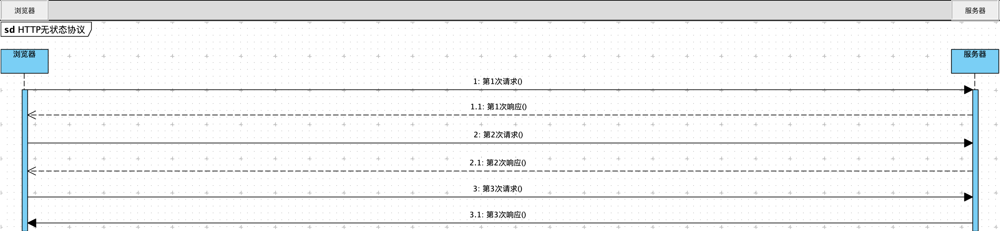
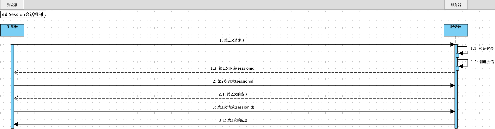
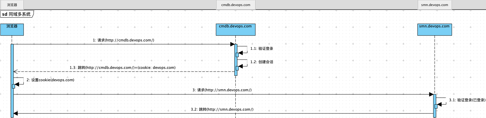
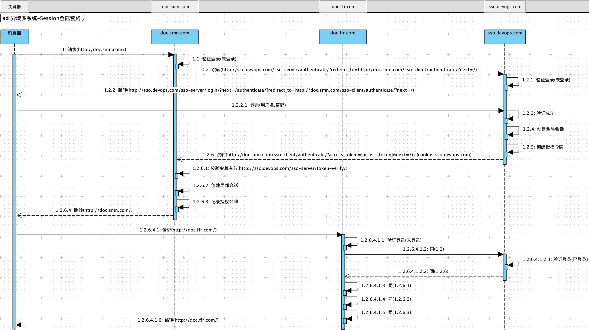
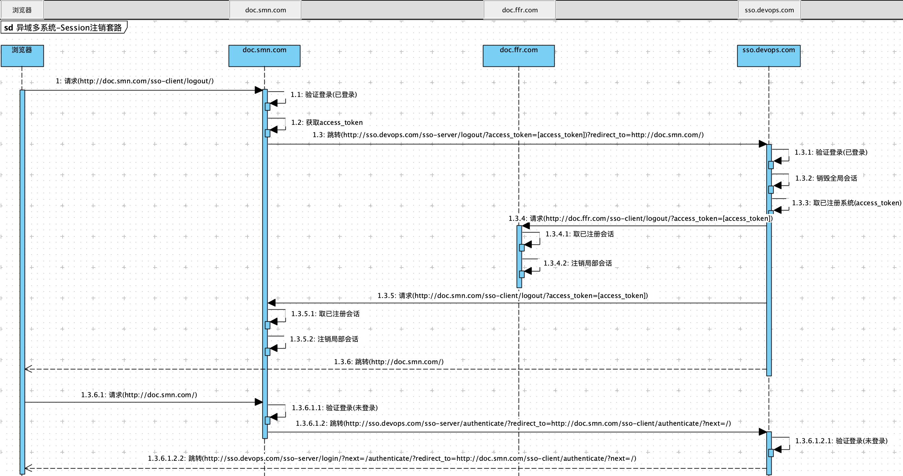

----
* [简单概述](#简单概述)
* [SSO演进](#SSO演进)
  * [单系统登陆](#单系统登陆)
    * [HTTP无状态协议](#HTTP无状态协议)
    * [Session会话机制](#Session会话机制)
  * [同域多系统](#同域多系统)
  * [异域多系统](#异域多系统)
    * [Session登陆套路](#Session登陆套路)
    * [Session注销套路](#Session注销套路)
----

# 简单概述

> SSO(Single Sign On),单点登录是一种标准规范,主要解决多个系统重复创建用户认证管理功能问题,允许用户通过统一的账户密码无缝登陆多个同域/异域系统

# SSO演进

## 单系统登陆

### HTTP无状态协议

* Web应用基于HTTP协议的B/S架构,而HTTP为无状态的,默认对于浏览器的每次请求,服务器都会独立处理,并不会与之前或之后的的请求产生关联,如上三次请求/响应之间没有任何关联
* 如上架构的问题在于任何人都可以无限制的访问服务器资源,所以急需一种手段能够让服务器鉴别浏览器请求,也就是下面所说的Session会话机制

### Session会话机制

* Cookie是浏览器存储少量数据的一种机制,以KV形式存储,浏览器发送同域请求时会自动携带Cookie信息
* Django会话机制当然也借助了Cookie,当登陆服务器后,浏览器中可以看到名为sessionid的Cookie,这就是Django会话机制维护的会话id,同域请求时会自动携带Cookie信息,服务器收到请求时尝试提取Cookie中的sessionid还原用户对象,来鉴别此次浏览器请求

## 同域多系统

> 同域多系统应用的复杂性应该由系统内部承担而不是终端用户

* Cookie的限制在于在发送请求时只会携带与该域名匹配的Cookie信息(支持父域Cookie)
* 如上架构的问题在于所有的子系统必须是同一个父域下子域名,并设置Cookie的Domain为*.devops.com,但前提是需要所有子系统共享Session,但更大的问题在于无法跨语言,由于不同语言的Web服务对于Session的实现稍有差异,会导致无法维持会话,当然Cookie本身也是不安全的

## 异域多系统

> 异域多系统应用的复杂性应该由系统内部承担而不是终端用户

### Session登陆套路

* 用户访问[http://doc.smn.com/](http://doc.smn.com/),SMN系统发现用户未登录则跳转至[http://sso.devops.com/sso-server/authenticate/?redirect_to=http://doc.smn.com/sso-client/authenticate/?next=/](http://sso.devops.com/sso-server/authenticate/?redirect_to=http://doc.smn.com/sso-client/authenticate/?next=/)SSO认证中心,并将本系统的地址作为redirect_to参数传递过去
* SSO系统发现用户未登录则跳转至[http://sso.devops.com/sso-server/login/?next=/authenticate/?redirect_to=http://doc.smn.com/sso-client/authenticate/?next=/](http://sso.devops.com/sso-server/login/?next=/authenticate/?redirect_to=http://doc.smn.com/sso-client/authenticate/?next=/)SSO认证中心的登录界面登录认证
* 用户输入账户密码提交登录请求
* SSO系统验证认证信息,并为此用户创建全局会话和授权令牌
* SSO系统携带授权令牌跳转至[http://doc.smn.com/sso-client/authenticate/?access_token=[access_token]&next=/](http://doc.smn.com/sso-client/authenticate/?access_token=[access_token]&next=/)SMN系统
* SMN系统拿着令牌到SSO系统校验
* SSO系统校验成功返回用户信息
* SMN根据返回的用户信息创建用户局部会话,记录授权令牌,并根据next参数跳转到SMN系统指定页面
* 用户访问[http://doc.ffr.com/](http://doc.ffr.com/),FFR系统发现用户未登录则跳转至[http://sso.devops.com/sso-server/authenticate/?redirect_to=http://doc.ffr.com/sso-client/authenticate/?next=/](http://sso.devops.com/sso-server/authenticate/?redirect_to=http://doc.ffr.com/sso-client/authenticate/?next=/)SSO认证中心,并将本系统的地址作为redirect_to参数传递过去
* SSO系统发现用户已登录则携带授权令牌跳转至[http://doc.ffr.com/sso-client/authenticate/?access_token=[access_token]&next=/](http://doc.ffr.com/sso-client/authenticate/?access_token=[access_token]&next=/)FFR系统
* FFR系统拿着令牌到SSO系统校验
* SSO系统校验成功返回用户信息
* FFR根据返回的用户信息创建用户局部会话,记录授权令牌,并根据next参数跳转到FFR系统指定页面

### Session注销套路

> 异域多系统应用的复杂性应该由系统内部承担而不是终端用户,单点注销也应如此

* 用户请求[http://doc.smn.com/sso-client/logout/](http://doc.smn.com/sso-client/logout/),SMN系统发现用户已登录,则获取用户Token跳转至[http://sso.devops.com/sso-server/logout/?access_token=[access_token])?redirect_to=http://doc.smn.com/](http://sso.devops.com/sso-server/logout/?access_token=[access_token])?redirect_to=http://doc.smn.com/)SSO认证中心,并将本系统的地址作为redirect_to参数传递过去
* SSO系统发现用户已登录,首先注销全局会话,然后获取已注册的子站点,携带access_token向所有子站点发送注销请求,子站点收到请求后根据access_token获取用户,然后注销用户局部会话,后跳转至[http://doc.smn.com/](http://doc.smn.com/)
* SMN系统发现用户未登录则跳转至[http://sso.devops.com/sso-server/authenticate/?redirect_to=http://doc.smn.com/sso-client/authenticate/?next=/](http://sso.devops.com/sso-server/authenticate/?redirect_to=http://doc.smn.com/sso-client/authenticate/?next=/)SSO认证中心,并将本系统的地址作为redirect_to参数传递过去
* SSO系统发现用户未登录则跳转至[http://sso.devops.com/sso-server/login/?next=/authenticate/?redirect_to=http://doc.smn.com/sso-client/authenticate/?next=/](http://sso.devops.com/sso-server/login/?next=/authenticate/?redirect_to=http://doc.smn.com/sso-client/authenticate/?next=/)让用户重新登录

