----
* [简单概述](#简单概述)
* [环境准备](#环境准备)
  * 注册[企业微信](https://work.weixin.qq.com/wework_admin/register_wx?from=loginpage)
  * [创建企业应用](#创建企业应用)
  * [设置可信域名](#设置可信域名)
* [具体实现](#具体实现)
  * [整体流程](#整体流程)
  * [代码实现](#代码实现)
* [效果演示](#效果演示)
  * [企业网站](#企业网站)
  * [手机授权](#手机授权)
----

# 简单概述

> 企业微信提供基于OAuth的扫码登录授权,可在企业网站登录时引导用户使用个人/企业微信扫码授权登录,从而获取用户的身份信息,免去登录环节

# 环境准备

## 注册[企业微信](https://work.weixin.qq.com/wework_admin/register_wx?from=loginpage)

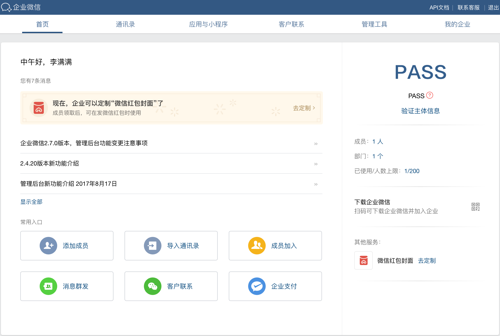

* 首先在[官网](https://work.weixin.qq.com/)注册一个企业微信账户

## 创建企业应用

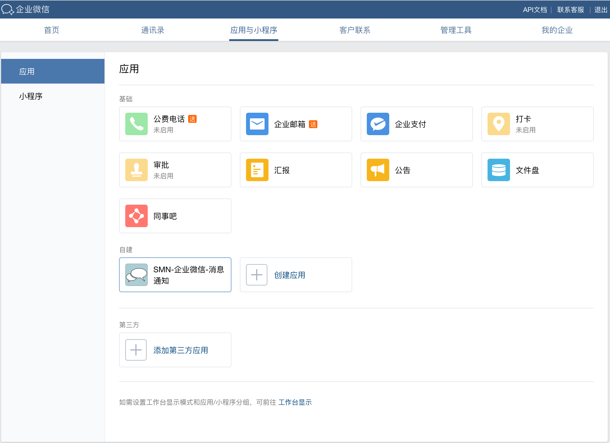

* 注册完企业微信账户后,后台会自建一个应用,此应用无法删除,但可更改为自定义图标和名称

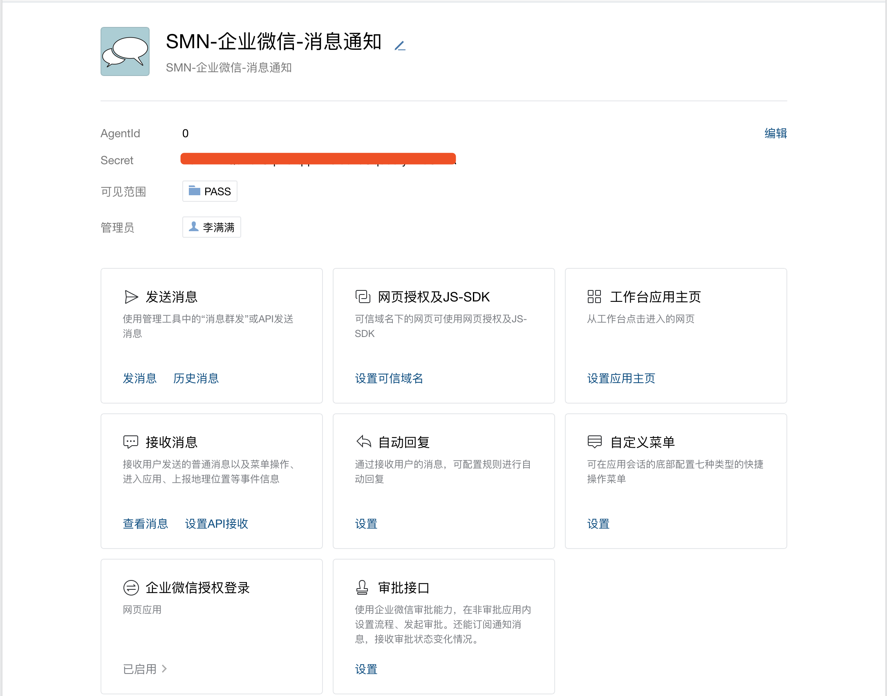

* 假设如上应用将作为开发中的SMN消息通知系统中一个功能模块,则消息模型中依赖用户ID,所以不仅需要在企业网站登录处支持企业微信登录,而且还支持在企业网站管理后台为已有用户绑定企业微信

## 设置可信域名

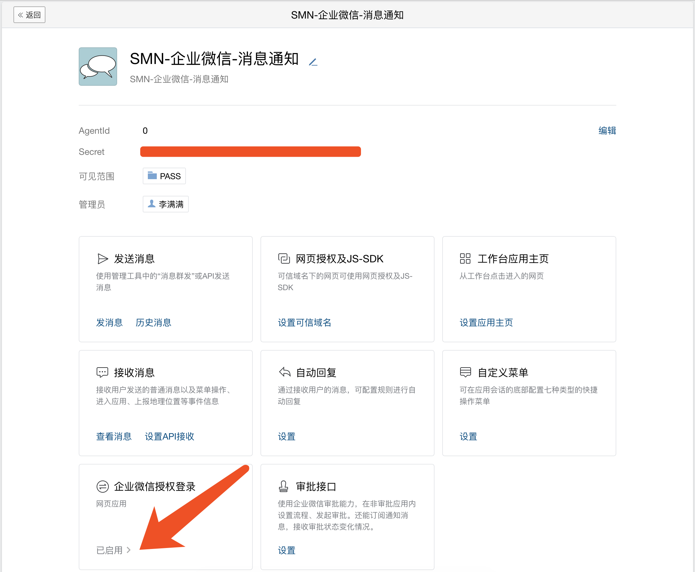

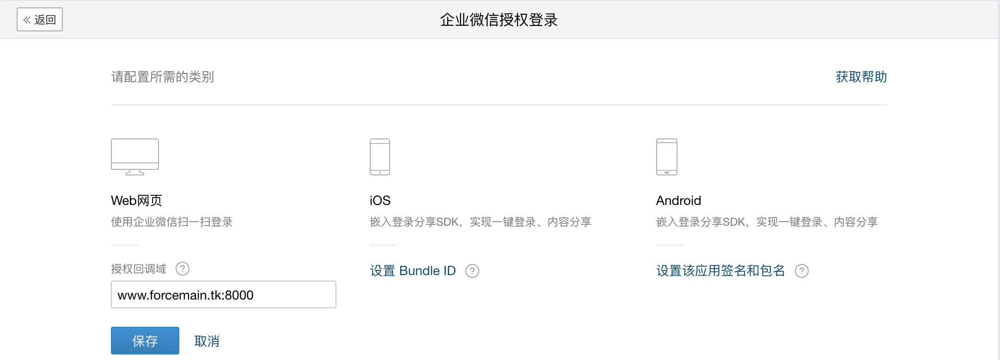

* 由于是网页接入,所以需要在Web网页配置中设置授权回调,因为企业网站后端检测到用户未登录则会携带corpid和agentid和redirect_uri跳转到微信SSO单点登录页面等待用户扫码授权,用户通过手机扫码授权后就会回调跳转到redirect_uri并携带上生成的code,而此时就会判断corpid和agentid对应的应用的授权回调的域名是否是你此处设置的域
* 注意授权回调域如果非80端口,务必带上端口

# 具体实现

## [相关概念](https://open.work.weixin.qq.com/api/old/doc#10013/%E6%9C%AF%E8%AF%AD%E4%BB%8B%E7%BB%8D)

## 整体流程

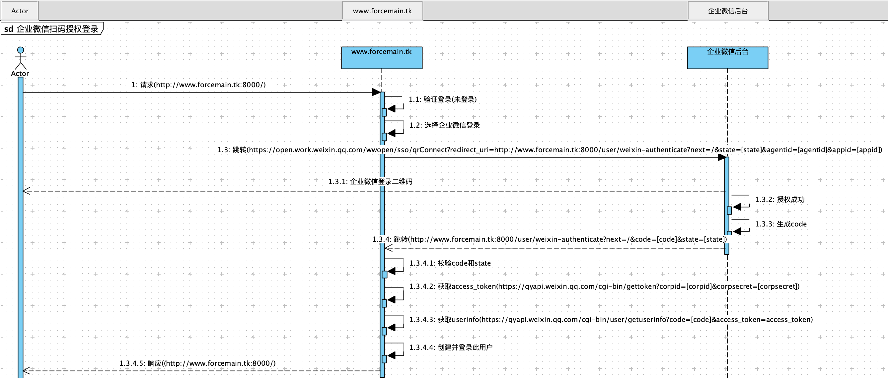

* 用户请求[http://www.forcemain.tk:8000/](http://www.forcemain.tk:8000/)企业网站,企业网站后端发现用户未登录则跳转到登陆界面让用户选择登录方式,此处提供了账号密码登录和企业微信登录,用户点击企业微信登录
* 企业网站后端发现用户未登录则跳转至[https://open.work.weixin.qq.com/wwopen/sso/qrConnect?redirect_uri=http://www.forcemain.tk:8000/user/weixin-authenticate?next=/&state=[state]&agentid=[agentid]&appid=[appid]](https://open.work.weixin.qq.com/wwopen/sso/qrConnect?redirect_uri=http://www.forcemain.tk:8000/user/weixin-authenticate?next=/&state=[state]&agentid=[agentid]&appid=[appid])企业微信SSO单点登录二维码页面,并携带上回调域redirect_uris
* 用户通过手机扫码授权后,企业微信后台生成code并校验授权回调域redirect_uris中是否与设置的域相符,如果相符则携带code跳转至redirect_uris
* 企业网站收到code和state后对其进行校验,接着拿corpid和corpsecret请求[https://qyapi.weixin.qq.com/cgi-bin/gettoken?corpid=[corpid]&corpsecret=[corpsecret]](https://qyapi.weixin.qq.com/cgi-bin/gettoken?corpid=[corpid]&corpsecret=[corpsecret])获取访问令牌access_token,接着拿code和access_token请求[https://qyapi.weixin.qq.com/cgi-bin/user/getuserinfo?code=[code]&access_token=access_token](https://qyapi.weixin.qq.com/cgi-bin/user/getuserinfo?code=[code]&access_token=access_token)获取用户信息,最终在本地建立用户系统并强制登录此用户

## 代码实现

> 请参考 [企业微信认证授权实现.code] 中通用代码实现细节

# 效果演示

## 企业网站

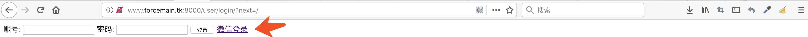

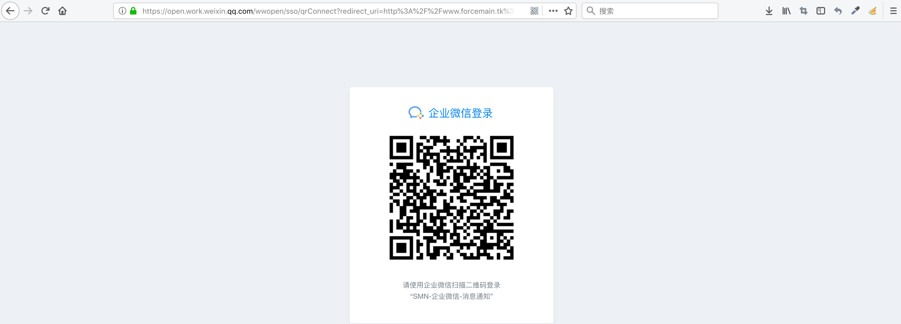

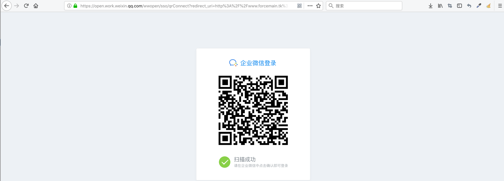

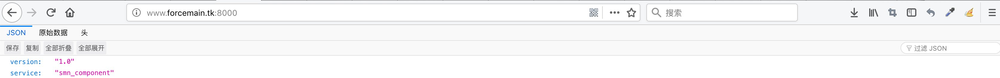

## 手机授权

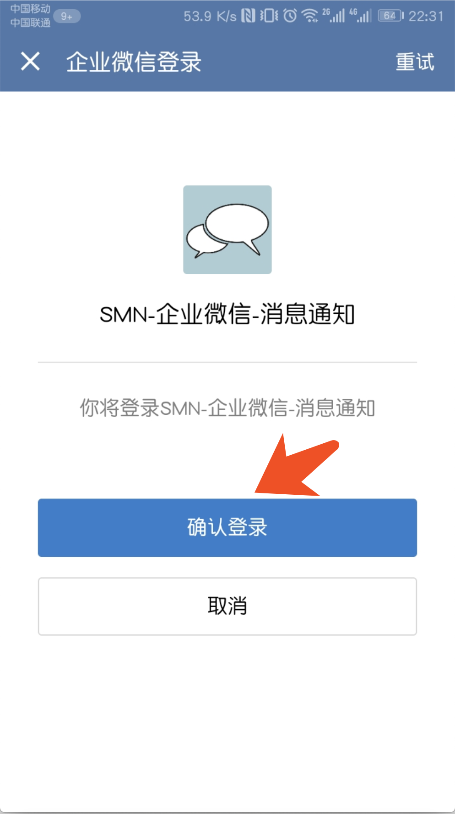