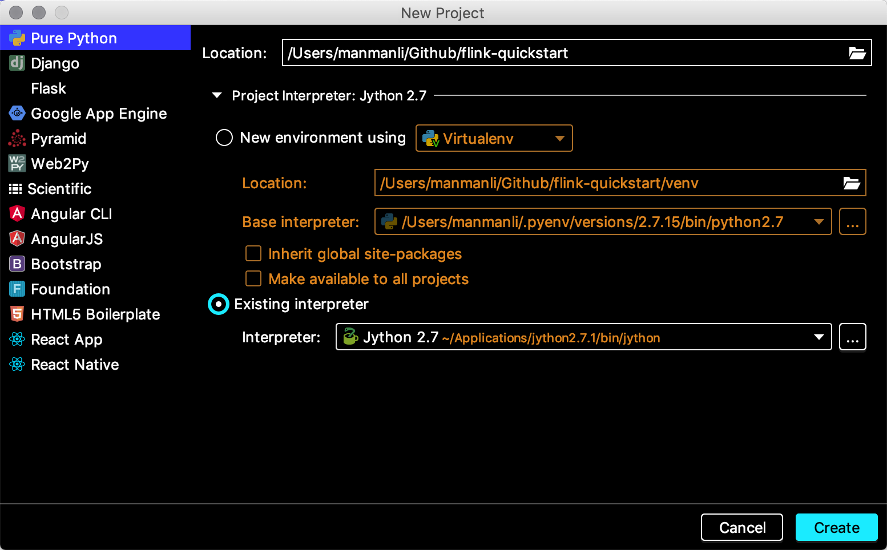

----

----

# 开发环境

>   后续应用开发都将采用Python语言,但需要注意的是由于Jython2.7.1目前仅支持2.7.x版本的CPython有效语法

| 开发工具                                               | 计算引擎                                                     | 解释器                                         | 运行时                                                       |
| ------------------------------------------------------ | ------------------------------------------------------------ | ---------------------------------------------- | ------------------------------------------------------------ |
| [PyCharm](https://www.jetbrains.com/pycharm/download/) | [Flink1.8.1](https://www.apache.org/dyn/closer.lua/flink/flink-1.8.1/flink-1.8.1-bin-scala_2.12.tgz) | [Jython2.7.1](https://www.jython.org/download) | [Jdk](https://www.oracle.com/java/technologies/jdk12-downloads.html) |

:point_right: 需要首先安装Jdk然后安装Jython然后安装PyCharm​并尝试创建项目时指定解释器为Jython然后点击确定即可

