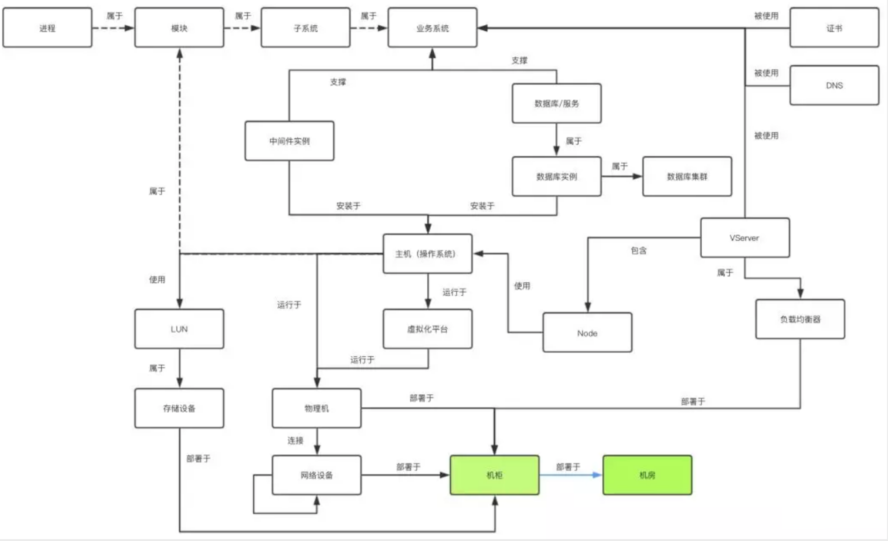

----

----

# 终极目标

> 运维服务的"四化建设"

* 标准化, 配置管理标准化
* 自动化
* 服务化
* 产品化

# 相关术语

## CMDB

> Configuration Management Database

* 表示用于存储硬件和软件资产,通常称为配置项[CI]的IT基础架构库[ITIL]数据库

## CI

> Configuration Items

* 表示资源对象,如主机,硬件设备,软件应用等

## CI属性

> Configuration Items Attribute

* 表示资源对象的具体配置属性,如主机CI属性包括IP,主机名,主机负责人等

## 实例

* 表示唯一识别一个资源对象的实例,如主机A(IP: 10.246.101.17, 主机名:Asset 负责人:Limanman)

# 项目目标

> 通过建立一个权威的配置管理数据库,作为作业平台,监控平台,流程平台,运维平台等一系列IT系统的基石

* 适配各场景下各类CI的纳管,需要支持灵活可扩展的CI模型
* 无缝对接原子平台层各应用,对于已有应用的接入需要提供应用快速开发框架
* 支持配置的自动发现和实时同步
* 支持跨云管理

# 技术选型

> 配置管理平台位于原子平台层,通过HPaaS的ESB为上层SaaS提供持续集成[CI],持续交付和持续部署[CD],持续运营[CO]的能力

# 实施步骤

## 定义目标

> 对象范围, 场景范围, 如可按照如下定义企业内部资源的逻辑分层

| 分层       | 模块                                    |
| ---------- | --------------------------------------- |
| 应用层     | 业务系统, 子系统, 模块, 进程, 证书, DNS |
| 组件层     | 中间件, 数据库                          |
| 操作系统层 | 主机                                    |
| 虚拟化层   | 虚拟化平台                              |
| 基础架构层 | 网络设备, 负载均衡, 物理机, 机柜, 机房  |

## 设计CI模型

> CI, CI属性, CI关联, 根据定义的目标来梳理各个CI之间的关系,谁属于谁?谁部署在谁上面?谁运行在谁上面?等等

## 部署CMDB

## 创建CI模型

> 创建CI, 录入数据

