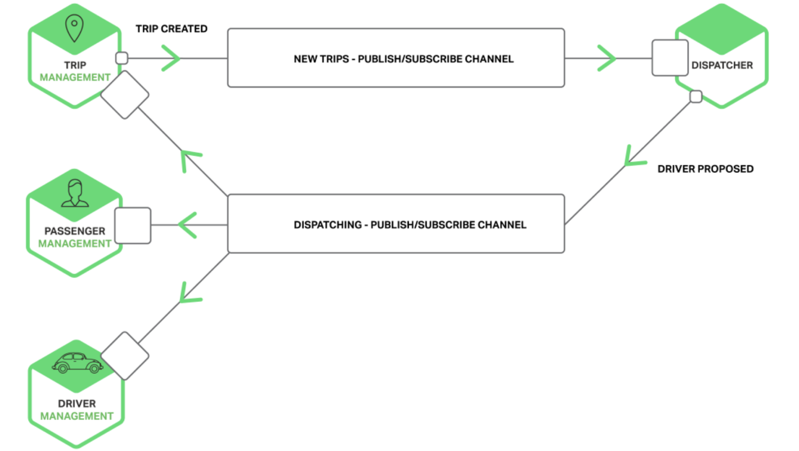
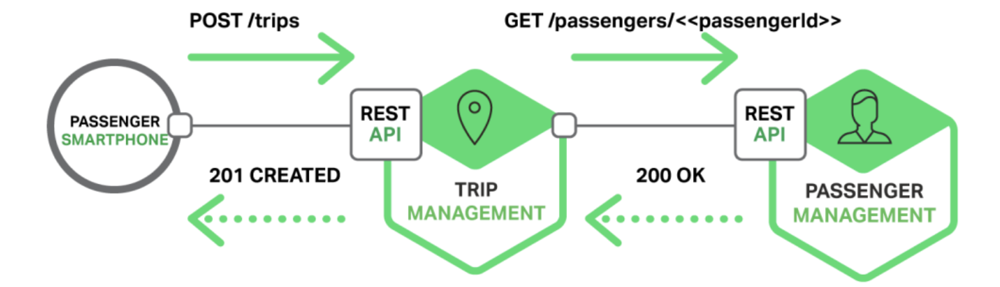
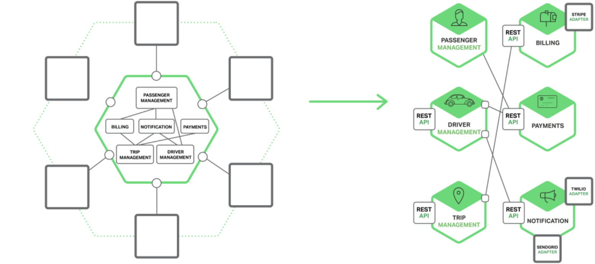
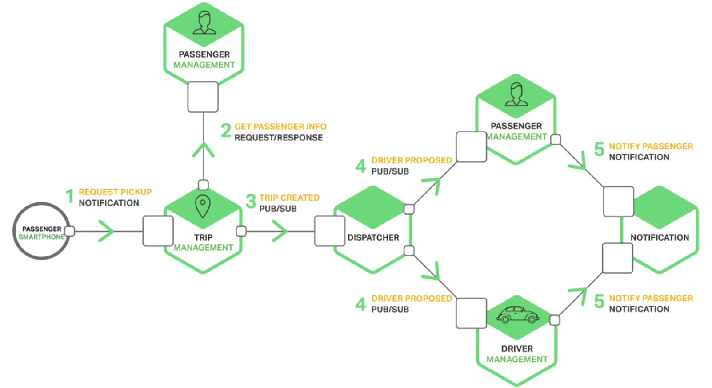

----
* [通信概念](#通信概念)
  * [异步通信](#异步通信)
  * [同步通信](#同步通信)
* [通信对比](#通信对比)
  * [单体通信](#单体通信)
  * [微服务通信](#微服务通信)
* [交互模式](#交互模式)
* [接口定义](#接口定义)
* [接口更新](#接口更新)
----

# 通信概念

> IPC通信方式众多,但对于微服务来说,同步模式常见的有基于HTTP的REST,异步模式常见的有AMQP

## 异步通信

* 如上展示打车软件中基于发布/订阅的异步通信模式的使用,行程管理中心收到一条行程消息,然后通过发布/订阅通道通知调度中心,调度中心发现此乘客附近有可接单司机,则通过发布/订阅管道分别通知乘客管理中心(附近可约司机),司机管理中心(附近可接乘客),行程管理中心(行程已处理)
* 此方式的优点一在于客户端只需将消息发送到正确的通道,无需关心通道对端的服务实例以及其地址和端口
* 此方式的优点二在于客户端发送的消息按照队列方式缓冲在消息代理,直至被消费者消费,可有效削峰填谷
* 此方式的优点三在于支持灵活交互,无论是按照通知方式的同步/异步交互还是按照通知对象的一对一/一对多
* 此方式的优点四在于基于RPC的通信机制让开发者可以轻松实现像调用本地服务一样唤醒远程服务
* 此方式的缺点一在于需要独立部署消息中间件,而且必须支持高可用,否则系统可靠性将受到影响
* 此方式的缺点二在于基于RPC的通信机制来实现同步调用相对于直接通过API请求/响应要更复杂,依赖一个唯一ID

## 同步通信

* 如上展示打车软件中基于请求/响应同步通信模式的使用,通常以REST风格的API作为首选,它基于HTTP协议,核心概念为资源表现层状态转变,通过GET/POST/PUT/PATCH/DELETE方法对远端资源操作,如乘客通过POST请求创建一个行程,行程管理中心收到请求后继续发送一个GET请求从乘客管理中心获取乘客信息,最终返回201响/应通知乘客行程已创建
* 此方式的优点一在于REST基于HTTP协议,非常简单
* 此方式的优点二在于REST基于HTTP协议,可直接通过浏览器或CURL命令测试
* 此方式的优点三在于REST基于HTTP协议,内置请求/响应通信通信模式
* 此方式的优点四在于不需要中间代理,简化系统架构
* 此方式的缺点一在于REST基于HTTP协议,也就是说后端微服务只能支持HTTP协议
* 此方式的缺点二在于无代理或缓冲机制,也就是说后端微服务必须保证在线状态
* 此方式的缺点三在于无服务实例发现机制,也就是说客户端必须知道所有服务实例的URL

# 通信对比

## 单体通信

> 对于单体应用,通常各个模块之间的调用是通过编程语言级别的函数/方法实现的

## 微服务通信

> 由于基于微服务的分布式应用通常以进程的形式运行在相同/不同的EC实例上,也可以说一个微服务实例就是一个进程,那么微服务之间的通信就是所谓的IPC通信(进程间通信)

# 交互模式

> 微服务之间的IPC通信方式支持取决于微服务之间的交互需求,通常按照通知对象和通知方式可以分为一对一/一对多和同步/异步模式

* 如上展示了用户打车场景下的微服务之间交互模式,首先乘客发起一个异步通知类的单向请求给TRIP行程管理中心,收到请求后首先发起一个同步请求获取乘客个人信息,然后通过发布订阅通道异步发给DISPATCHER调度中心,收到请求后分别通过发布订阅通道异步发给乘客管理中心和司机管理中心,管理中心最终将生成的通知消息异步发送给通知中心,最终由通知中心发送消息给终端用户,提醒用户附近可约司机,提醒司机附近可接订单
* 每个微服务都可能同时支持多种通信模式,具体依赖业务场景

# 接口定义

> 接口的定义依赖于交互模式的选定,如果使用消息通道则可能需要预定义消息通道和消息类型,如果使用HTTP模式则需要预定义URL,请求和响应格式

# 接口更新

> 接口更新遵循用户体验优先原则,通常不能强制让所有客户端与服务端保持同步更新,对于小更新可选择向下兼容,对于大更新可选择增加部署服务新版本或以版本号形式兼容多套接口并提醒终端用户客户端升级

