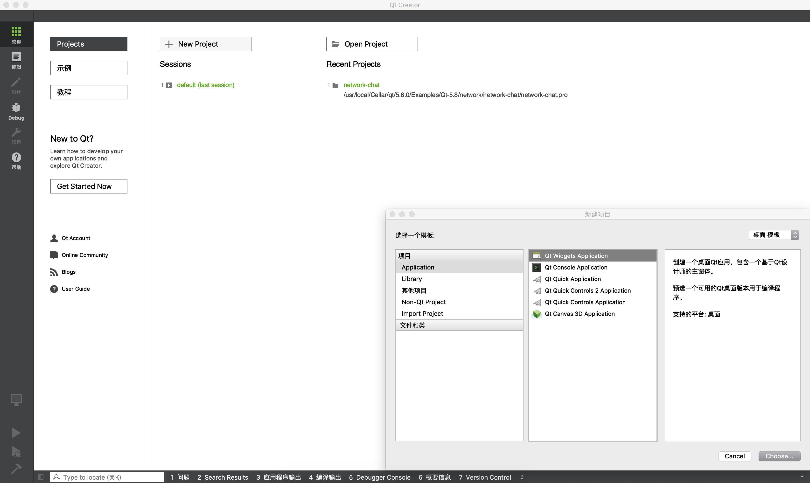
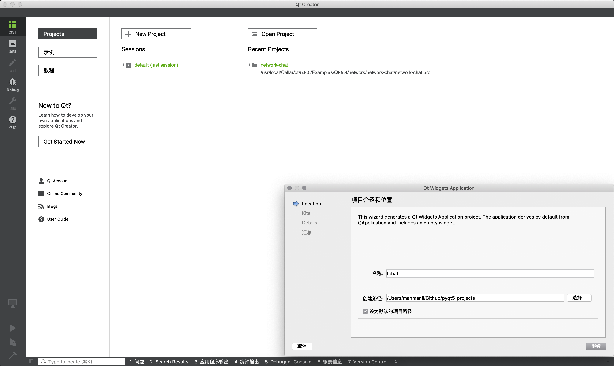
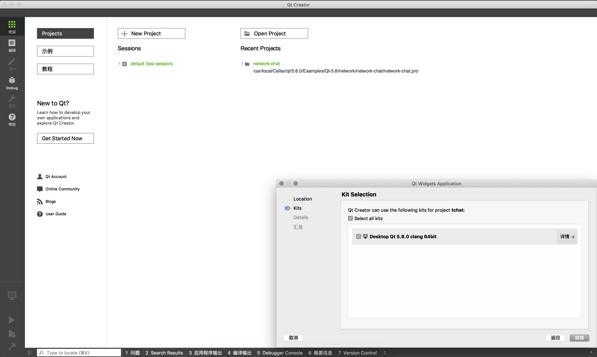
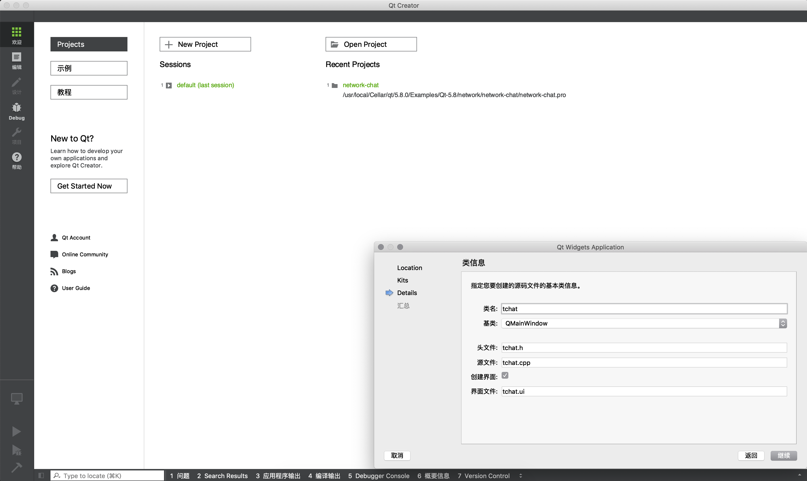
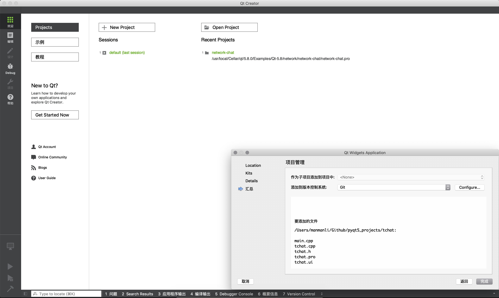
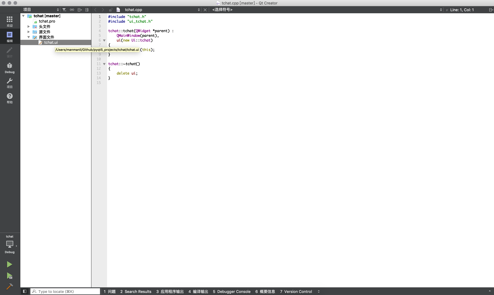
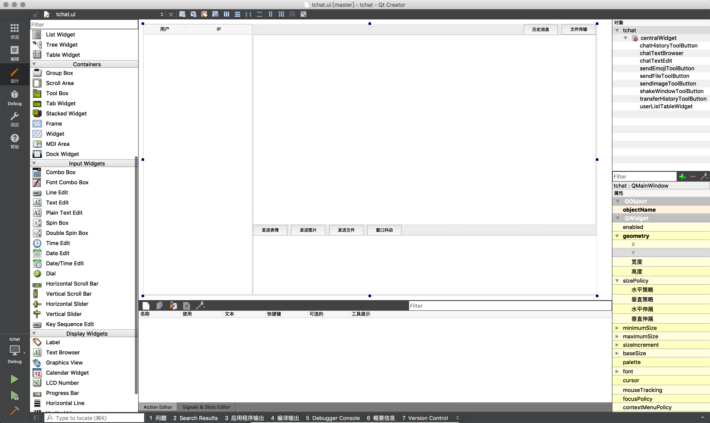
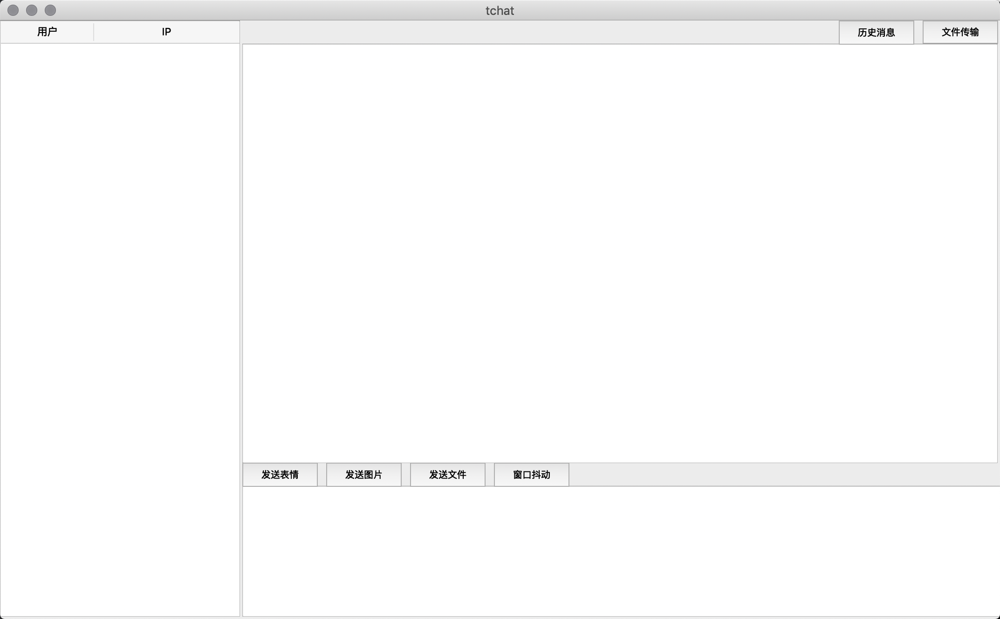
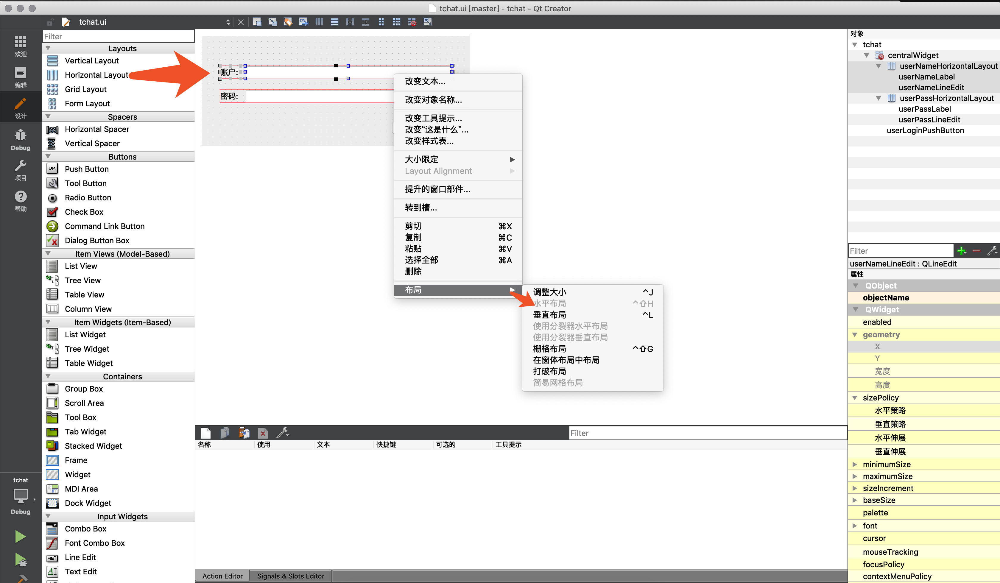

# 简单概述

> 自PyQt5后,原Qt designer等app被统一封装在Qt creator中,自带众多示例并支持项目调试与UI设计

# 常规套路

##  启动应用

> /usr/local/Cellar/qt/5.8.0/Qt Creator.app/Contents/MacOS/Qt Creator

## 创建应用



* 创建包含UI控件的应用



* 指定项目的名称和位置





* 指定项目文件和UI基类名,这个基类将作为后面运行GUI的入口类的基类





* 自动生成.ui文件,双击.ui文件进入图形化设计界面



* 设计模式下可使用现有控件及特性构建复杂的图形化界面,强烈推荐在右上侧对象管理里面为每个控件设置有意义的名称,方便后面转换为Py文件调用

## 转换为Py

> cd /Users/manmanli/Github/pyqt5_projects/tchat
>
> cat tchat.ui

```
<?xml version="1.0" encoding="UTF-8"?>
<ui version="4.0">
 <class>tchat</class>
 <widget class="QMainWindow" name="tchat">
  <property name="geometry">
   <rect>
    <x>0</x>
    <y>0</y>
    <width>1073</width>
    <height>643</height>
   </rect>
  </property>
  <property name="windowTitle">
   <string>tchat</string>
  </property>
  <widget class="QWidget" name="centralWidget">
   <widget class="QTableWidget" name="userListTableWidget">
    <property name="geometry">
     <rect>
      <x>0</x>
      <y>0</y>
      <width>258</width>
      <height>641</height>
     </rect>
    </property>
    <attribute name="horizontalHeaderStretchLastSection">
     <bool>true</bool>
    </attribute>
    <column>
     <property name="text">
      <string>用户</string>
     </property>
    </column>
    <column>
     <property name="text">
      <string>IP</string>
     </property>
    </column>
   </widget>
   <widget class="QTextBrowser" name="chatTextBrowser">
    <property name="geometry">
     <rect>
      <x>260</x>
      <y>25</y>
      <width>811</width>
      <height>451</height>
     </rect>
    </property>
   </widget>
   <widget class="QTextEdit" name="chatTextEdit">
    <property name="geometry">
     <rect>
      <x>260</x>
      <y>500</y>
      <width>821</width>
      <height>141</height>
     </rect>
    </property>
   </widget>
   <widget class="QToolButton" name="chatHistoryToolButton">
    <property name="geometry">
     <rect>
      <x>900</x>
      <y>0</y>
      <width>81</width>
      <height>26</height>
     </rect>
    </property>
    <property name="text">
     <string>历史消息</string>
    </property>
   </widget>
   <widget class="QToolButton" name="transferHistoryToolButton">
    <property name="geometry">
     <rect>
      <x>990</x>
      <y>0</y>
      <width>81</width>
      <height>25</height>
     </rect>
    </property>
    <property name="text">
     <string>文件传输</string>
    </property>
   </widget>
   <widget class="QToolButton" name="sendEmojiToolButton">
    <property name="geometry">
     <rect>
      <x>260</x>
      <y>475</y>
      <width>81</width>
      <height>26</height>
     </rect>
    </property>
    <property name="text">
     <string>发送表情</string>
    </property>
   </widget>
   <widget class="QToolButton" name="sendImageToolButton">
    <property name="geometry">
     <rect>
      <x>350</x>
      <y>475</y>
      <width>81</width>
      <height>26</height>
     </rect>
    </property>
    <property name="text">
     <string>发送图片</string>
    </property>
   </widget>
   <widget class="QToolButton" name="sendFileToolButton">
    <property name="geometry">
     <rect>
      <x>440</x>
      <y>475</y>
      <width>81</width>
      <height>26</height>
     </rect>
    </property>
    <property name="text">
     <string>发送文件</string>
    </property>
   </widget>
   <widget class="QToolButton" name="shakeWindowToolButton">
    <property name="geometry">
     <rect>
      <x>530</x>
      <y>475</y>
      <width>81</width>
      <height>26</height>
     </rect>
    </property>
    <property name="text">
     <string>窗口抖动</string>
    </property>
   </widget>
  </widget>
 </widget>
 <layoutdefault spacing="6" margin="11"/>
 <resources/>
 <connections/>
</ui>
```

> /usr/local/Cellar/pyqt/5.9.2/pyuic5 -o tchat.py tchat.ui
>
> cat   tchat.py

```python
# -*- coding: utf-8 -*-

# Form implementation generated from reading ui file 'tchat.ui'
#
# Created by: PyQt5 UI code generator 5.9.2
#
# WARNING! All changes made in this file will be lost!

from PyQt5 import QtCore, QtGui, QtWidgets

class Ui_tchat(object):
    def setupUi(self, tchat):
        tchat.setObjectName("tchat")
        tchat.resize(1073, 643)
        self.centralWidget = QtWidgets.QWidget(tchat)
        self.centralWidget.setObjectName("centralWidget")
        self.userListTableWidget = QtWidgets.QTableWidget(self.centralWidget)
        self.userListTableWidget.setGeometry(QtCore.QRect(0, 0, 258, 641))
        self.userListTableWidget.setObjectName("userListTableWidget")
        self.userListTableWidget.setColumnCount(2)
        self.userListTableWidget.setRowCount(0)
        item = QtWidgets.QTableWidgetItem()
        self.userListTableWidget.setHorizontalHeaderItem(0, item)
        item = QtWidgets.QTableWidgetItem()
        self.userListTableWidget.setHorizontalHeaderItem(1, item)
        self.userListTableWidget.horizontalHeader().setStretchLastSection(True)
        self.chatTextBrowser = QtWidgets.QTextBrowser(self.centralWidget)
        self.chatTextBrowser.setGeometry(QtCore.QRect(260, 25, 811, 451))
        self.chatTextBrowser.setObjectName("chatTextBrowser")
        self.chatTextEdit = QtWidgets.QTextEdit(self.centralWidget)
        self.chatTextEdit.setGeometry(QtCore.QRect(260, 500, 821, 141))
        self.chatTextEdit.setObjectName("chatTextEdit")
        self.chatHistoryToolButton = QtWidgets.QToolButton(self.centralWidget)
        self.chatHistoryToolButton.setGeometry(QtCore.QRect(900, 0, 81, 26))
        self.chatHistoryToolButton.setObjectName("chatHistoryToolButton")
        self.transferHistoryToolButton = QtWidgets.QToolButton(self.centralWidget)
        self.transferHistoryToolButton.setGeometry(QtCore.QRect(990, 0, 81, 25))
        self.transferHistoryToolButton.setObjectName("transferHistoryToolButton")
        self.sendEmojiToolButton = QtWidgets.QToolButton(self.centralWidget)
        self.sendEmojiToolButton.setGeometry(QtCore.QRect(260, 475, 81, 26))
        self.sendEmojiToolButton.setObjectName("sendEmojiToolButton")
        self.sendImageToolButton = QtWidgets.QToolButton(self.centralWidget)
        self.sendImageToolButton.setGeometry(QtCore.QRect(350, 475, 81, 26))
        self.sendImageToolButton.setObjectName("sendImageToolButton")
        self.sendFileToolButton = QtWidgets.QToolButton(self.centralWidget)
        self.sendFileToolButton.setGeometry(QtCore.QRect(440, 475, 81, 26))
        self.sendFileToolButton.setObjectName("sendFileToolButton")
        self.shakeWindowToolButton = QtWidgets.QToolButton(self.centralWidget)
        self.shakeWindowToolButton.setGeometry(QtCore.QRect(530, 475, 81, 26))
        self.shakeWindowToolButton.setObjectName("shakeWindowToolButton")
        tchat.setCentralWidget(self.centralWidget)

        self.retranslateUi(tchat)
        QtCore.QMetaObject.connectSlotsByName(tchat)

    def retranslateUi(self, tchat):
        _translate = QtCore.QCoreApplication.translate
        tchat.setWindowTitle(_translate("tchat", "tchat"))
        item = self.userListTableWidget.horizontalHeaderItem(0)
        item.setText(_translate("tchat", "用户"))
        item = self.userListTableWidget.horizontalHeaderItem(1)
        item.setText(_translate("tchat", "IP"))
        self.chatHistoryToolButton.setText(_translate("tchat", "历史消息"))
        self.transferHistoryToolButton.setText(_translate("tchat", "文件传输"))
        self.sendEmojiToolButton.setText(_translate("tchat", "发送表情"))
        self.sendImageToolButton.setText(_translate("tchat", "发送图片"))
        self.sendFileToolButton.setText(_translate("tchat", "发送文件"))
        self.shakeWindowToolButton.setText(_translate("tchat", "窗口抖动"))
```

* 可通过如上命令将指定的.ui界面文件转换为.py界面文件然后被其它业务文件所引用

## 调用界面文件

> cd /Users/manmanli/Github/pyqt5_projects/tchat
>
> vim tchat_window.py

```python
#! -*- coding: utf-8 -*-


# author: forcemain@163.com


import sys


from tchat import Ui_tchat
from PyQt5 import QtWidgets


class TchatWindow(QtWidgets.QMainWindow):
    def __init__(self, *args, **kwargs):
        super(TchatWindow, self).__init__(*args, **kwargs)

        self.ui = Ui_tchat()
        self.ui.setupUi(self)


if __name__ == '__main__':
    app = QtWidgets.QApplication(sys.argv)
    win = TchatWindow()
    win.show()
    sys.exit(app.exec_())
```



* PyQt5支持界面和业务分离,使得允许不断对界面文件修改生成Py文件而不影响逻辑层
* 只需继承自创建项目时的基类QtWidgets.QMainWindow,并在初始化时将界面注册到主窗口并调用其show方法即可

# 简单布局

## 用布局管理器布局

## 水平布局

> 鼠标同时选中Label和LineEdit控件右键选择布局->水平布局



### 垂直布局


## 用容器控件布局


