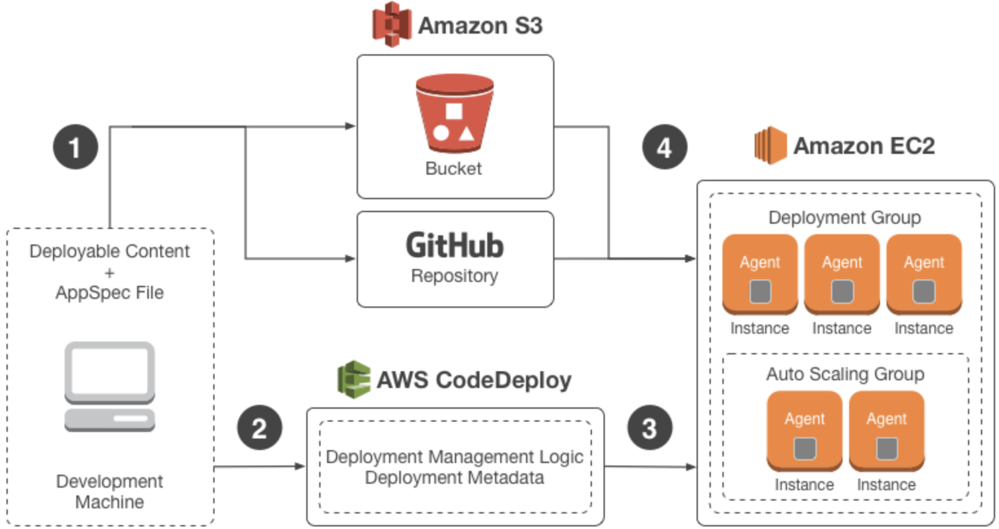

----

* [简单介绍](#简单介绍)
* [原生用法](#原生用法)
* [扩展用法](#扩展用法)
  * [基础扩展](#基础扩展)
  * [装饰扩展](#装饰扩展)
* [实战练习](#实战练习)

----

# 简单介绍

> \_\_ror_\_在Python中表示按位或运算符,只要有一个为1则为1否则为0

# 原生用法

```python
#! -*- coding: utf-8 -*-


# author: forcemain@163.com


import sys


# 补齐转换后的二进制位数为8的倍数
def fbin(num):
    bit_xrange = xrange(8, sys.maxint, 8)
    num_bin = bin(num)
    num_bin_real = num_bin[2:]
    num_bin_read_len = len(num_bin_real)
    for bit in bit_xrange:
        if bit < num_bin_read_len:
            continue
        return '{0}{1}{2}'.format(num_bin[:2], (bit - num_bin_read_len)*'0', num_bin_real)


if __name__ == '__main__':
    fbin_2 = fbin(2)
    fbin_10 = fbin(10)

    print '''
    {0}
    {1}
    {2}
    {3}
    '''.format(fbin_10, fbin_2, '-' * len(fbin_10), 10 | 2)
```

# 扩展用法

## 基础扩展

> 如下通过\_\_ror\_\_模拟类unix管道,实现常规远程代码部署流程

```python
#! -*- coding: utf-8 -*-


# author: forcemain@163.com


import os
from itertools import count


counter = count(start=1)


# 关闭应用
def application_stop(return_code, event, workspace):
    if return_code != 1314:
        return return_code
    # do something
    print '{0}.application_stop'.format(counter.next())

    return return_code, event, workspace


# 下载依赖
def download_bundle(return_code, event, workspace):
    if return_code != 1314:
        return return_code
    # do something
    print '{0}.download_bundle'.format(counter.next())

    return return_code, event, workspace


# 安装之前
def before_install(return_code, event, workspace):
    if return_code != 1314:
        return return_code
    # do something
    print '{0}.before_install'.format(counter.next())

    return return_code, event, workspace


# 安装应用
def application_install(return_code, event, workspace):
    if return_code != 1314:
        return return_code
    # do something
    print '{0}.application_install'.format(counter.next())

    return return_code, event, workspace


# 安装之后
def after_install(return_code, event, workspace):
    if return_code != 1314:
        return return_code
        # do something
    print '{0}.after_install'.format(counter.next())

    return return_code, event, workspace


# 启动应用
def application_start(return_code, event, workspace):
    if return_code != 1314:
        return return_code
        # do something
    print '{0}.application_start'.format(counter.next())

    return return_code, event, workspace


# 验证服务
def validate_service(return_code, event, workspace):
    if return_code != 1314:
        return return_code
        # do something
    print '{0}.validate_service'.format(counter.next())

    return return_code, event, workspace


class Event(object):
    pass


# 管道实现
class Pipe(object):
    def __init__(self, func):
        self.func = func

    def __ror__(self, other):
        if not isinstance(other, (tuple, list)):
            return self.func(other)
        return self.func(*other)


if __name__ == '__main__':
    # 参数传递
    (1314, Event(), os.path.dirname(__file__)) | Pipe(application_stop) \
                                               | Pipe(download_bundle) \
                                               | Pipe(before_install) \
                                               | Pipe(application_install) \
                                               | Pipe(after_install) \
                                               | Pipe(application_start) \
                                               | Pipe(validate_service)
```


## 装饰扩展

> 如下通过\_\_ror\_\_模拟类unix管道,实现常规远程代码部署流程

```python
#! -*- coding: utf-8 -*-


# author: forcemain@163.com


import os
from itertools import count

# 计数类
counter = count(start=1)


# 事件类
class Event(object):
    pass


# 管道类
class Pipe(object):
    def __init__(self, func):
        self.func = func

    def __ror__(self, other):
        if not isinstance(other, (tuple, list)):
            return self.func(other)
        return self.func(*other)
	
    # 管道后函数扩展支持参数,但依然需要是一个Pipe对象
    def __call__(self, *args, **kwargs):
        return Pipe(lambda return_code: self.func(return_code, *args, **kwargs))


# 关闭应用    
@Pipe
def application_stop(return_code, event, workspace):
    if return_code != 1314:
        return return_code
    # do something
    print '{0}.application_stop'.format(counter.next())

    return return_code


# 下载依赖
@Pipe
def download_bundle(return_code, event, workspace):
    if return_code != 1314:
        return return_code
    # do something
    print '{0}.download_bundle'.format(counter.next())

    return return_code


# 安装之前
@Pipe
def before_install(return_code, event, workspace):
    if return_code != 1314:
        return return_code
    # do something
    print '{0}.before_install'.format(counter.next())

    return return_code


# 安装应用
@Pipe
def application_install(return_code, event, workspace):
    if return_code != 1314:
        return return_code
    # do something
    print '{0}.application_install'.format(counter.next())

    return return_code


# 安装之后
@Pipe
def after_install(return_code, event, workspace):
    if return_code != 1314:
        return return_code
        # do something
    print '{0}.after_install'.format(counter.next())

    return return_code


# 启动应用
@Pipe
def application_start(return_code, event, workspace):
    if return_code != 1314:
        return return_code
        # do something
    print '{0}.application_start'.format(counter.next())

    return return_code


# 验证服务
@Pipe
def validate_service(return_code, event, workspace):
    if return_code != 1314:
        return return_code
        # do something
    print '{0}.validate_service'.format(counter.next())

    return return_code


if __name__ == '__main__':
    # 参数传递
    event, workspace = Event(), os.path.dirname(__file__)
    1314 | application_stop(event, workspace) \
         | download_bundle(event, workspace) \
         | before_install(event, workspace) \
         | application_install(event, workspace) \
         | after_install(event, workspace) \
         | application_start(event, workspace) \
         | validate_service(event, workspace)
```

# 实战练习

* 根据AWS[代码部署](#https://docs.aws.amazon.com/zh_cn/codedeploy/latest/userguide/welcome.html)规范配合\_\_ror\_\_管道简单实现如下通用部署架构 ?
  * 思考
    * 如何用代码描述整个流程 ?
    * 如何异步通知服务端部署状态以及进度 ?



> vim deploy/basehandler.py

```python
#! -*- coding: utf-8 -*-


import os
import time
import fcntl
import signal
import subprocess


from agent.common.logger import Logger


logger = Logger.get_logger(__name__)


# 基类部署处理器
class BaseDeployHandler(object):
    def __init__(self, engine=None):
        # 部署描述对象
        self._specs = None
        # 部署事件对象
        self.pevent = None
        # 处理引擎对象
        self.engine = engine

    @property
    def appspec(self):
        return self._specs

    @appspec.setter
    def appspec(self, appspec):
        self._specs = appspec

    def deploy(self, event):
        raise NotImplementedError

    def download(self, event):
        raise NotImplementedError

    # 根据不同的hook_name从部署描述对象回去对应的hook脚本执行
    def _hook_dispatch(self, hook_name, return_code, event, workspace):
        return_code = return_code
        if return_code != 1314:
            return return_code

        hooks = self.appspec.get_hooks()
        if hook_name not in hooks or len(hooks[hook_name]) == 0:
            return_code = 1314
            _message = 'Not found {0} hook scripts, skipped'.format(hook_name)
            self.engine.error(self.pevent, _message)
            return return_code

        _scripts = hooks[hook_name]
        _message = 'Start Load {0} hook scripts'.format(hook_name)
        self.engine.info(self.pevent, _message)
        for script in _scripts:
            if 'timeout' not in script or 'location' not in script:
                _message = 'Invalid {0} hook script, (timeout, location) required'.format(hook_name)
                self.engine.error(self.pevent, _message)
                return_code = 1313
                break
            script_timeout, script_location = script['timeout'], script['location']
            script_file = os.path.join(workspace, script_location)
            command = 'sh {0} 2>&1'.format(script_file)
            os.environ.update({'PYTHONIOENCODING': 'utf-8'})
            # 异步执行
            p = subprocess.Popen(command, shell=True, close_fds=True, stdout=subprocess.PIPE, stderr=subprocess.PIPE,
                                 preexec_fn=os.setsid, env=os.environ, cwd=workspace)
            fd = p.stdout.fileno()
            fl = fcntl.fcntl(fd, fcntl.F_GETFL)
            fcntl.fcntl(fd, fcntl.F_SETFL, fl | os.O_NONBLOCK)

            interrupt = False
            p_running = time.time()
            p_timeout = int(script_timeout)
            # 等待执行结果或超时
            while True:
                p_during = time.time() - p_running
                if p_during > p_timeout:
                    p.terminate()
                    p.wait()
                    try:
                        os.killpg(p.pid, signal.SIGTERM)
                    except OSError:
                        pass
                    interrupt = True
                    return_code = 1312
                    break
                logger.debug('Script: {0}(timeout: {1}s) left {2} secomnds force exit'.format(
                    script_file, p_timeout, p_timeout - p_during
                ))
                try:
                    line = p.stdout.readline()
                except IOError:
                    time.sleep(0.1)
                    continue
                if line == b'' and p.poll() is not None:
                    break
                self.engine.info(self.pevent, line)
            if interrupt is False and p.returncode != 0:
                return_code = 1313
                while True:
                    line = p.stderr.readline()
                    if line == b'':
                        break
                    self.engine.error(self.pevent, line)

            if return_code != 1314:
                break

        _message = 'Finish exec {0} hook scripts, return_code: {1}'.format(hook_name, return_code)
        if return_code != 1314:
            self.engine.error(self.pevent, _message)
        else:
            self.engine.info(self.pevent, _message)

        return return_code

    def _application_stop(self, return_code, event, workspace):
        return_code = 1313

        return return_code

    def _download_bundle(self, return_code, event, workspace):
        return_code = 1313

        return return_code

    def _before_install(self, return_code, event, workspace):
        return_code = 1313

        return return_code

    def _application_install(self, return_code, event, workspace):
        return_code = 1313

        return return_code

    def _after_install(self, return_code, event, workspace):
        return_code = 1313

        return return_code

    def _application_start(self, return_code, event, workspace):
        return_code = 1313

        return return_code

    def _validate_service(self, return_code, event, workspace):
        return_code = 1313

        return return_code

    def deployer_notexists(self, event):
        parent_event = event.get_event()
        event_name = event.get_app_name()
        message = 'No deploy handler handle event: {0}'.format(event_name)

        logger.warning(message)
        self.engine.async_logging('WARN', parent_event, message)
```

> vim deploy/_code.py

````python
#! -*- coding: utf-8 -*-


import os
import urllib
import shutil


from agent.common.enhance import Pipe
from agent.common.logger import Logger
from agent.common.zipfile import ZipFile
from agent.models.deploy.pub_appspec import PubAppSpec
from agent.handler.deploy.basehandler import BaseDeployHandler


logger = Logger.get_logger(__name__)


# 代码部署处理器
class CodeDeployHandler(BaseDeployHandler):
    def deploy(self, event):
        workspace = self.download(event)
        if workspace is None:
            return_code = 1313
            return return_code

        return self.deploy_code(event, workspace)

    def deploy_code(self, event, workspace):
        # 管道使用
        return_code = 1314 | Pipe(self._application_stop)(event, workspace) |\
                      Pipe(self._download_bundle)(event, workspace) | Pipe(self._before_install)(event, workspace) |\
                      Pipe(self._application_install)(event, workspace) | Pipe(self._after_install)(event, workspace) |\
                      Pipe(self._application_start)(event, workspace) | Pipe(self._validate_service)(event, workspace)

        return return_code
    
    # 验证描述配置
    def validate_appspec(self, dpath):
        appspec_path = os.path.join(dpath, 'appspec.json')
        with open(appspec_path, 'r+b') as fd:
            self.appspec = PubAppSpec.from_json(fd.read())

        return self.appspec.is_valid()

    def get_unzip_path(self, event, frelease):
        app_id = event.get_app_id()
        revision_id = event.get_revision_id()
        dpath = os.path.join(self.engine.channel_handler.dcache_path, app_id, revision_id, frelease)

        return dpath

    def force_unzip(self, spath, dpath):
        if not os.path.exists(dpath):
            os.makedirs(dpath)

        z = ZipFile(spath)
        z.extractall(dpath)
        z.close()

    def download_retrieve(self, url, path):
        def _retrieve(blocknum, blocksize, totalsize):
            percent = 100.0 * blocknum * blocksize / totalsize
            percent = 100 if percent > 100 else percent
            _message = 'Download progress: %.2f%%' % (percent,)
            self.engine.info(self.pevent, _message)

        urllib.urlretrieve(url, path, _retrieve)

    def download(self, event):
        workspace = None
        download_url = event.get_download_url()

        self.pevent = event.get_event()
        parent_timestamp = self.pevent.get_event_timestamp()
        frelease = '{0}_release'.format(parent_timestamp)
        filename = '{0}.zip'.format(frelease)
        filepath = os.path.join(self.engine.channel_handler.dcache_path, filename)

        app_name = event.get_app_name()
        app_revision = event.get_app_revision()
        _message = 'Start download application: {0} revision: {1} from {2}'.format(app_name, app_revision, download_url)
        self.engine.info(self.pevent, _message)

        self.download_retrieve(download_url, filepath)

        if os.path.exists(filepath):
            filesize = os.path.getsize(filepath)
            if filesize > 0:
                _message = 'Download to {0} success, filesize: {1}'.format(filepath, filesize)
                self.engine.info(self.pevent, _message)

                spath, dpath = filepath, self.get_unzip_path(event, frelease)
                _message = 'Start unzip {0} to {1}'.format(spath, dpath)
                self.engine.info(self.pevent, _message)
                self.force_unzip(spath, dpath)
                _message = 'Start validate required appspec.json from {0}'.format(dpath)
                self.engine.info(self.pevent, _message)
                is_valid = self.validate_appspec(dpath)
                if is_valid:
                    _message = 'Validate appspec.json from {0} success'.format(dpath)
                    self.engine.info(self.pevent, _message)
                    workspace = dpath
                else:
                    _message = 'Validate appspec.json from {0} failed'.format(dpath)
                    self.engine.error(self.pevent, _message)
                    workspace = workspace

                # reverse 3 backup release
                base_path = os.path.dirname(dpath)
                releases = sorted(os.listdir(base_path), reverse=True)
                for release in releases[3:]:
                    abs_path = os.path.join(base_path, release)
                    shutil.rmtree(abs_path)
                    zip_path = os.path.join(self.engine.channel_handler.dcache_path, '{0}.zip'.format(release))
                    if not os.path.exists(zip_path):
                        continue
                    os.remove(zip_path)
            else:
                _message = 'Download to {0} failed, filesize: {1}'.format(filepath, filesize)
                self.engine.error(self.pevent, _message)
        else:
            _message = 'Download to {0} failed'.format(filepath)
            self.engine.error(self.pevent, _message)

        return workspace

    def _application_stop(self, return_code, event, workspace):
        hook_name = 'application_stop'

        return self._hook_dispatch(hook_name, return_code, event, workspace)

    def _download_bundle(self, return_code, event, workspace):
        hook_name = 'download_bundle'

        return self._hook_dispatch(hook_name, return_code, event, workspace)

    def _before_install(self, return_code, event, workspace):
        hook_name = 'before_install'

        return self._hook_dispatch(hook_name, return_code, event, workspace)

    def _application_install(self, return_code, event, workspace):
        hook_name = 'application_install'

        files = self.appspec.get_files()
        for file_map in files:
            if 'source' not in file_map or 'destination' not in file_map:
                _message = 'Invalid file map, (source, destination) required'
                self.engine.error(self.pevent, _message)
                return_code = 1313
                break
            source, destination = file_map['source'], file_map['destination']
            if (destination.endswith('.war') or
                    destination.endswith('.jar') or
                    destination.endswith('.so') or
                    destination.endswith('.zip')):
                destination = os.path.dirname(destination)
            if not source.startswith('/'):
                source = os.path.join(workspace, source)
            else:
                source = '{0}{1}'.format(workspace, source)
            _message = 'Copy {0} to {1}'.format(source, destination)
            self.engine.info(self.pevent, _message)

            if os.path.isdir(source):
                shutil.copytree(source, destination)
            else:
                shutil.copy(source, destination)

        return self._hook_dispatch(hook_name, return_code, event, workspace)

    def _after_install(self, return_code, event, workspace):
        hook_name = 'after_install'

        return self._hook_dispatch(hook_name, return_code, event, workspace)

    def _application_start(self, return_code, event, workspace):
        hook_name = 'application_start'

        return self._hook_dispatch(hook_name, return_code, event, workspace)

    def _validate_service(self, return_code, event, workspace):
        hook_name = 'validate_service'

        return self._hook_dispatch(hook_name, return_code, event, workspace)

````


