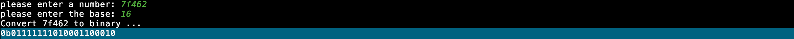
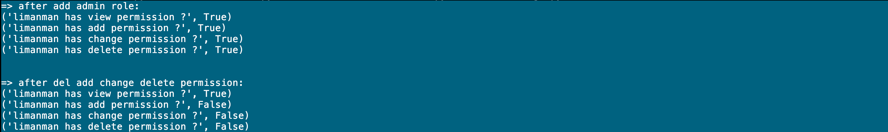

----

* [数字类型](#数字类型)
  * [整数](#整数)
    * [对象创建](#对象创建)
    * [进制转换](#进制转换)
    * [精度扩展](#精度扩展)
  * [浮点数](#浮点数)
    * [对象创建](#对象创建)
    * [精度丢失](#精度丢失)
  * [复数](#复数)
    * [创建对象](#创建对象)
* [数字操作](#数字操作)
  * [赋值运算](#赋值运算)
  * [身份运算](#身份运算)
  * [比较运算](#比较运算)
  * [数学运算](#数学运算)
  * [逻辑运算](#逻辑运算)
  * [位移运算](#位移运算)
* [对象方法](#对象方法)
* [相关函数](#相关函数)
* [相关模块](#相关模块)
* [本章习题](#本章习题)

----

# 数字类型

>   数字并不是一个真正的对象类型,而是一组类似类型的分类

## 整数

>   整数包含正数,负数和0,同时允许使用二进制, 八进制, 十六进制字面量表示

````python
# 整数类型
# -521, 521, 0, 无群小~无群大(只和内存有关)

# 向内存申请一空闲内存单元存储521并将变量名dec_num指向此内存单元的地址
# 十进制
>>> dec_num = 521
# 二进制
>>> bin_num = 0b1000001001
# 八进制
# for Python2
>>> oct_num = 01011
# for Python3
>>> oct_num = 0o1011
# 16进制
>>> hex_num = 0x209
>>> type(dec_num), type(bin_num), type(oct_num), type(hex_num)
(<type 'int'>, <type 'int'>, <type 'int'>, <type 'int'>)
# 查看变量dec_num类型的定义
>>> help(dec_num)
# 查看变量dec_num类型的属性和方法
>>> dir(dec_num)
````

### 对象创建

```python
# 方式一: 通过字面量形式创建
>>> 521
521

# 方式二: 通过类型创建
"""
int(x=0) -> int or long
int(x, base=10) -> int or long
"""
>>> int('521')
521
>>> int('1000001001', base=2)
521
>>> int('1011', base=8)
521
>>> int(521)
521
>>> int('200', base=16)
521
```

### 进制转换

>   核心思想就是D进制满D向左进1位,也就是说从右到左的基数依次为d^0^~d^n^

```bash
# 十进制, 满十进一位
> 521
= 1 * 1    + 2 * 10   + 5 * 100
= 1*10^0 + 2*10^1 + 5*10^2

# 二进制, 满二进一位
> 1000001001
= 1*2^0 + 0*2^1 + 0*2^2 + 1*2^3 + 0*2^4 + 0*2^5 + 0*2^6 + 0*2^7 + 0*2^8 + 1*2^9

# 八进制, 满八进一位
> 1011
= 1*8^0 + 1*8^1 + 0*8^2 + 1*8^3

# 16进制, 满16进一位
# 0 1 2 3 4 5 6 7 8 9 a(10) b(11) c(12) d(13) e(14) f(15)
> 209
= 9*16^0 + 0*16^1 + 2*16^2
```

### 精度扩展

>   Python2中会自动将大整数转换为长整型数并且以后缀l/L标识,但Python3中则隐藏了此默认行为

```python
>>> import sys

# for Python2
>>> sys.maxint + 1
9223372036854775808L

# for Python3
>>> sys.maxsize + 1
9223372036854775808
```

##  浮点数

>   浮点数为包含小数部分的数字,同时允许使用单点,科学计数法的字面量表示

```python
# 浮点数类型
# 5.21, .5, 5., 5.21e2/5.21E2, 512e-2/512E-2

# 向内存申请一空闲内存单元存储5.21并将变量名f指向此内存单元的地址
>>> f = 5.21
>>> type(f)
<type 'float'>
# 查看变量f类型的定义
>>> help(f)
# 查看变量f类型的属性和方法
>>> dir(f)
```

### 对象创建

```python
# 方式一: 通过字面量形式创建
>>> 5.21
5.21

# 方式二: 通过类型创建
"""
float(x) -> floating point number
"""
>>> float(521)
521.0
```

### 精度丢失

>   浮点数转换二进制时可能出现死循环,CPU为了阻止此默认行为而导致的精度丢失是必然行为且不可控

```python
# 问题: 浮点数运算为何会丢失精度?
>>> 0.2 + 0.4
0.6000000000000001

# 模拟: 浮点数转二进制通过不断乘2直至小数部分为0,然后倒序组合整数部分与0.组合即为二进制
"""
部分浮点数如0.2,0.4会导致转换过程死循环,CPU会在计算到固定位数时中断此行为,所以就出现了精度丢失的问题
"""
# 0.2转换为二进制模拟 0.0011...
0.2 * 2 = 0.4,整数部分为0,小数部分为0.4
0.4 * 2 = 0.8,整数部分为0,小数部分为0.8
0.8 * 2 = 1.6,整数部分为1,小数部分为0.6
0.6 * 2 = 1.2,整数部分为1,小数部分为0.2   # 无限循环

# 0.4转换为二进制模拟 0.0110...
0.4 * 2 = 0.8 整数部分为0,小数部分为0.8
0.8 * 2 = 1.6 整数部分为1,小数部分为0.6
0.6 * 2 = 1.2 整数部分为1,小数部分为0.2
0.2 * 2 = 0.4 整数部分为0,小数部分为0.4   # 无限循环


# 解决: 使用双精度浮点数或分数精确表示
# 方式一: 使用decimal.Decimal类转换为小数对象
"""
优点: 从代码层面模拟CPU算法支持精确到任意精度
缺点: 提升精度的同时会带来性能上的损耗
"""
>>> from decimal import Decimal
>>> Decimal('0.2') + Decimal('0.4')
Decimal('0.6')
# 方式二: 使用fractions.Fraction类转换为分子对象
>>> Fraction('0.2') + Fraction('0.4')
Fraction(3, 5)
```

## 复数

>   复数为包含实部和虚部(以j或J结尾)的数字

```python
# 复数类型
# 100j

# 向内存申请一空闲内存单元存储0+100j并将变量名c指向此内存单元的地址
>>> c = 0+100j
>>> type(c)
<type 'complex'>
# 查看变量c类型的定义
>>> help(c)
# 查看变量c类型的属性和方法
>>> dir(c)
```

### 创建对象

```python
# 方式一: 通过字面量形式创建
>>> 0 + 100j
100j

# 方式二: 通过类型创建
"""
complex(real[, imag]) -> complex number
"""
>>> complex(0, 100)
100j
```

# 数字操作

:point_right: 混合操作符优先级问题可通过括号()提升优先级解决

:point_right: 混合类型的转换以复杂度为基准,会自动转换至复杂度最高的类型

## 赋值运算

>   向内存申请一空闲内存单元存储数字然后将变量名指向此内存单元,至此可通过变量名操作此内存单元数据

```python
>>> x = 521
>>> y = 52.1
>>> z = 5.21
```

## 身份运算

>   常用于比较两个对象是否指向同一个内存单元

```python
# 为避免频繁分配释放内存,解释器预先将-5~256的小整数作为索引将值存入small_ints列表对应的内存单元
# 至此声明变量右侧值为小整数时会首先在small_ints列表中索引是否存在,如果存在则直接将变量名指向此地址
>>> n1 = 1
>>> n2 = 1
>>> n1 is n2
True

>>> n1 = 521
>>> n2 = 521
>>> n1 is n2
False

# 对于单行多个赋值的特殊情况,如果值相同会将变量名指向同一块儿内存单元
>>> n1 = 521; n2 = 521; n3 = 521
>>> n1 is n2 is n3
True
```

## 比较运算

>   结果总是被隐式转换为布尔对象

```python
# 值比较
# 小于
>>> y < x
True

# 小于等于
>>> x <= x
True

# 大于
>>> x > y
True

# 大于等于
>>> x >= y
True

# 等于
>>> x == x
True

# 不等于
# for Python2
>>> x != y
True
>>> x <> y
True
# for Python3
>>> x != y
True

# 地址比较
>>> id(x), id(521)
(140428868352096, 140428868352072)
>>> x is 521
False
```

:point_right: 比较操作符支持连续使用如5.21 < 52.1 < 521等同于5.21 < 52.1 and 52.1 < 521

## 数学运算

>   结果总是隐式转换为复杂类型

```python
# 正负
>>> +x
521
>>> -x
-521

# 加法,可结合赋值运算+=
>>> x + 0
521

# 减法,可结合赋值运算-=
>>> x - 21
500

# 乘法,可结合赋值运算*=
>>> z * 100
521.0

# 除法,可结合赋值运算/=或//=
"""
兼容特性: from __future__ import division
"""
# Python2中对于包含小数使用真除法(保留小数部分,最终为小数)
>>> x / 100.
5.21
# Python3中对于包含小数使用真除法(保留小数部分,最终为小数)
>>> x / 100.
5.21
# Python2中对于全整数使用传统除法(保留整数部分,最终为整数)
>>> x / 100
5
# Python3中对于全整数使用真除法(保留小数部分,最终为小数)
>>> x / 100
5.21
# Python2中对于包含小数使用地板除(保留整数部分,最终为小数)
# Python3中对于包含小数使用地板除(保留整数部分,最终为小数)
>>> x // 100.
5.0
# Python2中对于全整数使用地板除(保留整数部分,最终为整数)
# Python3中对于全整数使用地板除(保留整数部分,最终为整数)
>>> x // 100
5

# 取模,可结合赋值运算%=
>>> x % 2
1

# 乘方,可结合赋值运算**=
>>> z * 10 ** 2
521.0
```

## 逻辑运算

```python
# 与, 都为真为真
>>> x and y
52.1

# 或, 一个真即真
>>> x or y
521

# 非,总是隐式转换为布尔对象
>>> not x
False
```

## 位移运算

```python
>>> bin(x)
'0b1000001001'

# 左移,可结合赋值运算<<=
"""
规则: 左
"""
>>> bin(x << 2)
'0b100000100100'

# 右移,可结合赋值运算>>=
>>> bin(x >> 2)
'0b10000010'

# 位与,可结合赋值运算&=
"""
规则: 都为1为1,否则为0
100000100100
000010000010
------------
000000000000
"""
>>> 0b100000100100 & 0b10000010
0

# 位或,可结合赋值运算|=
"""
规则: 存在1为1,否则为0
100000100100
000010000010
------------
100010100110
"""
>>> 0b100000100100 | 0b10000010
2214

# 异或,可结合赋值运算^=
"""
规则: 不同为1,相同为0
100000100100
000010000010
----------
100010100110
"""
>>> 0b100000100100 ^ 0b10000010
2214

# 取反,可结合赋值运算～=
"""
规则: 1变为0,0变为1
0000001000001001
----------------
1111110111110110  取反,此时最高位为1表示负数,负数的存储需要将其转换为补码
----------------
1000001000001001  反码,保持符号位不变,其它位置取反
----------------
1000001000001010  补码,在反码的基础上最低位+1
----------------
-522
"""
>>> ~0b1000001001
-522
```

:point_right: 位或运算等同于十进制加法,基于此值之上与操作数位与等同于求操作数,反之与操作数取反位与等同于求被操作数,通常被用于权限模型

# 对象方法

| 方法                | 版本 | 说明                               |
| ------------------- | ---- | ---------------------------------- |
| .bit_length()       |      | 计算数字二进制位数并返回           |
| .as_integer_ratio() |      | 将浮点数转换为分数并以元祖形式返回 |

```python
# .bit_length()
# 方式一: 低效率
>>> len(bin(x)) - 2
10
# 方式二: 高效率
>>> x.bit_length()
10

# .as_integer_ratio()
>>> z.as_integer_ratio()
(5865938514650071, 1125899906842624)
```

# 相关函数

>   函数的参数可以是变量也可以是字面量哟～

| 函数                     | 说明                                        |
| ------------------------ | ------------------------------------------- |
| bin(number)              | 将整数转换为二进制字符串并返回              |
| oct(number)              | 将整数转换为八进制字符串并返回              |
| int(x, base=10)          | 将base进制字符串x转换为十进制整数并返回     |
| hex(number)              | 将整数转换为十六进制字符串并返回            |
| pow(x, y[, z])           | 计算x的y次方后选择性对z取模并返回           |
| abs(number)              | 计算数字number的绝对值并返回                |
| round(number[, ndigits]) | 将数字number四舍五入保留ndigits位小数并返回 |

```python
# bin(number)
>>> bin(521)
'0b1000001001'

# oct(number)
>>> oct(521)
'01011'

# int(x, base=10)
>>> int('1000001001', base=2)
521
>>> int('1011', base=8)
521

# hex(number)
>>> hex(521)
'0x209'

# pow(x, y[, z])
>>> 5 * pow(10, 2) + 2 * pow(10, 1) + 1 * pow(10, 0)
521
>>> 5 * 10 ** 2 + 2 * 10 ** 1 + 1 * 10 ** 0
521
# 求根: 方式一
>>> import math
>>> math.sqrt(521)
22.825424421026653
# 求根: 方式二
>>> pow(521, .5)
22.825424421026653
# 求根: 方式三
>>> 521 ** .5
22.825424421026653

# abs(number)
>>> abs(-521)
521

# round(number[, ndigits])
>>> round(5.21, 0)
5.0
```

# 相关模块

>   内置数字相关模块请可参考([2.x](https://docs.python.org/2/library/numeric.html), [3.x](https://docs.python.org/zh-cn/3.7/library/numeric.html))

| 模块                        | 版本 | 说明                                                      |
| --------------------------- | ---- | --------------------------------------------------------- |
| [NumPy](https://numpy.org/) |      | 纯C\|C++编写的存储和处理大型矩阵的知名科学计算库,性能极高 |

# 本章习题

1.  编写一个脚本,要求将用户输入的指定进制的数字字符串转换为二进制字符串(若没思路可使用内置函数)?



```python
#! -*- coding: utf-8 -*-


# compatible / in python3
from __future__ import division
# compatible print in python3
from __future__ import print_function


# import build-in models
import platform


# got interpreter version
is_python2 = platform.python_version_tuple() < ('3',)
is_python3 = not is_python2

# compatible input in python2
input = input if is_python3 else raw_input


if __name__ == '__main__':
    target_base = 2
    bases = ('2', '8', '10', '16')
    # binary digits
    bindigits = '01'
    # octal digits
    octdigits = '012345678'
    # decimal digits
    decdigits = '0123456789'
    # hex digits
    hexdigits = '0123456789abcdefABCDEF'

    number = input('please enter a number: ')
    for i, c in enumerate(number):
        # can't start with 0
        if i == 0 and c == '0':
            print('Invalid number, exit')
            exit()
        # can only 0123456789abcdefABCDEF
        if c not in hexdigits:
            print('Invalid number, exit')
            exit()

    base = input('please enter the base: ')
    # can only support 2 8 10 16
    if base not in bases:
        print('Invalid target base, exit')
        exit()

    print('Convert %s to binary ...' % number)

    base = int(base)
    result = ''
    # binary
    if base == target_base:
        # can only 01
        for c in number:
            if c not in bindigits:
                print('Invalid binary number, exit')
                exit()
        result = number
    # decimal
    if base == 10:
        # can only 0123456789
        for c in number:
            if c not in decdigits:
                print('Invalid decimal number, exit')
                exit()
        number = int(number)
        while True:
            # quotient
            quotient = number // target_base
            # remainder
            remainder = number % target_base
            # append bit to result
            result += str(remainder)
            if quotient == 0:
                break
            # continue
            number = quotient
        # reverse
        result = result[::-1]
    # octal
    if base == 8:
        # can only 012345678
        for c in number:
            if c not in octdigits:
                print('Invalid octal number, exit')
                exit()
            # 1 octal to 3 binary
            c = int(c)
            current_result = ''
            while True:
                # quotient
                quotient = c // target_base
                # remainder
                remainder = c % target_base
                # append bit to result
                current_result += str(remainder)
                if quotient == 0:
                    break
                # continue
                c = quotient
            # got 3 binary
            current_result += (3 - len(current_result)) * '0'
            # add reversed current result
            result += current_result[::-1]
    # hex decimal
    if base == 16:
        # convert hex letter to int number
        character_map = {
            '0': 0,  '1': 1,  '2': 2,  '3': 3,  '4': 4,  '5': 5, '6': 6, '7': 7, '8': 8, '9': 9,
            'a': 10, 'b': 11, 'c': 12, 'd': 13, 'e': 14, 'f': 15,
            'A': 10, 'B': 11, 'C': 12, 'D': 13, 'E': 14, 'F': 15
        }
        for c in number:
            # 1 hex to 4 binary
            c = character_map[c]
            current_result = ''
            while True:
                # quotient
                quotient = c // target_base
                # remainder
                remainder = c % target_base
                # append bit to result
                current_result += str(remainder)
                if quotient == 0:
                    break
                # continue
                c = quotient
            # got 4 binary
            current_result += (4 - len(current_result)) * '0'
            # add reversed current result
            result += current_result[::-1]
    # format print
    print('0b%s' % result)
```

2.  编写一个脚本,利用位运算设计一个权限管理模块, 目前着重介绍思路即可(若没思路可百度) ?



```python
#! -*- coding: utf-8 -*-


import os


class Permission(object):
    """Permission class"""
    _COUNT = 0

    def __new__(cls, *args, **kwargs):
        """constructor
        1.accumulative static variable _COUNT for current permission value
        """
        cls._COUNT += 1
        return super(Permission, cls).__new__(cls, *args, **kwargs)

    def __init__(self, name, value=None, detail=''):
        """initialization
        :param name: permission alias name
        :param value: permission bin value
        :param detail: permission more detail
        """
        self.name = name
        self.value = value or (1 << self._COUNT)
        self.detail = detail


class PermissionMixin(object):
    """PermissionMixin
    1.provide public permission operation interface
    """
    def __init__(self, permissions):
        """initialization
        :param permissions: bin permissions
        """
        self._permissions = permissions

    @property
    def permissions(self):
        """got bin permissions"""
        return self._permissions

    @permissions.setter
    def permissions(self, p):
        """set bin permissions"""
        self._permissions = p

    def _allow_permission(self, p):
        """add bin permission
        1. add bin permission to permissions with | bit operation

        00000001  -> 1
        |
        00000010  -> 2
        --------
        00000011  -> 3
        """
        self._permissions = p.value if not self._permissions else (self._permissions | p.value)

    def allow(self, *p):
        """add onr or more permissions"""
        map(lambda _p: self._allow_permission(_p), p)

    def _deny_permission(self, p):
        """del bin permission
        1. del bin permission from permissions with & ~ bit operation


        00000010  -> 2
        ~
        --------
        11111101

        00000011  -> 3
        &
        11111101
        --------
        00000001  -> 1
        """
        self._permissions = p.value if not self._permissions else (self._permissions & ~p.value)

    def deny(self, *p):
        """del one or more permissions"""
        map(lambda _p: self._deny_permission(_p), p)

    def has_permission(self, p):
        """check permission
        1. return False directly with not permissions
        2. check has permission ?

        00000011  -> 3
        &
        00000010  -> 2
        --------
        00000010  -> 2
        """
        if not self.permissions:
            return False
        return self._permissions & p.value == p.value


class Role(PermissionMixin):
    """Role inherit from PermissionMixin"""
    def __init__(self, name, permissions=None, detail=''):
        """initialization
        :param name: role name
        :param permissions: role bin permissions
        :param detail: role more detail
        """
        self.name = name
        self.detail = detail

        # use PermissionMixin interface
        super(Role, self).__init__(permissions=permissions)


class User(PermissionMixin):
    """User inherit from PermissionMixin"""
    def __init__(self, name, permissions=None, roles=None):
        """initialization
        :param name: user name
        :param permissions: user permissions
        :param roles: user roles
        """
        self.name = name
        self._roles = roles or []

        # use PermissionMixin interface
        super(User, self).__init__(permissions=permissions)
        # update user permissions
        self._update_permissions()

    def _update_permissions(self):
        """update user permissions
        1. return directly with no roles
        2. merge roles bin permissions as user bin permissions
        """
        if not self._roles:
            return
        for r in self._roles:
            if not self.permissions:
                self.permissions = r.permissions
                continue
            self.permissions |= r.permissions

    @property
    def roles(self):
        """got roles"""
        return self._roles

    def set_roles(self, roles):
        """set roles"""
        # roles data type must be tuple or list
        assert isinstance(roles, (tuple, list))

        self._roles = roles
        # update user permissions
        self._update_permissions()

    def _add_role(self, r):
        """add role"""
        if r in self._roles:
            return
        self._roles.append(r)

    def add_role(self, *r):
        """add roles"""
        map(lambda _r: self._add_role(_r), r)
        # update user permissions
        self._update_permissions()

    def _delete_role(self, r):
        """delete role"""
        if r not in self._roles:
            return
        self._roles.remove(r)

    def remove_role(self, r):
        """delete roles"""
        map(lambda _r: self._delete_role(_r), r)
        # update user permissions
        self._update_permissions()


if __name__ == '__main__':
    # define view, add, change, delete permission object
    view = Permission('view', detail='view permission, 1=0b0000001')
    add = Permission('add', detail='add permission, 2=0b0000010')
    change = Permission('change', detail='change permission, 4=0b0000100')
    delete = Permission('delete', detail='delete permission, 8=0b0001000')

    # define admin role object
    admin = Role('admin', detail='superuser')
    # allow permissions
    admin.allow(view, add, change, delete)

    # define limanman user object
    limanman = User(name='limanman')
    # add role
    limanman.add_role(admin)
    print('=> after add admin role:')
    print('limanman has view permission ?', limanman.has_permission(view))
    print('limanman has add permission ?', limanman.has_permission(add))
    print('limanman has change permission ?', limanman.has_permission(change))
    print('limanman has delete permission ?', limanman.has_permission(delete))

    print(os.linesep)
    # deny permissions
    limanman.deny(add, change, delete)
    print('=> after del add change delete permission:')
    print('limanman has view permission ?', limanman.has_permission(view))
    print('limanman has add permission ?', limanman.has_permission(add))
    print('limanman has change permission ?', limanman.has_permission(change))
    print('limanman has delete permission ?', limanman.has_permission(delete))
```

:point_right: 位运算优势在于速度快,效率高,省内存,但同时也存在局限性,由于基于2为基数,64位系统最大支持64类权限定义