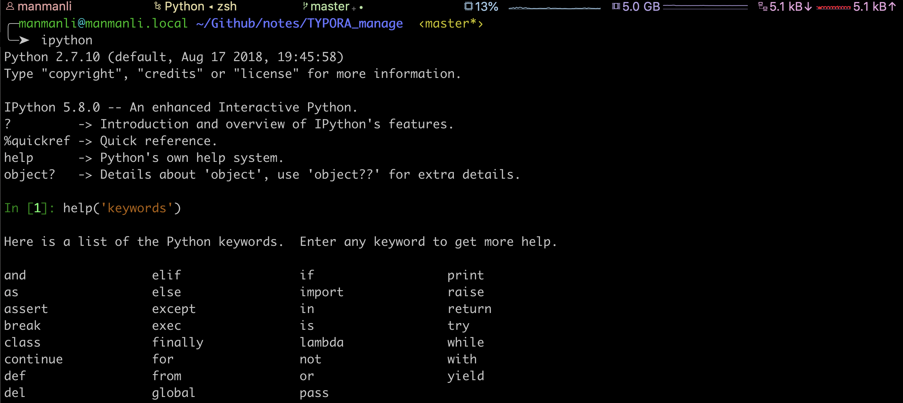
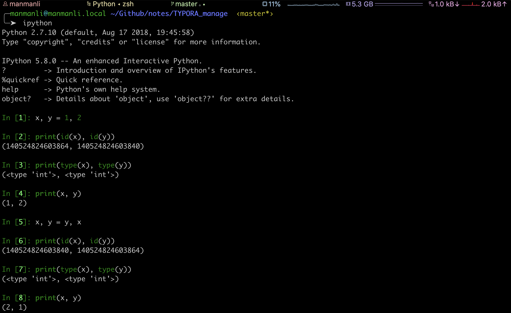
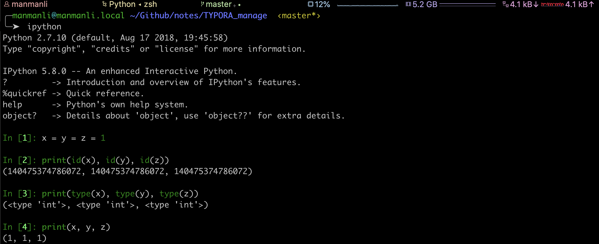

----

* [变量简介](#变量简介)
* [变量命名](#变量命名)
* [变量赋值](#变量赋值)
  * [单个赋值](#单个赋值)
  * [多个赋值](#多个赋值)
* [本章习题](#本章习题)

----

# 变量简介

> 变量其实是一个存储数据的内存空间对象,定义一个变量,即向内存申请一个带地址的访问空间对象,用来存储数据,通过变量名找到(指向)这个值,如下定义一个变量date = 20290809


* 简单的说就是将变量名与内存块儿的物理地址关联在一起(指向物理内存地址),自此即可通过变量名访问控制此块儿内存数据

# 变量命名



* 变量命名禁止与如上内置关键字重名
* 变量命名只允许包含字母,数字,下划线
* 变量命名禁止以数字开头
* 变量命名区分大小写

# 变量赋值

> 由于Python是一种动态类型语言,即一切决定于运行时,包括变量最终的类型

* 在Python中直接给变量赋值就相当于其它语言中的定义一个变量的过程
* 可通过type函数查看变量类型,通过id函数查看变量对应内存中的物理地址

## 单个赋值


## 多个赋值







# 本章习题

1. 编写脚本将你的个人信息存储到变量并按照如下格式输出?


```python
#! -*- coding: utf-8 -*-


import platform


is_python2 = platform.python_version_tuple() < ('3',)
input = raw_input if is_python2 else input


username = input('姓名: ')
sex = input('性别: ')
birthday = input('生日: ')
hobby = input('爱好: ')

print('''个人信息:
    姓名: %s
    性别: %s
    生日: %s
    爱好: %s
''' % (username, sex, birthday, hobby))
```

