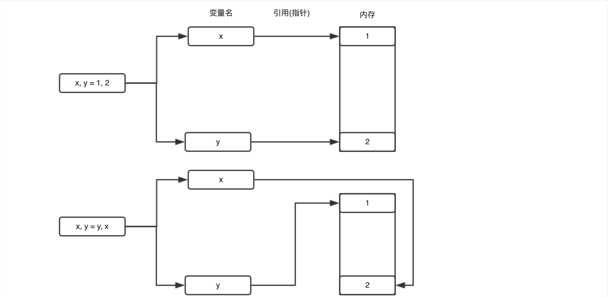
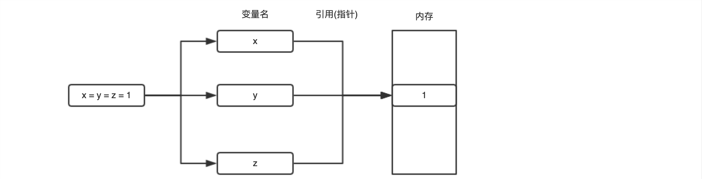
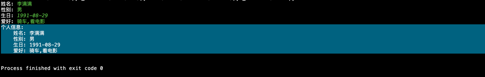

----

* [变量本质](#变量本质)
* [变量命名](#变量命名)
* [变量赋值](#变量赋值)
  * [单个赋值](#单个赋值)
  * [多个赋值](#多个赋值)
* [本章习题](#本章习题)

----

# 变量本质

> 变量的本质就是向内存申请一空闲内存单元并将变量名指向这个空闲内存单元,至此可通过变量名操作对应内存单元的数据


# 变量命名

```python
# 查看内置关键字列表
>>> help('keywords')

Here is a list of the Python keywords.  Enter any keyword to get more help.

and                 elif                if                  print
as                  else                import              raise
assert              except              in                  return
break               exec                is                  try
class               finally             lambda              while
continue            for                 not                 with
def                 from                or                  yield
del                 global              pass
```

* 变量命名禁止与如上内置关键字重名
* 变量命名只允许包含字母,数字,下划线
* 变量命名禁止以数字开头
* 变量命名区分大小写

# 变量赋值

> 由于Python是一种动态类型语言,即一切决定于运行时,包括变量最终的类型

* 在Python中直接给变量赋值就相当于其它语言中的定义一个变量的过程
* 可通过type函数查看变量类型,通过id函数查看变量对应内存中的物理地址

## 单个赋值

```python
# 通过字面量方式赋值,向内存申请空闲内存单元存储20190809然后将变量名date指向这个内存单元
>>> date = 20190809
# 通过变量名访问对应内存单元数据
>>> date
20190809
```


```python
# 导入内置模块
>>> import platform
# 判断解释器版本
>>> is_python2 = platform.python_version_tuple() < ('3',)
# 由于Python2的raw_input在Python3中被重命名为input,所以此处做兼容处理
>>> input = raw_input if is_python2 else input
# 通过函数返回值赋值,向内存申请空闲内存单元存储input('姓名: ')返回的值,然后将变量名username指向这内存单元
>>> username = input('姓名: ')
姓名: 李满满
# 通过变量名访问对应内存单元数据
>>> username
'\xe6\x9d\x8e\xe6\xbb\xa1\xe6\xbb\xa1'
```

## 多个赋值

```python
# 向内存申请两块空闲内存单元分别存1和2,将变量名x指向1所在的内存单元,变量名y指向2所在的内存单元
>>> x, y = 1, 2
# 通过变量名访问对应内存单元数据
>>> x
1
# 通过变量名访问对应内存单元数据
>>> y
2
# 将x指向之前y的值所在的内存单元,将y指向之前x的值所在的内存单元
>>> x, y = y, x
# 通过变量名访问对应内存单元数据
>>> x
2
# 通过变量名访问对应内存单元数据
>>> y
1
```



```python
# 向内存申请空闲内存单元存储1然后将变量名x和y都指向这个内存单元
>>> x = y = 1
# 通过变量名访问对应内存单元数据
>>> x
1
# 通过变量名访问对应内存单元数据
>>> y
1
```



# 本章习题

1. 编写一个脚本将你的个人信息存储到变量并按照如下格式输出且代码需要保证向下兼容至2.6+?



```python
#! -*- coding: utf-8 -*-


import sys
import platform


# 判断当前Python解释器版本
is_python2 = platform.python_version_tuple() < ('3',)
is_python3 = not is_python2

# 兼容input函数
input = input if is_python3 else raw_input


# 编码转换函数
def _(s, encoding=sys.stdout.encoding):
    if is_python3:
        return s
    if isinstance(s, unicode):
        return s.encode(encoding)
    return s.decode('utf-8').encode(encoding)


# 获取用户信息输入并设置到变量
username = input(_('姓名: '))
sex = input(_('性别: '))
birthday = input(_('生日: '))
hobby = input(_('爱好: '))

# 格式化打印
print(_('''个人信息:
    姓名: %s
    性别: %s
    生日: %s
    爱好: %s
''') % (username, sex, birthday, hobby))
```

* 脚本头部#! -\*- coding: utf-8 -\*-主要用于告诉解释器将代码内容编码为utf-8编码的字符串
* 由于Python3的终端输入编码(sys.stdin.encoding)和终端输出编码(sys.stdout.encoding)都强制设置成了utf-8,所以任何系统任何解释器都不会出现乱码情况
* 由于Python2的终端输入编码(sys.stdin.encoding)和终端输出编码(sys.stdout.encoding)依赖于系统本身,所以输出中文时需要先将utf-8编码内容按照utf-8解码为unicode再编码为终端输出编码,而对于输入由于其本身已经被编码为系统终端输入编码所以输出时无需重新编码即可正常显示

