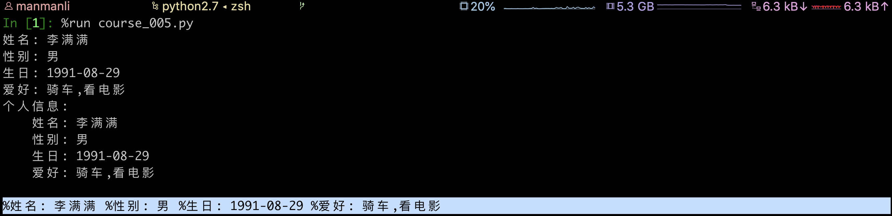

----

* [初识脚本](#初识脚本)
* [初识模块](#初识模块)
  * [模块简介](#模块简介)
  * [模块导入](#模块导入)
  * [导入方式](#导入方式)
  * [模块重载](#模块重载)
    * [Python2](#Python2)
    * [Python3](#Python3)
  * [模块查找](#模块查找)
  * [模块测试](#模块测试)
  * [内置模块](#内置模块)
* [本章习题](#本章习题)

----

# 初识脚本

> 前面提到的交互式命令行更适用于临时实验或测试,对于大段代码更推荐使用.py后缀的文件保存,方便后期的变更与重复使用,这种文件叫做Python脚本

`course_005.py`

```python
#! -*- coding: utf-8 -*-


# 模块导入
import platform


# 变量声明
is_python2 = platform.python_version_tuple() < ('3',)
input = raw_input if is_python2 else input


# 变量声明
username = input('username: ')

# 业务逻辑
print('Hello %s!' % username)
```

# 初识模块

## 模块简介

> 模块的本质(约定俗成的规范)是不包含业务逻辑的脚本,也就是说只包含一些变量,函数,类等声明

:point_right: ​解释器在解释执行时会自动为每个py文件设置独立的命名空间,也就是说可以包含相同声明而互不冲突

## 模块导入

> 在任何Python脚本/模块中都可以通过import导入模块到当前命名空间并使用,此特性也是Python程序架构的核心,大型程序往往由多个模块组成,最终由一个脚本作为入口文件来驱动整个程序

`course_004.py`

```python
#! -*- coding: utf-8 -*-


# 声明变量
filename = 'course_004.py'
```

:point_right: 由于此文件只包含了声明并未包含业务逻辑所以可以暂定为模块

`course_005.py`

```python
#! -*- coding: utf-8 -*-


# 导入模块
import course_004


# 访问模块中声明的变量
print('course_004.filename is %s' % course_004.filename)
```

:point_right: 由于此文件包含业务逻辑所以可以暂定为脚本


:point_right: 解释器在解释执行时会自动为每个py文件设置独立的命名空间

:point_right: 导入的本质是变量赋值的过程,如上解释器首先解释执行course_005.py文件并为其创建独立的命名空间course_005,当解释执行至import course_004时自动搜索解释执行course_004.py文件并为其创建独立的命名空间course_004,并隐式的在命名空间course_005中创建一个变量名为course_004指向的是命名空间course_004,至此在命名空间course_005中可通过变量course_004访问命名空间course_004中的一切声明

## 导入方式

```python
# 将当前命名空间中的变量course_004指向命名空间course_004
import course_004
# 将当前命名空间中的变量c4指向命名空间course_004
import course_004 as c4
# 将当前命名空间中的变量filename指向命名空间course_004中的变量filename
from course_004 import filename
# 将当前命名空间中的变量fname指向命名空间course_004中的变量filename
from course_004 import filename as fname
```

## 模块重载

> 模块导入是一个开销很大的操作,所以默认导入操作会且仅会执行一次(天然的单例模式),如需强制重新导入可调用reload(\<model\>)实现模块重载

### Python2

```python
# 第一次导入模块
>>> import course_005
course_004.filename is course_004.py
# 第二次导入模块前会检查course_005.py和course_005.pyc时间戳是否一致,如果不一致则重新解释执行,否则跳过
>>> import course_005
# 通过内置函数reload(module) -> module可强制重载模块
>>> reload(course_005)
course_004.filename is course_004.py
<module 'course_005' from 'course_005.pyc'>
# 通过内置函数reload(module) -> module可强制重载模块
>>> reload(course_005)
course_004.filename is course_004.py
<module 'course_005' from 'course_005.pyc'>
```

### Python3

```python
# 第一次导入模块
>>> import course_005
course_004.filename is course_004.py
# 第二次导入模块前会检查course_005.py和course_005.pyc时间戳是否一致,如果不一致则重新解释执行,否则跳过
>>> import course_005
# Python3中已淘汰了内置函数reload(统一迁移至importlib模块中)
>>> from importlib import reload
# 通过模块声明的函数imp.reload(module) -> module可强制重载模块
>>> reload(course_005)
course_004.filename is course_004.py
<module 'course_005' from '/Users/manmanli/Github/pyc_20190809/course_005.py'>
# 通过模块声明的函数imp.reload(module) -> module可强制重载模块
>>> reload(course_005)
course_004.filename is course_004.py
<module 'course_005' from '/Users/manmanli/Github/pyc_20190809/course_005.py'>
```

## 模块查找

```python
# 导入未知模块
>>> import django
Traceback (most recent call last):
  File "<stdin>", line 1, in <module>
ImportError: No module named django

# 模块查找路径 
>>> import sys
['',
 '/Users/manmanli/.pyenv/versions/2.7.15/lib/python27.zip',
 '/Users/manmanli/.pyenv/versions/2.7.15/lib/python2.7',
 '/Users/manmanli/.pyenv/versions/2.7.15/lib/python2.7/plat-darwin',
 '/Users/manmanli/.pyenv/versions/2.7.15/lib/python2.7/plat-mac',
 '/Users/manmanli/.pyenv/versions/2.7.15/lib/python2.7/plat-mac/lib-scriptpackages',
 '/Users/manmanli/.pyenv/versions/2.7.15/lib/python2.7/lib-tk',
 '/Users/manmanli/.pyenv/versions/2.7.15/lib/python2.7/lib-old',
 '/Users/manmanli/.pyenv/versions/2.7.15/lib/python2.7/lib-dynload',
 '/Users/manmanli/.pyenv/versions/2.7.15/lib/python2.7/site-packages']
```

:point_right: ​解释器会默认按照如上路径顺序查找,首行空字符串表示当前目录,这也就是上面例子可以正常运行的关键原因

:point_right: 由于解释器查找模块是按照sys.path顺序查找,也就是说其实我们可以通过修改此列表来导入任意目录的模块

## 模块测试

> 由于之前说模块的本质是不包含业务逻辑的脚本,且无论是导入还是执行操作都会触发解释器重新解释执行,但对于单元测试场景通常更希望将测试逻辑写到模块中,但又不希望导入时执行此逻辑,那么套路来了～

`course_004.py`

```python
#! -*- coding: utf-8 -*-


# 变量声明
filename = 'course_004.py'


# 测试逻辑
if __name__ == '__main__':
    print('start unittest!')

```

:point_right: Python中\_\_name\_\_叫做魔术变量,值为当前模块名,作为脚本执行时由于\_\_name_\_的值为\_\_main\_\_所以语句块儿的代码会被执行,而作为模块导入时由于\_\_name\_\_的值为course_004所以语句块儿的代码不会被执行

:point_right: 由于此特性可以统一模块和脚本的概念,于是也就约定俗成无论脚本还是模块都应该按照这个规范编写.

## 内置模块

> Python包含众多内置模块([2.x](https://docs.python.org/2/library/index.html),[3.x](https://docs.python.org/zh-cn/3.7/library/index.html)),用法和自定义模块相同

```python
#! -*- coding: utf-8 -*-


# 导入内置模块
import platform


# 调用内置模块platform的python_version_tuple函数
if __name__ == '__main__':
    print(platform.python_version_tuple())
```

# 本章习题

1. 编写一个脚本导入上节习题脚本模块,并以如下格式化打印?



```python
#! -*- coding: utf-8 -*-


import course_004 as c4


# %s表示字符串占位, %%自动显示为%
print('%%姓名: %s %%性别: %s %%生日: %s %%爱好: %s' % (c4.username, c4.sex, c4.birthday, c4.hobby))
```


