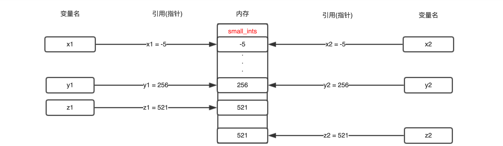
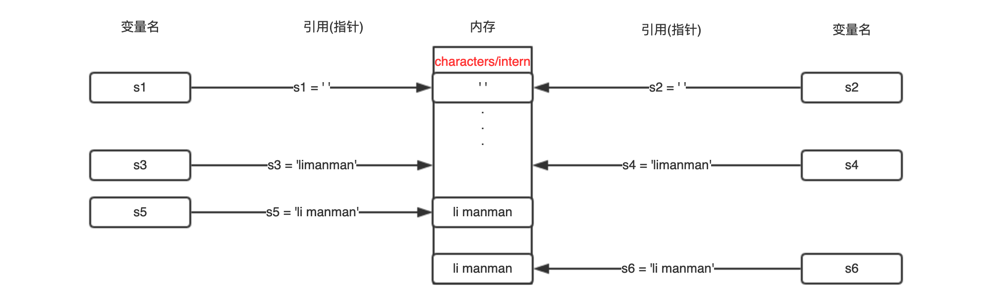
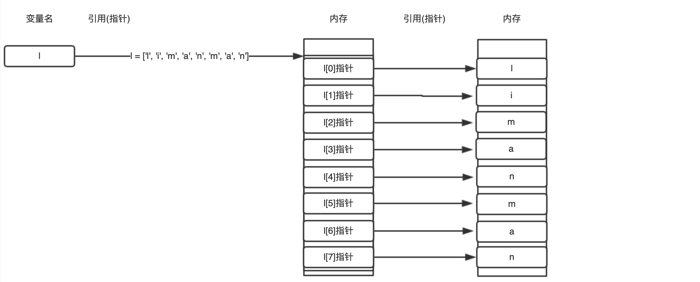
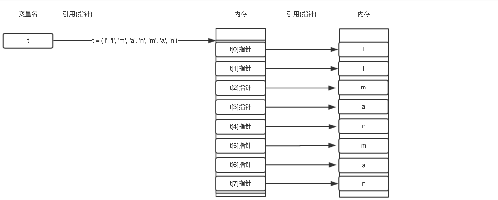
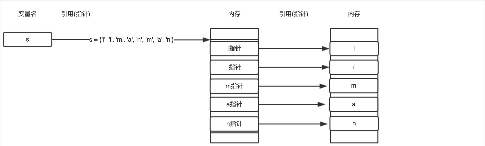
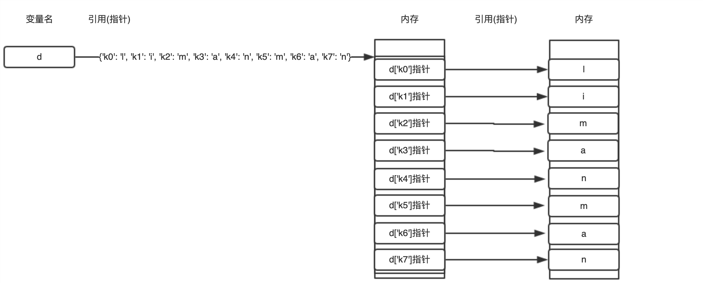
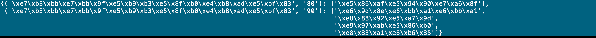

-----
* [初识类型](#初识类型)
* [常见类型](#常见类型)
  * [布尔](#布尔)
  * [NoneType](#NoneType)
  * [数字](#数字)
    * [整数](#整数)
    * [浮点数](#浮点数)
    * [复数](#复数)
  * [字符串](#字符串)
    * [通用特性](#通用特性)
    * [测试存在](#测试存在)
  * [列表](#列表)
  * [元组](#元组)
  * [集合](#集合)
  * [字典](#字典)
* [类型判断](#类型判断)
* [本章习题](#本章习题)

----

# 初识类型

> 现实世界中为了更方便的管理事物通常会将不同的事物按照特有的属性及操作进行分类,同理编程世界中为了更方便的管理对象引入类型的概念,类型是对象的抽象化描述,对象是类型的具像化实体

:point_right: 任何对象都有类型,具体可通过type(object)和dir([object])和help([object])命令查看对象类型及定义

# 常见类型

## 布尔

> 布尔对象的本质是为了描述事物的真假

```python
# 布尔类型
# 常用于描述事物的真假
# 声明一个变量is_even并将其地址指向内置变量True指向的内存单元
>>> is_even = True
# 查看变量is_even的类型
>>> type(is_even)
<type 'bool'>
# if后面支持变量或表达式,它们会被隐式的转换为布尔对象,如果为True则执行紧接着语句块否则执行else语句块
>>> if is_even:
...     print('even')
... else:
...     print('not even')
# 查看变量is_even类型的定义
>>> help(is_even)
# 查看变量is_even类型的属性和方法
>>> dir(is_even)
# 测试变量is_even是否为True/False
>>> is_even is True
True
>>> is_even is False
False
>>> is_even is not True
False
>>> is_even is not False
True
```


:point_right: 解释器初始化时向内存申请2个空闲内存单元分别存储bool(1)和bool(0)对象,并将内置变量True和False分别指向这2个内存单元

## NoneType

> NoneType对象的本质是为了描述变量没有初始化

```python
# NoneType类型
# 常用于描述变量没有初始化
# 声明变量obj并将其地址指向内置变量True指向的内存单元
>>> obj = None
# 查看变量obj的类型
>>> type(obj)
<type 'NoneType'>
# 查看变量obj类型的定义
>>> help(obj)
# 查看变量obj类型的属性和方法
>>> dir(obj)
# 测试变量obj是否为None
>>> obj is None
True
>>> obj is not None
False
```


:point_right: 解释器初始化时向内存申请空闲内存单元存储一个空对象,并将内置变量None指向这个内存单元

## 数字

> 数字并不是一个真正的对象类型,而是一组类似类型的分类

### 整数

>   整数包含正数,负数和0,同时允许使用二进制, 八进制, 十六进制字面量表示

````python
# 整数类型
# -521, 521, 0, 无群小~无群大(只和内存有关)

# 向内存申请一空闲内存单元存储521并将变量名dec_num指向此内存单元的地址
# 十进制
>>> dec_num = 521
# 二进制
>>> bin_num = 0b1000001001
# 八进制
# for Python2
>>> oct_num = 01011
# for Python3
>>> oct_num = 0o1011
# 16进制
>>> hex_num = 0x209
>>> type(dec_num), type(bin_num), type(oct_num), type(hex_num)
(<type 'int'>, <type 'int'>, <type 'int'>, <type 'int'>)
# 查看变量dec_num类型的定义
>>> help(dec_num)
# 查看变量dec_num类型的属性和方法
>>> dir(dec_num)
````

### 浮点数

>   浮点数为包含小数部分的数字,同时允许使用单点,科学计数法的字面量表示

```python
# 浮点数类型
# 5.21, 5., 5.21e2/5.21E2, 512e-2/512E-2

# 向内存申请一空闲内存单元存储5.21并将变量名f指向此内存单元的地址
>>> f = 5.21
>>> type(f)
<type 'float'>
# 查看变量f类型的定义
>>> help(f)
# 查看变量f类型的属性和方法
>>> dir(f)
```

### 复数

>   复数为包含实部和虚部(以j或J结尾)的数字

```python
# 复数类型
# 100j

# 向内存申请一空闲内存单元存储0+100j并将变量名c指向此内存单元的地址
>>> c = 0+100j
>>> type(c)
<type 'complex'>
# 查看变量c类型的定义
>>> help(c)
# 查看变量c类型的属性和方法
>>> dir(c)
```



:point_right: 为避免频繁分配释放内存,解释器预先将-5~256的小整数作为索引将值存入small_ints列表对应的内存单元

:point_right: 至此声明变量右侧值为小整数时会首先在small_ints列表中索引是否存在,如果存在则直接将变量名指向此地址

## 字符串

`Python2`

:point_right: ​Python2中str默认为终端编码(sys.[stdin|stdout].encoding)的16进制,u前缀可自动将其转换为万国码(unicode)

```python
# str类型
# 默认无前缀为str对象
# 向内存申请一空闲内存单元存储'李满满'并将变量名username指向此内存单元的地址
>>> username = '李满满'
# 以终端输出编码的16进制显示
>>> username
'\xe6\x9d\x8e\xe6\xbb\xa1\xe6\xbb\xa1'
>>> type(username)
<type 'str'>
# 查看str类型的定义
>>> help(str)
# 查看str类型的属性和方法
>>> dir(str)

# unicode类型
# 默认u前缀为unicode对象
# 向内存申请一空闲内存单元存储u'李满满'并将变量名username指向此内存单元的地址
>>> username = u'李满满'
# 以unicode编码显示
>>> username
u'\u674e\u6ee1\u6ee1'
>>> type(username)
<type 'unicode'>
# 查看unicode类型的定义
>>> help(unicode)
# 查看unicode类型的属性和方法
>>> dir(unicode)

# 将str类型变量转换为unicode类型变量S.decode([encoding[,errors]]) -> object
>>> import sys
>>> username = '李满满'
>>> username.decode(sys.stdin.encoding)
u'\u674e\u6ee1\u6ee1'
# 将unicode类型变量转换为str类型变量S.encode([encoding[,errors]]) -> string or unicode
>>> import sys
>>> username = u'李满满'
>>> username.encode(sys.stdin.encoding)
'\xe6\x9d\x8e\xe6\xbb\xa1\xe6\xbb\xa1'
```

`Python3`

:point_right: ​Python3中的str默认为unicode,b前缀可自动将其转换为二进制字节序列bytes

```python
# str类型
# 默认无前缀为str对象(本质上是Python2中的unicode对象)
# 向内存申请一空闲内存单元存储'李满满'并将变量名username指向此内存单元的地址
>>> username = '李满满'
# 由于unicode为万国码所以输出时可转换为任意终端输出编码,所以并不会乱码
>>> username
'李满满'
>>> type(username)
<class 'str'>
# 查看str类型的定义
>>> help(str)
# 查看str类型的属性和方法
>>> dir(str)

# bytes类型
# 默认b前缀为bytes对象
# 向内存申请一空闲内存单元存储b'\xe6\x9d\x8e\xe6\xbb\xa1\xe6\xbb\xa1'并将变量名username指向此内存单元的地址
>>> username = b'\xe6\x9d\x8e\xe6\xbb\xa1\xe6\xbb\xa1'
>>> username
b'\xe6\x9d\x8e\xe6\xbb\xa1\xe6\xbb\xa1'
>>> type(username)
<class 'bytes'>
# 查看bytes类型的定义
>>> help(bytes)
# 查看bytes类型的属性和方法
>>> dir(bytes)

# 将str类型变量转换为bytes类型变量S.encode(self, /, encoding='utf-8', errors='strict')
>>> import sys
>>> username = '李满满'
>>> username.encode(sys.stdin.encoding)
b'\xe6\x9d\x8e\xe6\xbb\xa1\xe6\xbb\xa1'
# 将bytes类型变量转换为str类型变量S.decode(self, /, encoding='utf-8', errors='strict')
>>> import sys
>>> username = b'\xe6\x9d\x8e\xe6\xbb\xa1\xe6\xbb\xa1'
>>> username.decode(sys.stdin.encoding)
'李满满'
```

:point_right: 二进制字节序列的优势在于网络编程时数据传输,Python3中可直接将str对象转换为bytes字节序列对象

### 通用特性

> 有序的, 可迭代, 可切片, 可合并, 不可变

```python
>>> s = 'limanman'
# 让Python2中也可以兼容Python3的print函数用法
>>> from __future__ import print_function

# 通用特性 - 有序的
# 通过S[索引]访问指定位置的字符,索引左边从0开始,右边从-1开始
# 正数索引
>>> s[0], s[1], s[2], s[3], s[4], s[5], s[6], s[7]
('l', 'i', 'm', 'a', 'n', 'm', 'a', 'n')
# 负数索引
>>> s[-1], s[-2], s[-3], s[-4], s[-5], s[-6], s[-7], s[-8]
('n', 'a', 'm', 'n', 'a', 'm', 'i', 'l')

# 通用特性 - 可迭代
# 通过for循环语句可顺序遍历出每个字符
>>> for c in s:
...     print(c, end=' ')
l i m a n m a n
# 通过while循环语句可用索引取出每个字符
>>> index = 0
>>> while i < len(s):
...     print(s[index], end=' ')
...     index = index + 1
l i m a n m a n 

# 通用特性 - 可切片
"""注意:
1. S[开始索引:结束索引:步长]切片时结束索引必须大于开始索引,如果步长为负数则表示按照绝对值为步长倒序取
"""
# 通过S[开始索引:结束索引:步长]访问指定部分字符串,索引左边从0开始,右边从-1开始
# 取索引位置2开始一直到最后的子字符串
>>> s[2:]
'manman'
# 取开始位置一直到索引位置5的子字符串
>>> s[:5]
'liman'
# 取索引位置2到索引位置8的子子字符串,内置函数len(object) -> integer,返回任意对象的长度
>>> s[2:len(s)]
'manman'
# 取索引位置-6开始一直到最后的子字符串
>>> s[-6:]
'manman'
# 取索引位置-8到索引位置-3的子字符串
>>> s[-8:-3]
'liman'
# 取开始位置一直到最后的子字符串,但倒序取且步长为1
>>> s[::-1]
'namnamil'

# 通用特性 - 可合并
# 通过加号(+)或乘号(*)来合并字符串
# +号对于字符串表示组合生成新的字符串
>>> s + s
'limanmanlimanman'
# *号对于字符串表示复制产生新的字符串
>>> s * 2
'limanmanlimanman'

# 通用特性 - 不可变
"""注意:
1. 由于字符串不可变,也就意味着所有上面对字符串的操作都是产生一个新的对象将变量名指向这个新的对象
2. 不可变对象的优势如高性能(固定内存段),线程安全(无需锁)和可哈希(多值Key的字典)等,典型的如数字,字符串,元祖
3. 如果希望将不可变的字符串对象变为可变对象可通过内置函数bytearray(object)将其转换为字节数组即可
"""
# 无法在不改变物理地址指向的前提下实现原地修改
>>> s[:2] = ''
Traceback (most recent call last):
  File "<stdin>", line 1, in <module>
TypeError: 'str' object does not support item assignment
```

### 测试存在

> 可通过in表达式判断字符串对象中是否包含其它子字符串

```python
>>> s = 'limanman'
# 让Python2中也可以兼容Python3的print函数用法
>>> from __future__ import print_function

>>> 'manman' in s
True
```



:point_right: 为避免频繁分配释放内存,解释器会对首次声明的单字符以哈希后整数作为索引将值存入characters列表对应的内存单元

:point_right: 解释器也会对符合变量命名规范的字符串自动应用intern缓存机制,以哈希后整数作为索引将值存入intern列表对应的内存单元

:point_right: 至此声明变量右侧值为字符或字符串时会首先在characters/intern列表中索引是否存在,如果存在则直接将变量名指向此地址

## 列表

> 列表对象的本质是一个有序的,可迭代,可切片,可变的序列,内部元素支持任意类型的对象或变量

```python
# 列表类型
# 向内存申请一空闲内存单元存储['l', 'i', 'm', 'a', 'n', 'm', 'a', 'n']并将变量名l指向此内存单元的首地址
>>> l = ['l', 'i', 'm', 'a', 'n', 'm', 'a', 'n']
>>> type(l)
<type 'list'>
# 查看list类型的定义
>>> help(list)
# 查看list类型的属性和方法
>>> dir(list)
# 让Python2中也可以兼容Python3的print函数用法
>>> from __future__ import print_function

# 通用特性 - 有序的, 参考字符串对象, 略

# 通用特性 - 可迭代, 参考字符串对象, 略

# 通用特性 - 可切片, 参考字符串对象, 略

# 通用特性 - 可变的
# 可以不改变物理地址指向的前提下实现原地修改
>>> id(l)
4307712048
# 向变量l尾部添加一个字符串对象!,L.append(object) -- append object to end
# 等同于l.insert(len(l), '!'), L.insert(index, object) -- insert object before index
>>> l.append('!')
>>> l
['l', 'i', 'm', 'a', 'n', 'm', 'a', 'n', '!']
>>> id(l)
4307712048
# 从变量l中删除指定索引位置的对象,L.pop([index]) -> item,默认index的值为-1
>>> l.pop(-1)
'!'
>>> l
['l', 'i', 'm', 'a', 'n', 'm', 'a', 'n']
>>> id(l)
4307712048

# 通用特性 - 可嵌套
# 由于列表作为容器内部支持任意对象元素,当然也包括列表对象
>>> tables = [
['1 x 1 = 1'],
['1 x 2 = 2', '2 x 2 = 4'],
['1 x 3 = 3', '2 x 3 = 6', '3 x 3 = 9'],
['1 x 4 = 4', '2 x 4 = 8', '3 x 4 = 12', '4 x 4 = 16'],
['1 x 5 = 5', '2 x 5 = 10', '3 x 5 = 15', '4 x 5 = 20', '5 x 5 = 25'],
['1 x 6 = 6', '2 x 6 = 12', '3 x 6 = 18', '4 x 6 = 24', '5 x 6 = 30', '6 x 6 = 36'],
['1 x 7 = 7', '2 x 7 = 14', '3 x 7 = 21', '4 x 7 = 28', '5 x 7 = 35', '6 x 7 = 42', '7 x 7 = 49'],
['1 x 8 = 8', '2 x 8 = 16', '3 x 8 = 24', '4 x 8 = 32', '5 x 8 = 40', '6 x 8 = 48', '7 x 8 = 56', '8 x 8 = 64'],
['1 x 9 = 9', '2 x 9 = 18', '3 x 9 = 27', '4 x 9 = 36', '5 x 9 = 45', '6 x 9 = 54', '7 x 9 = 63', '8 x 9 = 72', '9 x 9 = 81']
]

# 测试存在
# 可通过in表达式判断列表对象中是否包含其它子对象
>>> 'm' in l
True
```



:point_right: 变量l指向列表对应内存单元的首地址,从首地址开始依次在固定长度的字节中存储列表内部元素的地址

:point_right: 为避免频繁分配释放内存,解释器在释放内存时并不会直接释放而是尝试将首地址放入free_list中

:point_right: 至此声明变量右侧值为列表时会首先从free_list中取,如果存在则直接将变量名指向此首地址

## 元组

> 元组对象的本质是一个有序的,可迭代,可切片,不可变的序列,且内部元素支持任意对象,但通常为可哈希对象

```python
# 元组类型
# 向内存申请一空闲内存单元存储('l', 'i', 'm', 'a', 'n', 'm', 'a', 'n')并将变量名t指向此内存单元的首地址
>>> t = ('l', 'i', 'm', 'a', 'n', 'm', 'a', 'n')
>>> type(t)
<type 'tuple'>
# 查看tuple类型的定义
>>> help(tuple)
# 查看tuple类型的属性和方法
>>> dir(tuple)
# 让Python2中也可以兼容Python3的print函数用法
>>> from __future__ import print_function

# 通用特性 - 有序的, 参考字符串对象, 略

# 通用特性 - 可迭代, 参考字符串对象, 略

# 通用特性 - 可切片, 参考字符串对象, 略

# 通用特性 - 不可变, 参考字符串对象, 略

# 通用特性 - 可嵌套, 参考列表对象, 略

# 测试存在
# 可通过in表达式判断元组对象中是否包含其它子对象
>>> 'm' in t
True
```

:point_right: 不可变对象的优势在于高性能(固定内存段),线程安全(无需锁)和可哈希(多值Key的字典)等,典型的如数字,字符串,元祖



:point_right: 元组的内存形态和列表几乎一样,不同的是受代码层面的控制禁止改变内部元素的值

## 集合

> 集合对象的本质是一个无序的,可迭代,自去重,可变的集合,内部元素支持任意可哈希对象

```python
# 集合类型
# 向内存申请一空闲内存单元存储{'l', 'i', 'm', 'a', 'n', 'm', 'a', 'n'}并将变量名s指向此内存单元的首地址
>>> s = {'l', 'i', 'm', 'a', 'n', 'm', 'a', 'n'}
>>> type(s)
<type 'set'>
# 查看set类型的定义
>>> help(set)
# 查看set类型的属性和方法
>>> dir(set)
# 让Python2中也可以兼容Python3的print函数用法
>>> from __future__ import print_function

# 通用特性 - 无序的
>>> s
set(['i', 'a', 'm', 'l', 'n'])
# 向集合中添加一个可哈希对象
>>> s.add('!')
>>> s
set(['a', '!', 'i', 'm', 'l', 'n'])

# 通用特性 - 自去重
# 自动去除容器内的重复对象
>>> s.add('!')
>>> s
set(['a', '!', 'i', 'm', 'l', 'n'])

# 通用特性 - 可迭代, 参考字符串对象, 略

# 通用特性 - 可变的
>>> id(s)
4448963840
>>> s.discard('!')
>>> id(s)
4448963840

# 测试存在
# 可通过in表达式判断集合对象中是否包含其它子对象
>>> 'm' in s
True
```



:point_right: 集合的内存形态和元组几乎一样,不同的是受代码层面的控制会自动预去重且无序禁止切片

## 字典

> 字典对象的本质是一个通过键值而非索引存取的无序的,可迭代,可变的映射表

```python
# 字典类型
# 向内存申请一空闲内存单元存储{'k0': 'l', 'k1': 'i', 'k2': 'm', 'k3': 'a', 'k4': 'n', 'k5': 'm', 'k6': 'a', 'k7': 'n'}并将变量名d指向此内存单元的首地址
>>> d = {'k0': 'l', 'k1': 'i', 'k2': 'm', 'k3': 'a', 'k4': 'n', 'k5': 'm', 'k6': 'a', 'k7': 'n'}
>>> type(d)
<type 'dict'>
# 查看dict类型的定义
>>> help(dict)
# 查看dict类型的属性和方法
>>> dir(dict)

# 通用特性 - 无序的
>>> d
{'k3': 'a', 'k2': 'm', 'k1': 'i', 'k0': 'l', 'k7': 'n', 'k6': 'a', 'k5': 'm', 'k4': 'n'}

# 通用特性 - 可迭代
# 通过for循环语句可顺序遍历出每个键名
>>> for k in d:
...     print('%s -> %s' % (k, d[k]))
...
k3 -> a
k2 -> m
k1 -> i
k0 -> l
k7 -> n
k6 -> a
k5 -> m
k4 -> n

# 通用特性 - 可变的
>>> id(d)
4452516480
>>> del d['k0']
>>> id(d)
4452516480

# 测试存在
# 可通过in表达式判断字典对象中是否包含指定键
>>> 5 in d
True
```



:point_right: 字典在内存中的形态和列表几乎一样,不同的是字典是通过键哈希之后的整数作为其索引来操作指针影响内部元素的

# 类型判断

> 可通过内置函数isinstance(object, class-or-type-or-tuple) -> bool判断对象是否属于某个类型

```python
# 导入内置类型模块,包含所有核心内置类型声明
>>> import types
>>> isinstance(None, types.NoneType)
True
>>> isinstance(True, types.BooleanType)
True
>>> isinstance(False, types.BooleanType)
True
>>> isinstance(521, types.IntType)
True
>>> isinstance(0b1000001001, types.IntType)
True
>>> isinstance(0o1011, types.IntType)
True
>>> isinstance(01011, types.IntType)
True
>>> isinstance(0x209, types.IntType)
True
>>> isinstance(5.21, types.FloatType)
True
>>> isinstance('limanman', (types.StringType, types.UnicodeType))
True
>>> isinstance(['l', 'i', 'm', 'a', 'n', 'm', 'a', 'n'], types.ListType)
True
>>> isinstance(('l', 'i', 'm', 'a', 'n', 'm', 'a', 'n'), types.TupleType)
True
>>> isinstance({'l', 'i', 'm', 'a', 'n', 'm', 'a', 'n'}, set)
True
>>> isinstance({0: 'l', 1: 'i', 2: 'm', 3: 'a', 4: 'n', 5: 'm', 6: 'a', 7: 'n'}, types.DictType)
True
```

# 本章习题

1.  编写一个脚本,使用如上所学的数据结构描述多个部门下80和90学生列表 ?



```python
#! -*- coding: utf-8 -*-


# import build-in models
import sys
import pprint
import platform


# got interpreter version
is_python2 = platform.python_version_tuple() < ('3',)
is_python3 = not is_python2

# compatible input in python2
input = input if is_python3 else raw_input


# coding convert
def _(s, encoding=sys.stdout.encoding):
    # for python3
    if is_python3:
        return s
    # for python2
    if isinstance(s, unicode):
        return s.encode(encoding)
    # utf-8 code that declared at headline
    return s.decode('utf-8').encode(encoding)


if __name__ == '__main__':
    # structure
    staff_map = {
        (_('系统平台中心'), '90'): [_('李满满'), _('舒姝'), _('闫冰'), _('胡超')],
        (_('系统平台中心'), '80'): [_('冯唐福')]
    }
    # format print
    pprint.pprint(staff_map)
```

