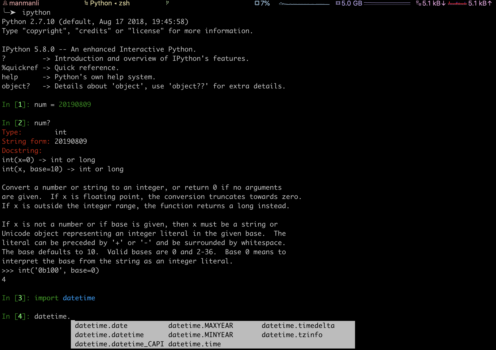
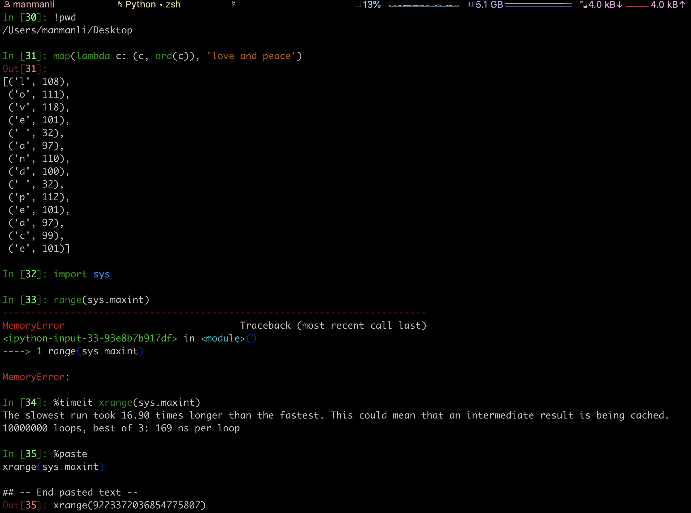
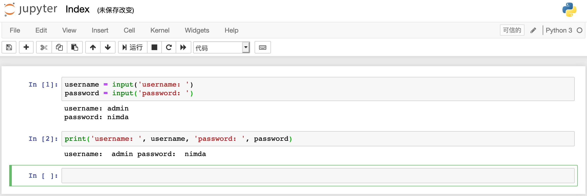
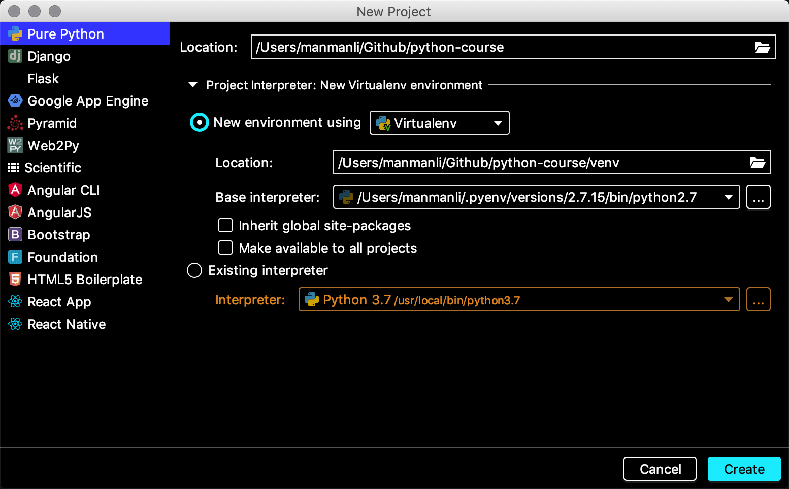
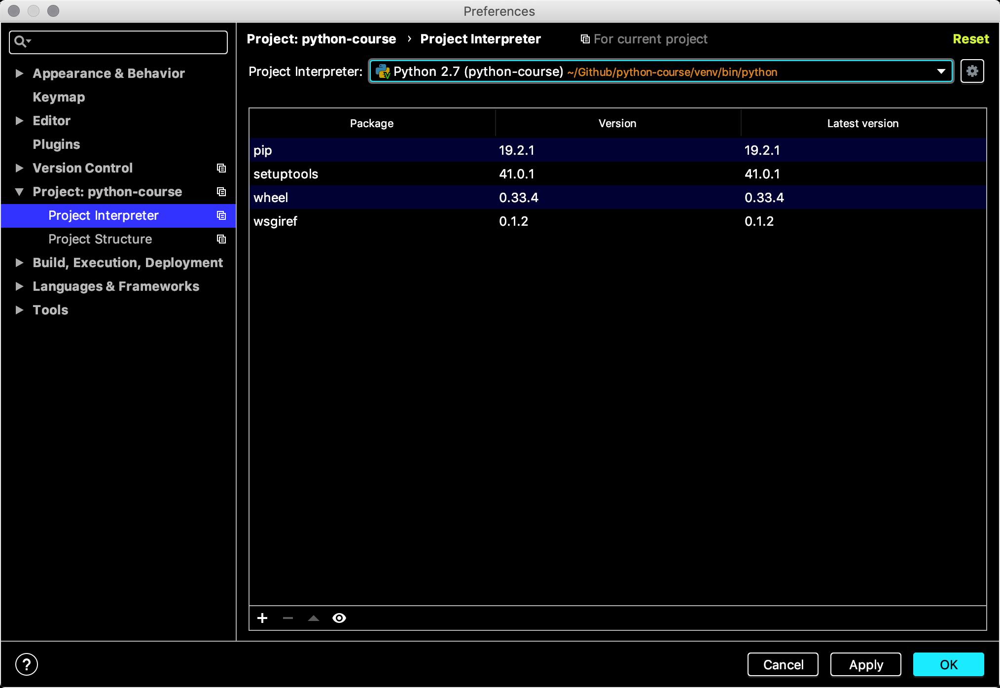
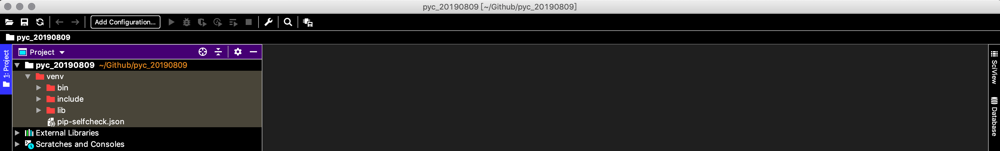

----

* [版本选择](#版本选择)
* [快速安装](#快速安装)
  * [首次安装](#首次安装)
  * [包的管理](#包的管理)
  * [多个版本](#多个版本)
  * [多个环境](#多个环境)
* [开发工具](#开发工具)
  * [入门级别](#入门级别)
  * [项目级别](#项目级别)
* [本章习题](#本章习题)

----

# 版本选择

`2.7+`

> 推荐稳定版[2.7.15](https://www.python.org/downloads/release/python-2715/),目前大部分生产应用使用,但将于2020年停止维护更新

`3.7+`

> 推荐稳定版[3.7.0](https://www.python.org/downloads/release/python-370/),新增编码兼容,类型声明,异步并行等新特性,但其并不向下兼容

# 快速安装

## 首次安装

> 如系统无内置Python解释器请点击[2.7.15](https://www.python.org/downloads/release/python-2715/)自行下载安装,略.

```bash
# 检测方式
python --version
Python 2.7.15
```

## 包的管理

> Python中的包等同于其它语言中库/包的概念,支持[在线包源](https://pypi.org/),通常通过[pip](https://pip.pypa.io/en/latest/installing/)管理本地包环境

```bash
# 检测方式
pip --version
pip 19.2.1 from /Library/Python/2.7/site-packages/pip (python 2.7)
# 已存在pip可忽略
curl https://bootstrap.pypa.io/get-pip.py -o get-pip.py
python get-pip.py
# 安装指定版本包
pip install ipython==5.8.0
pip install netaddr==0.7.19
# 卸载指定名称包
pip uninstall netaddr
```

## 多个版本

> 解决同一个系统不同项目依赖不同Python解释器版本的场景,推荐[pyenv](https://github.com/pyenv/pyenv)/[pyenv-win](https://github.com/pyenv-win/pyenv-win),请自行下载安装,略

```bash
# 查看版本列表
pyenv install --list
# 安装指定版本
# export CFLAGS="-I$(xcrun --show-sdk-path)/usr/include"
pyenv install 3.7.0
pyenv install 2.7.15 
pyenv rehash
# 查询已装版本
pyenv versions
# 设置当前版本
pyenv local <version>
# 设置全局版本
pyenv global <version>
# 卸载指定版本
pyenv uninstall <version>
pyenv rehash
```

其本质是借助PATH搜索优先级,将生成的\~/.pyenv/shims插入PATH的头部,调用并执行shims目录下的目标垫片程序

对于windows环境的套路为先安装2.7.16版本,再安装pyenv-win,再设置PATH变量,再安装2.7.15.amd64和3.7.0-amd64

## 多个环境

> 解决同一个系统不同项目依赖相同Python解释器版本但不同包环境的场景,推荐[virtualenv](https://github.com/pypa/virtualenv),可通过pip快速安装

```bash
# 安装虚拟环境包
pip install -U virtualenv
# 创建虚拟环境(请在项目顶层目录)
virtualenv --no-site-packages -p /Users/manmanli/.pyenv/shims/python2.7 venv
# 或
virtualenv --no-site-packages -p /Users/manmanli/.pyenv/shims/python3.7 venv
# 激活指定的环境
source venv/bin/activate
# 安装包到此环境
pip install netaddr==0.7.19
# 退出指定的环境
deactivate
```

# 开发工具

## 入门级别

> 推荐下载安装[IPython](https://ipython.org/)(附带详细的交互模式使用文档,[点击进入]((https://ipython.org/ipython-doc/3/interactive/index.html))),略,可顺带关注[Jupyter](https://jupyter.org/)项目







## 项目级别

> 推荐下载安装[Pycharm](https://www.jetbrains.com/pycharm/download/)(附带Idear家族全系列破解工具,[点击进入](http://idea.lanyus.com/)),略.





# 本章习题

1. 使用PyCharm编辑器创建一个包含虚拟环境的名为pyc_20190809的项目?



