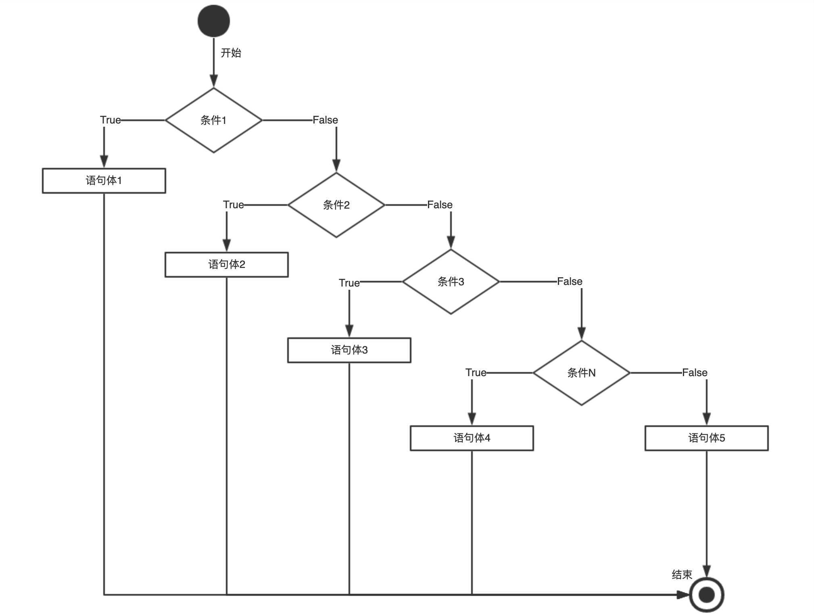
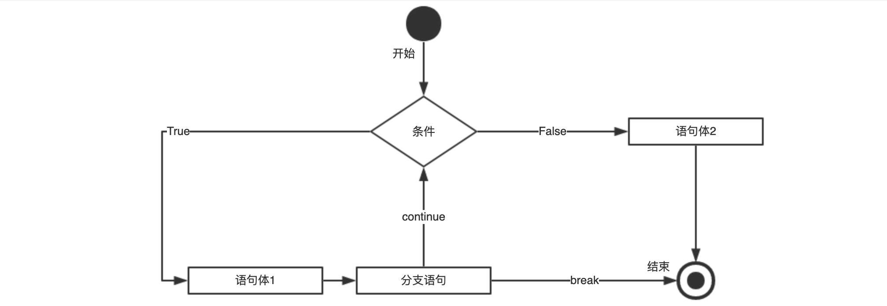
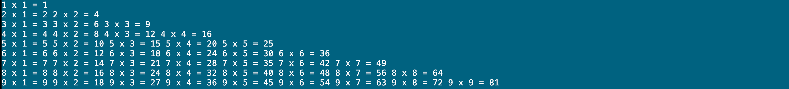

----

* [初识流程](#初识流程)
* [流程控制](#流程控制)
  * [顺序结构](#顺序结构)
  * [分支结构](#分支结构)
  * [循环结构](#循环结构)
  * [混合结构](#混合结构)
* [真假测试](#真假测试)
* [三元运算](#三元运算)
* [元组解包](#元组解包)
* [奇怪现象](#奇怪现象)
* [相关函数](#相关函数)
* [相关模块](#相关模块)
* [本章习题](#本章习题)

----

# 初识流程

>   现实世界中为了更高效的输出通常会定制诸多流程,而编程世界中为了描述这些流程而引入了流程控制语句

# 流程控制

>   顾名思义就是控制程序的执行顺序,常见的结构包括顺序,分支和循环,同时也支持任意嵌套混合构造复杂流程

## 顺序结构

>   主要用于顺序执行操作的场景


:point_right: 从<语句1>开始,无论其执行成功还是失败都继续执行,直至<语句N>,如下一个应用部署流程的抽象描述

```python
#! -*- coding: utf-8 -*-


# 兼容Python3的print内置函数
from __future__ import print_function


def application_stop():
    """执行关闭应用脚本"""
    print('Execute application stop script success')


def download_bundle():
    """下载应用的安装包"""
    print('Download bundle success')


def before_install():
    """执行部署之前脚本"""
    print('Execute before install script success')


def application_install():
    """执行应用部署脚本"""
    print('Execute application install script success')


def after_install():
    """执行部署之后脚本"""
    print('Execute after install script success')


def application_start():
    """执行应用启动脚本"""
    print('Execute application start script success')


def validate_service():
    """执行服务验证脚本"""
    print('Execute validate service script success')


# 判断是否是执行而非导入操作
if __name__ == '__main__':
    application_stop()
    download_bundle()
    before_install()
    application_install()
    after_install()
    application_start()
    validate_service()
```

## 分支结构

>   主要用于选择要执行的操作的场景



:point_right: 从<条件1>开始,之前条件都为假但当前条件为真则执行当前条件下的语句体,否则继续判断直至结束

```python
#! -*- coding: utf-8 -*-


# 兼容Python3的print内置函数
from __future__ import print_function


# 判断是否是执行而非导入操作
if __name__ == '__main__':
    level = 'E'
    score = int(input('Enter score: '))

    if score >= 100:      # score >= 100
        level = 'A'
    elif score >= 90:     # 90 <= score < 100
        level = 'B'
    elif score >= 80:     # 80 <= score < 90
        level = 'C'
    elif score >= 60:     # 60 <= score < 80
        level = 'D'
    else:
        level = 'E'       # score < 60

    # 格式化打印
    print('You got %s' % level)
```

## 循环结构

>   主要用于重复执行操作的场景



`for v in object...else...`

:point_right: 常用于遍历序列对象内的元素,并对每个元素都执行<语句体​1>,如果<语句块1>中正常结束接着执行<语句体2>

```python
>>> num_list = [(1, 2, 3), (4, 5, 6), (7, 8, 9)]
# 每次循环的本质是x, y, z = (num1, num2, num3),分别将x,y,z指向num1,num2,num3所在的内存单元,叫元组解包
>>> for x, y, z in num_list:
...     print(x, y, z)
... else:
...     # 如果上面语句体没有break或异常则此处语句体会被执行
...     print('StopIteration')
...
(1, 2, 3)
(4, 5, 6)
(7, 8, 9)
StopIteration
```

`while condition...else...`

:point_right: 常用于通用循环​,只要顶端测试为真则会重复执行<语句体1>,如果<语句体1>中正常结束接着执行<语句体2>

```python
"""
本意: 从0开始将10个偶数放入变量even_list中
"""
>>> even_list = []
>>> i = 0
>>> while True:
...     # 是否已够10个?如果是则使用break跳出循环
...     if len(even_list) >= 10:
...         break
...     # 是否不是偶数?如果不是则将i自增并跳过本次循环
...     if i % 2 != 0:
...         i += 1
...         continue
...     # 是偶数且还不够10个则将其加入偶数列表
...     even_list.append(i)
...     # 别忘了自增!
...     i += 1
... else:
...     # 如果上面语句体没有break或异常则此处语句体会被执行
...     print('StopIteration')
...
>>> print(even_list)
[0, 2, 4, 6, 8, 10, 12, 14, 16, 18]
```

:point_right: for语句比while语句更简单且更高效,应当作为你遍历序列的首选​

## 混合结构

>   顺序语句,分支语句,循环语句不仅支持自嵌套还支持相互嵌套来描述更复杂的流程

```python
"""
本意: 判断如下nginx日志片段中是否存在响应状态为40X或50X的日志
"""
>>> filter_code = ['40X', '50X']
>>> nginx_logs = ['100.109.195.91 - - [17/Feb/2017:00:08:11 +0800] "GET /data/upload/shop/common/loading.gif HTTP/1.0" 200 134 "http://www.example.com/" "Mozilla/4.0 (compatible; MSIE 8.0; Trident/4.0; Windows NT 6.1; SLCC2 2.5.5231; .NET CLR 2.0.50727; .NET CLR 4.1.23457; .NET CLR 4.0.23457; Media Center PC 6.0; MS-WK 8)" "140.205.201.12"\n', '100.109.195.78 - - [17/Feb/2017:00:08:11 +0800] "GET /shop/templates/default/images/u-safe.png HTTP/1.0" 200 3675 "http://www.example.com/" "Mozilla/4.0 (compatible; MSIE 8.0; Trident/4.0; Windows NT 6.1; SLCC2 2.5.5231; .NET CLR 2.0.50727; .NET CLR 4.1.23457; .NET CLR 4.0.23457; Media Center PC 6.0; MS-WK 8)" "140.205.201.12"\n', '100.109.195.26 - - [17/Feb/2017:00:08:11 +0800] "GET /data/upload/shop/adv/05240495346955824.jpg HTTP/1.0" 404 564 "http://www.example.com/" "Mozilla/4.0 (compatible; MSIE 8.0; Trident/4.0; Windows NT 6.1; SLCC2 2.5.5231; .NET CLR 2.0.50727; .NET CLR 4.1.23457; .NET CLR 4.0.23457; Media Center PC 6.0; MS-WK 8)" "140.205.201.12"\n']
>>> is_exists = False
>>> for line in nginx_logs:
...     for code in filter_code:
...         # str.split(sep=None, maxsplit=-1)默认按照空格分割字符串并以列表形式返回
...         # xxoo == 40/50 ?
...         if line.split()[8][:2] == code[:2]:
...             # 作为跳出上层循环的条件
...             is_exists = True
...             print('found')
...             # 跳出本层循环
...             break
...     # 根据is_exists是否为真判断是否要跳出这层循环
...     if is_exists:
...         break
... else:
...     print('not found')
...
found
```

# 真假测试

>   分支结构和循环结构中的条件测试何为真? 何为假?

:point_right: 对于布尔对象, False表示假, True表示真​

:point_right: 对于数字对象, 0表示假, 非0表示真

:point_right: 对于其它对象, ​空对象表示假, 非空对象表示真

:point_right: 对于比较运算, 真假与数学中的真假概念一致

:point_right: 对于身份运算, 真假取决于两个对象是否指向同一内存单元​

:point_right: 对于逻辑运算, and都为真为真, or一个为真为真, not取反​

```python
# 假
>>> bool(False)
False
# 真
>>> bool(True)
True

# 假
>>> bool(0)
False
# 真
>>> bool(1)
True
# 真
>>> bool(-1)
True

# 假
>>> bool(None)
False
# 假
>>> bool('')
False
# 假
>>> bool([])
False
# 假
>>> bool(())
False
# 假
>>> bool(set())
False
# 假
>>> bool({})
False
# 真
>>> bool('521')
True
# 真
>>> bool(['5', '2', '1'])
True
# 真
>>> bool(('5', '2', '1'))
True
# 真
>>> bool({'5', '2', '1'})
True
# 真
>>> bool({'5': '5', '2': '2', '1': '1'})
True

# 真
>>> bool(1 < 2)
True
# 真
>>> bool(1 <= 2)
True
# 真
>>> bool(2 > 1)
True
# 真
>>> bool(2 >= 1)
True
# 真
>>> bool(1 < 2 < 5)
True
# 真
>>> bool(5 > 2 > 1)
True
# 真
>>> bool(5 >= 2 >= 1)
True

# 真
>>> 1 is 1
True

# 真
>>> bool(5 and 2 and 1)
True
# 真
>>> bool(5 or 2 or 0)
True
# 真
>>> bool(not 521)
False
```

# 三元运算

>   简单分支结构中如果只为单纯的赋值可使用三元运算来简化代码

```python
# 简化写法
>>> import random
>>> is_true = True if random.choice((True, False)) else False
>>> is_true
True

# 原始写法
>>> import random
>>> is_true = None
>>> if random.choice((True, False)):
...     is_true = True
... else:
...     is_true = False
>>> is_true
False
```

# 元组解包

>   for循环的本质是元组解包的赋值运算

:point_right: Python2中同时打印多个变量或字面量时以元组形式打印,而Python3中依然是元组只是显示时去掉了逗号括号​

`Python2`

```python
# 元组解包赋值语法
>>> (x, y), z = ((1, 2), 3)
>>> x
1
>>> y
2
>>> z
3

# 每次循环的本质是item = (num1, num2, num3),将item指向(num1, num2, num3)所在内存单元的首地址
>>> for item in [(1, 2, 3), (4, 5, 6)]:
...     # 元组解包赋值语法
...     x, y, z = item
...     print(x, y, z)
...
(1, 2, 3)
(4, 5, 6)

# 每次循环的本质是x, y, z = (num1, num2, num3),分别将x,y,z指向num1,num2,num3所在的内存单元
>>> for x, y, z in [(1, 2, 3), (4, 5, 6)]:
...     print(x, y, z)
...
(1, 2, 3)
(4, 5, 6)

# 每次循环的本质是x, y = (num1, num2); z = num3,分别将x,y,z指向num1,num2,num3所在的内存单元
>>> for (x, y), z in [([1, 2], 3), ([4, 5], 6)]:
...     print(x, y, z)
...
(1, 2, 3)
(4, 5, 6)
```

`Python3`

```python
# 元组解包赋值语法
>>> first, *others = [1, 2, 3]
>>> first
1
>>> others
[2, 3]

# 每次循环的本质是first = num1; others = [num2, num3],分别将first指向num1的内存单元,others指向[num2, num3]内存单元的首地址
>>> for first, *others in [(1, 2, 3), (4, 5, 6)]:
...     print(first, others)
...
1 [2, 3]
4 [5, 6]
```

:point_right: ​Python3扩展了for循环时的序列解包赋值语法,支持提取其中元素和部分,由于其源于赋值,所以赋值也可这么用

# 奇怪现象

>   想一下到底是为什么?

```python
"""
本意: 将data内的每个元素都自增1
"""
>>> data = [1, 3, 5, 7, 9]
>>> for i in data:
...     i += 1
...
>>> data
[1, 3, 5, 7, 9]
# 分析下: 每次循环的本质是将i指向了当前元素所在的内存单元,即使强制改变i也只是将其指向了其它的内存单元
# 方案一
"""
使用while从0开始自增依次通过索引操作列表内元素
"""
>>> data = [1, 3, 5, 7, 9]
>>> i = 0
>>> while i < len(data):
...     data[i] += 1
...     i += 1
...
>>> data
[2, 4, 6, 8, 10]
# 方案二
"""
使用while计算并存储所有索引然后使用for遍历索引操作列表内元素
"""
>>> data = [1, 3, 5, 7, 9]
>>> data_indexes = []
>>> i = 0
>>> while i < len(data):
...     data_indexes.append(i)
...     i += 1
...
>>> data_indexes
[0, 1, 2, 3, 4]
>>> for i in data_indexes:
...     data[i] += 1
...
>>> data
[2, 4, 6, 8, 10]
# 方案三
"""
使用列表解析语法遍历出每个元素并用每个元素+1的值生成新的列表
"""
>>> data = [1, 3, 5, 7, 9]
>>> [i+1 for i in data]
[2, 4, 6, 8, 10]
```


# 相关函数

>   函数的参数可以是变量也可以是字面量哟～

| 函数                                     | 说明                                                         |
| ---------------------------------------- | ------------------------------------------------------------ |
| range(start, stop[, step])               | 生成start到stop步长为step的可迭代对象并返回                  |
| zip(seq1 [, seq2 [...]])                 | 将序列对象seq1,seq2,seqN并行压缩为以元组为元素的列表对象并返回 |
| map(function, sequence[, sequence, ...]) | 将序列对象sequence1,sequenceN并行传递给函数function并将其返回值以列表形式返回 |
| enumerate(iterable[, start])             | 将可迭代对象iterable转换为携带start为开始索引的可迭代对象并返回 |

```python
# range(start, stop[, step])
>>> range(5, -6, -1)
[5, 4, 3, 2, 1, 0, -1, -2, -3, -4, -5]
>>> for i in range(5, -6, -1):
...     print(i)
...
 5
 4
 3
 2
 1
 0
-1
-2
-3
-4
-5

# zip(seq1 [, seq2 [...]])
"""注意:
1. 当seq参数长度不同时它会以最短序列的长度为准来截断
"""
>>> zip(range(5, 0, -1), range(-5, 0, 1))
[(5, -5), (4, -4), (3, -3), (2, -2), (1, -1)]
>>> for i, j in zip(range(5, 0, -1), range(-5, 0, 1)):
...     print(i, j)
...
(5, -5)
(4, -4)
(3, -3)
(2, -2)
(1, -1)

# map(function, sequence[, sequence, ...])
"""注意:
1. map(None, sequence[, sequence, ...]) 等同于 zip(sequence[, sequence, ...]),但在Python3中已淘汰
"""
>>> map(None, range(5, 0, -1), range(-5, 0, 1))
[(5, -5), (4, -4), (3, -3), (2, -2), (1, -1)]
>>> map(lambda x, y: (x, y), range(5, 0, -1), range(-5, 0, 1))
[(5, -5), (4, -4), (3, -3), (2, -2), (1, -1)]
>>> for i, j in map(lambda x, y: (x, y), range(5, 0, -1), range(-5, 0, 1)):
...     print(i, j)
...
(5, -5)
(4, -4)
(3, -3)
(2, -2)
(1, -1)

# enumerate(iterable[, start])
>>> enum = enumerate(range(5, 0, -1), start=-5)
>>> next(enum)
(-5, 5)
>>> next(enum)
(-4, 4)
>>> for i, v in enum:
...     print(i, v)
...
(-3, 3)
(-2, 2)
(-1, 1)
```

:point_right: Python3中如上方法被统一返回迭代器对象,此类对象不会在内存中直接生成数据而是在迭代时生成,省内存高效

# 相关模块

>   流程控制相关模块可参考([2.x](https://docs.python.org/2/library/itertools.html), [3.x](https://docs.python.org/zh-cn/3.7/library/itertools.html))

# 本章习题

1.  编写一个脚本,使用如上所学的流程控制语句实现一个九九乘法表 ?



```python
#! -*- coding: utf-8 -*-


# compatible print in python3
from __future__ import print_function


# execute or import
if __name__ == '__main__':
    # max count
    count_max = 9
    i = 1
    # start
    while i <= count_max:
        j = 1
        while j <= i:
            '''
            i * 1, i * 2, i * 3 .... i * i
            '''
            print('%d x %d = %d ' % (i, j, i*j), end='')
            # accumulation
            j += 1
        # wrap
        print('')
        # accumulation
        i += 1
```

