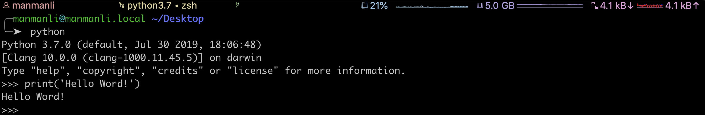
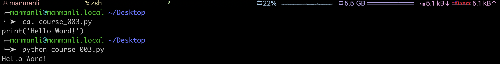
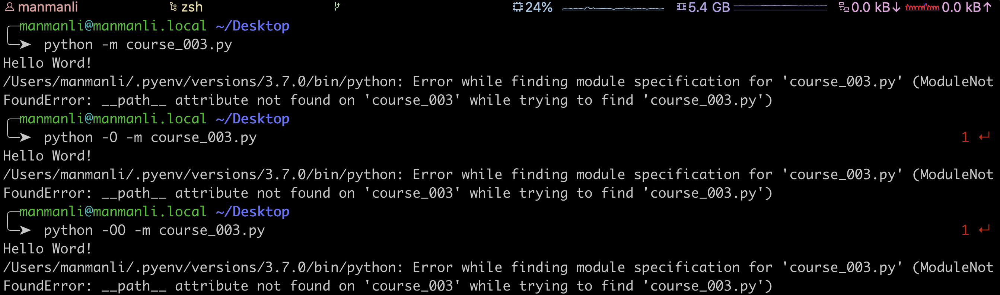
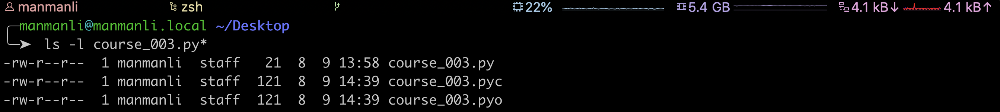
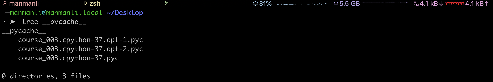

----

* [执行流程](#执行流程)
  * [通过解释器](#通过解释器)
  * [通过PY脚本](#通过PY脚本)
    * [手动编译](#手动编译)
    * [Python2](#Python2)
    * [Python3](#Python3)
* [执行变体](#执行变体)
* [本章习题](#本章习题)

----

# 执行流程

> Python解释器将源代码编译成字节码指令再将其发送给Python虚拟机执行(内部会再次将字节码指令编译成二进制指令交由机器执行),这里解释器和虚拟机其实都是二进制Python程序的组成部分而并非独立

* 由于Python默认编译的是字节码指令,每次交由虚拟机执行时都需要重新编译为二进制指令,而类C/C++默认编译出来的就是二进制指令,这也就是Python无法运行的像C/C++一样快的原因

## 通过解释器

> 执行流程如上,但会将首次编译的字节码指令存储在内存直到程序执行结束

## 通过PY脚本

> 执行流程如上,但会将首次编译成以.pyc结尾的字节码指令文件,下次执行时会首先检查源文件和字节码指令文件的时间戳来判断源文件是否变动,如果变动则重新编译字节码指令,否则加载已有字节码指令

### 手动编译

> \-m会将模块当作脚本执行,解释器在导入时才会编译出字节码指令文件,\-O优化字节码指令,\-OO深度优化字节码

### Python2

> 同上,但会将生成的字节码指令文件存储在目标脚本所在目录下且同名

### Python3

> 同上,但会将生成的字节码指令文件存储在目标脚本所在目录下的\_\_pycache\_\_

# 执行变体

> Python更准确的应该叫CPython,它是Python语言的实现,核心包含解释器和虚拟机,支持Python和C之间的相互独调用,但随之也涌现出其它语言的实现例如基于Java开发的[Jython](https://www.jython.org/)和基于C#开发的[IronPython](https://ironpython.net/),可完美实现Python和Java/C#的相互调用

# 本章习题

> 无

