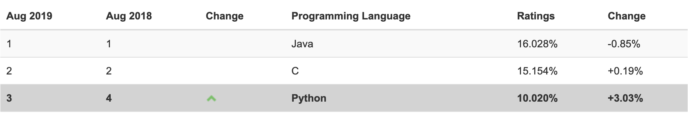

----

* [什么是编程?](#什么是编程?)
* [什么是Python?](#什么是Python?)
* [为什么选Python?](#为什么选Python?)
  * [编码规范](#编码规范)
  * [应用场景](#应用场景)
* [怎么学Python?](#怎么学Python?)
  * [习惯养成](#习惯养成)
  * [知识体系](#知识体系)
  * [阅读源码](#阅读源码)
  * [回归本质](#回归本质)
* [本章习题](#本章习题)

----

# 什么是编程?

> 编程其实就是用解释器能理解的语言告诉它你要做什么,那么本质上就是将自然语言转换为目标编程语言

# 什么是Python?

> [Python](https://www.python.org/)是一门编程语言,但实际是指语言本身(包括语法规则,用于编写有效代码)和解释器(用于执行有效代码)

# 为什么选Python?

> [Python](https://www.python.org/)是一种开发效率极高的支持面向对象的脚本语言,相比于众多其它语言,同样的功能实现代码量更少,并且内置众多标准库的同时也支持第三方库扩展库,但相对于C/C++等编译语言它的执行速度还不够快,所以对于非追求极致性能场景还是强烈推荐学习的



## 编码规范

```python
优美胜于丑陋（Python 以编写优美的代码为目标）
明了胜于晦涩（优美的代码应当是明了的，命名规范，风格相似）
简洁胜于复杂（优美的代码应当是简洁的，不要有复杂的内部实现）
复杂胜于凌乱（如果复杂不可避免，那代码间也不能有难懂的关系，要保持接口简洁）
扁平胜于嵌套（优美的代码应当是扁平的，不能有太多的嵌套）
间隔胜于紧凑（优美的代码有适当的间隔，不要奢望一行代码解决问题）
可读性很重要（优美的代码是可读的）
即便假借特例的实用性之名，也不可违背这些规则（这些规则至高无上）
 
不要包容所有错误，除非你确定需要这样做（精准地捕获异常，不写 except:pass 风格的代码）
 
当存在多种可能，不要尝试去猜测
而是尽量找一种，最好是唯一一种明显的解决方案（如果不确定，就用穷举法）
虽然这并不容易，因为你不是 Python 之父（这里的 Dutch 是指 Guido ）
 
做也许好过不做，但不假思索就动手还不如不做（动手之前要细思量）
 
如果你无法向人描述你的方案，那肯定不是一个好方案；反之亦然（方案测评标准）
 
命名空间是一种绝妙的理念，我们应当多加利用（倡导与号召）
```

## [应用场景](https://awesome-python.com/)

# 怎么学Python?

## 习惯养成

> 初级开发工程师阶段

* 研究表明,21天+的重复行为会养成习惯,91天+的重复行为会养成稳定习惯,学习亦是如此

## 知识体系

> 中级开发工程师阶段

* 定期记录更新整理实用知识体系套路(最佳实践),形式不限,推荐订阅[开发者头条](https://toutiao.io/)聚合文章

## 阅读源码

> 高级开发工程师阶段

* 定期阅读感兴趣的开源项目源码,甚至尝试重复造轮子,过程中会学到很多高级编程套路

## 回归本质

> 高级开发架构师阶段

* 如今技术更新迭代如此之快,最终能沉淀下来的除了经验我想更多的还是基础,如算法,设计模式,架构能力

# 本章习题

