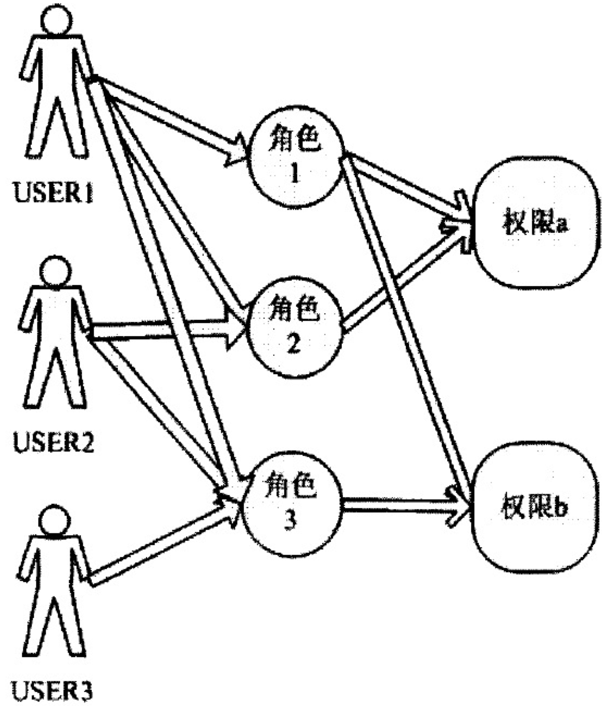

# 安全定义

> 防止非法用户进入系统, 防止合法用户对系统资源的非法使用

# 访问控制

> 明确哪些主体(如用户)可以使用哪些客体(如资源)

## RBAC

> Role-Based Access Control, 基于角色的访问控制, 核心思想在于在用户和权限之间引入角色的概念,角色作为访问权限的集合,用户通过赋予不同的角色获得角色所拥有的访问权限,一个用户可以拥有多个角色,一个角色也可以授权给多个用户,一个角色可以包含多个权限,一个权限也可以被多个角色包含

## ARBAC

