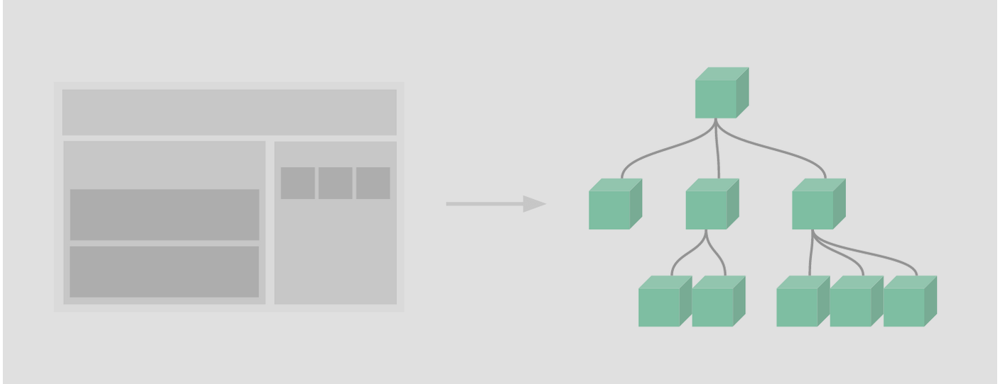

----

* [基本实例](#基本实例)
* [组件复用](#组件复用)
* [组织组件](#组织组件)
* [数据传递](#数据传递)
* [单根元素](#单根元素)
* [组件事件](#组件事件)
  * [触发事件](#触发事件)
  * [抛出一个值](#抛出一个值)
  * [配合v-model](#配合v-model)
    * [v-model本质](#v-model本质)
    * [v-model组件](#v-model组件)
* [插槽分发](#插槽分发)
* [动态组件](#动态组件)
* [解析问题](#解析问题)

----

# 基本实例

> 组件其实是命名的可复用的Vue实例,组件必须在通过new Vue创建的根实例中作为自定义元素来使用

```html
<!DOCTYPE html>
<html lang="en">
    <head>
        <meta charset="UTF-8">
        <meta name="viewport" content="width=device-width, initial-scale=1.0">
        <meta http-equiv="X-UA-Compatible" content="ie=edge">
        <!-- 开发环境版本，包含了有帮助的命令行警告 -->
        <script src="https://cdn.jsdelivr.net/npm/vue/dist/vue.js"></script>
        <!-- 生产环境版本，优化了尺寸和速度 -->
        <!--<script src="https://cdn.jsdelivr.net/npm/vue"></script>-->
        <title>Vue</title>
        <!-- 自定义的类样式 -->
        <style type="text/css">
            * {
                padding: 0;
                margin: 0;
            }
        </style>
    </head>
    <body>
        <div id="app">
            <button-counter></button-counter>
        </div>
        <script type="text/javascript">   
            // 创建一个Vue组件
            Vue.component('button-counter', {
                // 数据对象,但由于组件实例之间通常需要相互独立(包括数据)所以数据对象必须是一个可调用对象,此对象需要返回一个新的对象作为数据对象
                data: function(){
                  return {
                      counter: 0
                  }
                },
                // 组件模版,每个组件实例通过v-on指令监听click事件,当事件触发时会执行指令表达式使counter自增,并可在模版中使用文本插值
                template: '<button @click="counter++">you have click {{ counter }} times</button>'
            })
            // 创建一个Vue实例
            let vm = new Vue({
                // 绑定元素
                el: '#app'
            })
        </script>
    </body>
</html>
```

* 组件是命名可复用的Vue实例,所以声明时内部可以接收与根Vue相同的选项,如data,computed,watch,methods以及生命周期钩子等,但el这种根实例特有的除外

# 组件复用

> 组件可复用,每次复用都是一个新的组件实例,也就是说组件实例之间相互独立

```html
<!DOCTYPE html>
<html lang="en">
    <head>
        <meta charset="UTF-8">
        <meta name="viewport" content="width=device-width, initial-scale=1.0">
        <meta http-equiv="X-UA-Compatible" content="ie=edge">
        <!-- 开发环境版本，包含了有帮助的命令行警告 -->
        <script src="https://cdn.jsdelivr.net/npm/vue/dist/vue.js"></script>
        <!-- 生产环境版本，优化了尺寸和速度 -->
        <!--<script src="https://cdn.jsdelivr.net/npm/vue"></script>-->
        <title>Vue</title>
        <!-- 自定义的类样式 -->
        <style type="text/css">
            * {
                padding: 0;
                margin: 0;
            }
        </style>
    </head>
    <body>
        <div id="app">
            <!-- 作为自定义元素来使用则会自动创建一个新的组件实例, 组件实例之间相互独立 -->
            <button-counter></button-counter>
            <!-- 作为自定义元素来使用则会自动创建一个新的组件实例, 组件实例之间相互独立 -->
            <button-counter></button-counter>
            <!-- 作为自定义元素来使用则会自动创建一个新的组件实例, 组件实例之间相互独立 -->
            <button-counter></button-counter>
            <!-- 作为自定义元素来使用则会自动创建一个新的组件实例, 组件实例之间相互独立 -->
            <button-counter></button-counter>
        </div>
        <script type="text/javascript">   
            // 创建一个Vue组件
            Vue.component('button-counter', {
                 // 数据对象,但由于组件实例之间通常需要相互独立(包括数据)所以数据对象必须是一个可调用对象,此对象需要返回一个新的对象作为数据对象
                data: function(){
                  return {
                      counter: 0
                  }
                },
                 // 组件模版,每个组件实例通过v-on指令监听click事件,当事件触发时会执行指令表达式使counter自增,并可在模版中使用文本插值
                template: '<button @click="counter++">you have click {{ counter }} times</button>'
            })
            // 创建一个Vue实例
            let vm = new Vue({
                // 绑定元素
                el: '#app'
            })
        </script>
    </body>
</html>
```

* 由于要实现组件实例之间数据对象独立所以data必须是一个方法而非公共对象,否则将失去其复用的价值

# 组织组件

> 通常应用以嵌套组件树形式来组织组件



* 组件必须预先注册才能在作为自定义元素引用,注册方式分为全局注册(Vue.component)和局部注册,全局注册的组件可以用于任何根Vue实例甚至子组件模版中

# 数据传递

> 在组件实例上可通过v-bind:attr为向组件传递任意可用对象(当然这些对象名称必须在组件的props属性值中提前声明)

```html
<!DOCTYPE html>
<html lang="en">
    <head>
        <meta charset="UTF-8">
        <meta name="viewport" content="width=device-width, initial-scale=1.0">
        <meta http-equiv="X-UA-Compatible" content="ie=edge">
        <!-- 开发环境版本，包含了有帮助的命令行警告 -->
        <script src="https://cdn.jsdelivr.net/npm/vue/dist/vue.js"></script>
        <!-- 生产环境版本，优化了尺寸和速度 -->
        <!--<script src="https://cdn.jsdelivr.net/npm/vue"></script>-->
        <title>Vue</title>
        <!-- 自定义的类样式 -->
        <style type="text/css">
            * {
                padding: 0;
                margin: 0;
            }
        </style>
    </head>
    <body>
        <div id="app">
            <!-- 将blog-post作为自定义元素使用,并配合v-for指令表达式遍历posts遍历复制所在元素,并通过:title将title对象传递给组件 -->
            <!-- 组件强制要求为其设置唯一:key属性 -->
            <blog-post v-for="post in posts" :title="post.title" :key="post.id"></blog-post>
        </div>
        <script type="text/javascript">   
            // 创建一个Vue组件
            Vue.component('blog-post', {
                // 限制组件实例传递进来的对象名称列表
                props: ['title'],
                // 组件模版中可引用组件实例传递过来并在props中允许的对象
                template: '<h3>{{ title }}</h3>'
            })
            // 创建一个Vue实例
            let vm = new Vue({
                // 绑定元素
                el: '#app',
                // 数据对象
                data: {
                    posts: [
                        {id: 1, title: 'My journey with Vue'},
                        {id: 2, title: 'Blogging with Vue'},
                        {id: 3, title: 'Why Vue is so fun'},
                    ]
                }
            })
        </script>
    </body>
</html>
```

# 单根元素

> 组件模版中仅支持单个根元素,也就是说组件模版的内容必须包含在一个根元素下,否则实例化时会异常

```html
<!DOCTYPE html>
<html lang="en">
    <head>
        <meta charset="UTF-8">
        <meta name="viewport" content="width=device-width, initial-scale=1.0">
        <meta http-equiv="X-UA-Compatible" content="ie=edge">
        <!-- 开发环境版本，包含了有帮助的命令行警告 -->
        <script src="https://cdn.jsdelivr.net/npm/vue/dist/vue.js"></script>
        <!-- 生产环境版本，优化了尺寸和速度 -->
        <!--<script src="https://cdn.jsdelivr.net/npm/vue"></script>-->
        <title>Vue</title>
        <!-- 自定义的类样式 -->
        <style type="text/css">
            * {
                padding: 0;
                margin: 0;
            }
        </style>
    </head>
    <body>
        <div id="app">
            <!-- 将blog-post作为自定义元素使用,并配合v-for指令表达式遍历posts遍历复制所在元素,并通过:post将post对象传递给组件 -->
            <blog-post v-for="post in posts" :post="post" :key="post.id"></blog-post>
        </div>
        <script type="text/javascript">   
            // 创建一个Vue组件
            Vue.component('blog-post', {
                // 限制组件实例传递进来的对象名称列表
                props: ['post'],
                // 组件模版中可引用组件实例传递过来并在props中允许的对象
                // 组件模版中的内容必须包含一个根元素里面,也就是下面的<div class="blog-post"></div>下
                template: '\
                <div class="blog-post">\
                    <h3>{{ post.title }}</h3>\
                    <div v-html="post.content"></div>\
                </div>'
            })
            // 创建一个Vue实例
            let vm = new Vue({
                // 绑定元素
                el: '#app',
                // 数据对象
                data: {
                    posts: [
                        {id: 1, title: 'title1', content: 'content1'},
                        {id: 2, title: 'title2', content: 'content2'},
                        {id: 3, title: 'title3', content: 'content3'},
                    ]
                }
            })
        </script>
    </body>
</html>
```

* 通常会通过v-bind:attr来传递单个对象来代替多个对象属性的传递,这样无论对象本身如何变化都可在模版中直接引用

# 组件事件

> 组件内可通过$emit触发组件实例上监听的事件来与父组件(如根Vue实例)进行通讯

## 触发事件

> 子组件可通过$emit触发组件实例上监听的事件来与父组件(如根Vue实例)进行通讯(如更改父组件的数据对象等)

```html
<!DOCTYPE html>
<html lang="en">
    <head>
        <meta charset="UTF-8">
        <meta name="viewport" content="width=device-width, initial-scale=1.0">
        <meta http-equiv="X-UA-Compatible" content="ie=edge">
        <!-- 开发环境版本，包含了有帮助的命令行警告 -->
        <script src="https://cdn.jsdelivr.net/npm/vue/dist/vue.js"></script>
        <!-- 生产环境版本，优化了尺寸和速度 -->
        <!--<script src="https://cdn.jsdelivr.net/npm/vue"></script>-->
        <title>Vue</title>
        <!-- 自定义的类样式 -->
        <style type="text/css">
            * {
                padding: 0;
                margin: 0;
            }
        </style>
    </head>
    <body>
        <div id="app">
            <!-- 将blog-post作为自定义元素使用,并配合v-for指令表达式遍历posts遍历复制所在元素,并通过:post将post对象传递给组件 -->
            <!-- 在组件实例上通过v-on监听自定义事件,事件触发时配合:style来改变博文字体大小-->
            <blog-post v-for="post in posts" 
                       :post="post" 
                       :key="post.id"
                       :style="{'font-size': post_font_size + 'em'}"
                       @enlarge_text="post_font_size++"></blog-post>
        </div>
        <script type="text/javascript">   
            // 创建一个Vue组件
            Vue.component('blog-post', {
                // 限制组件实例传递进来的对象名称列表
                props: ['post'],
                // 组件模版中可引用组件实例传递过来并在props中允许的对象
                // 组件模版中的内容必须包含一个根元素里面,也就是下面的<div class="blog-post"></div>下
                // 组件模版中的元素可通过v-on指令监听指定事件,指令表达式支持通过$emit(event)来触发组件实例上自定义的监听事件
                template: '\
                <div class="blog-post">\
                    <h3>{{ post.title }}</h3>\
                    <div v-html="post.content"></div>\
                    <button @click="$emit(\'enlarge_text\')">enlarge</button>\
                </div>'
            })
            // 创建一个Vue实例
            let vm = new Vue({
                // 绑定元素
                el: '#app',
                // 数据对象
                data: {
                    // 博客内容字体大小
                    post_font_size: 1,
                    posts: [
                        {id: 1, title: 'title1', content: 'content1'},
                        {id: 2, title: 'title2', content: 'content2'},
                        {id: 3, title: 'title3', content: 'content3'},
                    ]
                }
            })
        </script>
    </body>
</html>
```


## 抛出一个值

> 子组件通过$emit触发组件实例上监听的事件时可通过第2个参数为组件实例上下文抛出一个值,如果组件实例对应监听的事件表达式为普通表达式则可直接通过\$event引用此值,如果为可调用方法对象属性则在调用时作为第一个参数传递

```html
<!DOCTYPE html>
<html lang="en">
    <head>
        <meta charset="UTF-8">
        <meta name="viewport" content="width=device-width, initial-scale=1.0">
        <meta http-equiv="X-UA-Compatible" content="ie=edge">
        <!-- 开发环境版本，包含了有帮助的命令行警告 -->
        <script src="https://cdn.jsdelivr.net/npm/vue/dist/vue.js"></script>
        <!-- 生产环境版本，优化了尺寸和速度 -->
        <!--<script src="https://cdn.jsdelivr.net/npm/vue"></script>-->
        <title>Vue</title>
        <!-- 自定义的类样式 -->
        <style type="text/css">
            * {
                padding: 0;
                margin: 0;
            }
        </style>
    </head>
    <body>
        <div id="app">
            <!-- 将blog-post作为自定义元素使用,并配合v-for指令表达式遍历posts遍历复制所在元素,并通过:post将post对象传递给组件 -->
            <!-- 在组件实例上通过v-on监听自定义事件,事件触发时配合:style来改变博文字体大小-->
            <blog-post v-for="post in posts" 
                       :post="post" 
                       :key="post.id"
                       :style="{'font-size': post_font_size + 'em'}"
                       @enlarge_text="post_font_size+=$event"></blog-post>
        </div>
        <script type="text/javascript">   
            // 创建一个Vue组件
            Vue.component('blog-post', {
                // 限制传递进子组件的对象
                props: ['post'],
                // 组件模版中可引用组件实例传递过来并在props中允许的对象
                // 组件模版中的内容必须包含一个根元素里面,也就是下面的<div class="blog-post"></div>下
                // 组件模版中的元素可通过v-on指令监听指定事件,指令表达式支持通过$emit(event, value)来触发组件实例上自定义的监听事件并抛出value值给组件实例
                template: '\
                <div class="blog-post">\
                    <h3>{{ post.title }}</h3>\
                    <div v-html="post.content"></div>\
                    <button @click="$emit(\'enlarge_text\', 0.1)">enlarge</button>\
                </div>'
            })
            // 创建一个Vue实例
            let vm = new Vue({
                // 绑定元素
                el: '#app',
                // 数据对象
                data: {
                    // 博客内容字体大小
                    post_font_size: 1,
                    posts: [
                        {id: 1, title: 'title1', content: 'content1'},
                        {id: 2, title: 'title2', content: 'content2'},
                        {id: 3, title: 'title3', content: 'content3'},
                    ]
                }
            })
        </script>
    </body>
</html>
```


## 配合v-model

> 自定义事件也可用于创建支持类似v-model双向绑定的自定义输入组件

### v-model本质

> v-model的本质其实是通过v-bind来绑定属性值并通过v-on来监听input或change事件来改变前者绑定的值

```html
<!DOCTYPE html>
<html lang="en">
    <head>
        <meta charset="UTF-8">
        <meta name="viewport" content="width=device-width, initial-scale=1.0">
        <meta http-equiv="X-UA-Compatible" content="ie=edge">
        <!-- 开发环境版本，包含了有帮助的命令行警告 -->
        <script src="https://cdn.jsdelivr.net/npm/vue/dist/vue.js"></script>
        <!-- 生产环境版本，优化了尺寸和速度 -->
        <!--<script src="https://cdn.jsdelivr.net/npm/vue"></script>-->
        <title>Vue</title>
        <!-- 自定义的类样式 -->
        <style type="text/css">
            * {
                padding: 0;
                margin: 0;
            }
        </style>
    </head>
    <body>
        <div id="app">
            <!-- v-model将数据对象属性input_value与输入框表单双向绑定,当表单数据发生改变时将影响数据对象属性,当数据对象属性发生改变时候会触发视图更新影响表单值 -->
            <input type="text" v-model="input_value">
            <!-- v-model等同于通过:value将value与数据对象属性input_value绑定,并通过@input来监听所在元素的输入事件,事件触发时会导致指令表达式被执行,也就是input_value=$event.target.value,此处的$event为原生的DOM对象-->
            <input type="text" :value="input_value" @input="input_value=$event.target.value">
            <p>{{ input_value }}</p>
        </div>
        <script type="text/javascript">   
            // 创建一个Vue实例
            let vm = new Vue({
                // 绑定元素
                el: '#app',
                // 数据对象
                data: {
                    input_value: '',
                }
            })
        </script>
    </body>
</html>
```

* v-on指令表达式中可直接引用\$event原生DOM对象,所以可通过$event.target.value直接获取输入框的表单值

### v-model组件

> 自定义事件也可用于创建支持类似v-model双向绑定的自定义输入组件

```html
<!DOCTYPE html>
<html lang="en">
    <head>
        <meta charset="UTF-8">
        <meta name="viewport" content="width=device-width, initial-scale=1.0">
        <meta http-equiv="X-UA-Compatible" content="ie=edge">
        <!-- 开发环境版本，包含了有帮助的命令行警告 -->
        <script src="https://cdn.jsdelivr.net/npm/vue/dist/vue.js"></script>
        <!-- 生产环境版本，优化了尺寸和速度 -->
        <!--<script src="https://cdn.jsdelivr.net/npm/vue"></script>-->
        <title>Vue</title>
        <!-- 自定义的类样式 -->
        <style type="text/css">
            * {
                padding: 0;
                margin: 0;
            }
        </style>
    </head>
    <body>
        <div id="app">
            <!-- v-bind:value将自定义元素的value属性与数据对象属性input_value绑定,并监听自定义元素input事件当事件被触发时,指令表达式被执行使得数据对象属性立即变更而导致视图更新 -->
            <custom-input @input="input_value=$event" :value="input_value"></custom-input>
            <p>{{ input_value }}</p>
        </div>
        <script type="text/javascript"> 
            // 创建一个Vue组件
            Vue.component('custom-input', {
                // 限制组件实例传递过来的对象列表
                props: ['value'],
                // 组件模版中input输入框通过v-on监听input事件,事件触发时通过$emit触发组件实例上的input事件并抛出当前输入框的值,组件实例上input事件表达式被执行使得数据对象属性被变更导致视图被更新
                template: '<input type="text" :value="value" @input="$emit(\'input\', $event.target.value)">'
            })
            // 创建一个Vue实例
            let vm = new Vue({
                // 绑定元素
                el: '#app',
                // 数据对象
                data: {
                    input_value: '',
                }
            })
        </script>
    </body>
</html>
```

* 如上在组件实例上通过v-bind:value将输入框的值传递给组件,并监听input事件,在事件触发时及时更新数据对象属性input_value的值,此举将立即触发视图更新,足以完美模拟v-model的效果

# 插槽分发

> 组件支持通过模版中预留slot插槽的方式来向组件中传递内容,如\<notice-box\>Something\</notice-box\>

```html
<!DOCTYPE html>
<html lang="en">
    <head>
        <meta charset="UTF-8">
        <meta name="viewport" content="width=device-width, initial-scale=1.0">
        <meta http-equiv="X-UA-Compatible" content="ie=edge">
        <!-- 开发环境版本，包含了有帮助的命令行警告 -->
        <script src="https://cdn.jsdelivr.net/npm/vue/dist/vue.js"></script>
        <!-- 生产环境版本，优化了尺寸和速度 -->
        <!--<script src="https://cdn.jsdelivr.net/npm/vue"></script>-->
        <title>Vue</title>
        <!-- 自定义的类样式 -->
        <style type="text/css">
            * {
                padding: 0;
                margin: 0;
            }
            .left {
                float: left;
            }
            .right {
                float: right;
            }
            .clear {
                clear: both;
            }
            .error {
                padding: 10px 20px;
                line-height: 50px;
                background-color: #f3beb8;
                border: solid 1px #f09898;
            }
        </style>
    </head>
    <body>
        <div id="app">
            <notice-box :class="['error']">Something bad happended.</notice-box>
        </div>
        <script type="text/javascript"> 
            // 创建一个Vue组件
            Vue.component('notice-box', {
                // 数据对象,但由于组件实例之间通常需要相互独立(包括数据)所以数据对象必须是一个可调用对象,此对象需要返回一个新的对象作为数据对象
                data: function(){
                    // 为每个组件实例创建独立的定时器
                    return {timer: 3}
                },
                // 组件模版中可通过<slot></slot>预留槽位的方式来动态向组件中传递内容,如下一个简单的提醒框
                template: '\
                <div>\
                    <div class="left">\
                        <slot></slot>\
                    </div>\
                    <div class="right">\
                        {{ timer }}\
                    </div>\
                    <div class="clear">\
                    </div>\
                </div>',
                // 在实例创建完成时通过生命周期钩子为每个组件实例创建一个计时器
                created: function(){
                    // this指向组件实例,由于在setInterval方法内部使用时this冲突所以需要起个别名
                    let that = this;
                    let timer = setInterval(function(){
                        // 倒数3个数
                        if (that.timer > 1){
                            that.timer--;
                            return;
                        };
                        // 清除计数器
                        clearInterval(timer);
                        // 原生JS删除元素
                        that.$el.parentNode.removeChild(that.$el);
                    }, 1000);
                }
            })
            // 创建一个Vue实例
            let vm = new Vue({
                // 绑定元素
                el: '#app'
            })
        </script>
    </body>
</html>
```

# 动态组件

> component配合:is属性可实现动态组件(组件切换),is属性表达式值需要为预定义的组件对象属性,is属性绑定的数据对象属性的变更将触发组件重绘

````html
<!DOCTYPE html>
<html lang="en">
    <head>
        <meta charset="UTF-8">
        <meta name="viewport" content="width=device-width, initial-scale=1.0">
        <meta http-equiv="X-UA-Compatible" content="ie=edge">
        <!-- 开发环境版本，包含了有帮助的命令行警告 -->
        <script src="https://cdn.jsdelivr.net/npm/vue/dist/vue.js"></script>
        <!-- 生产环境版本，优化了尺寸和速度 -->
        <!--<script src="https://cdn.jsdelivr.net/npm/vue"></script>-->
        <title>Vue</title>
        <!-- 自定义的类样式 -->
        <style type="text/css">
            * {
                padding: 0;
                margin: 0;
            }
            .left {
                float: left;
            }
            .right {
                float: right;
            }
            .clear {
                clear: both;
            }
            .error {
                padding: 10px 20px;
                line-height: 50px;
                background-color: #f3beb8;
                border: solid 1px #f09898;
            }
        </style>
    </head>
    <body>
        <div id="app">
            <!-- v-on指令监听所在元素的click事件.事件触发时指令表达式被执行 -->
            <button @click="change_tab">切换标签页</button>
            <!-- 可通过component配合:is特殊属性来实现动态组件,:is属性的表达式的值必须为组件对象中声明的组件选项名 -->
            <component :is="cur_component"></component>
        </div>
        <script type="text/javascript">
            // 创建一个Vue实例
            let vm = new Vue({
                // 绑定元素
                el: '#app',
                // 数据对象
                data: {
                    cur_index_num: 0,
                    cur_component: 'home',
                    component_arr: ['home', 'post', 'archive'],
                },
                // 方法对象
                methods: {
                    // 切换标签页
                    change_tab: function(){
                        // 自增标签ID
                        this.cur_index_num++;
                        // 改变当前组件
                        this.cur_component = this.component_arr[this.cur_index_num % 3];
                    }
                },
                // 组件对象,可同时声明多个组件,和Vue.component一样,但此方式是属于局部注册
                components: {
                    // 首页组件,{}中参数为组件的参数
                    home: {template: '<div>Home component</div>'},
                    // 文章组件,{}中参数为组件的参数
                    post: {template: '<div>Post component</div>'},
                    // 归档组件,{}中参数为组件的参数
                    archive: {template: '<div>Archive component</div>'}
                }
            })
        </script>
    </body>
</html>
````

# 解析问题

> 某些浏览器会对指定元素如(\<ul\>\<ol\>\<table\>\<select\>)允许内部出现的元素有强制限制,我们自定义的组件引用时可能因此而导致解析错误,所以Vue支持通过is属性来避免此问题

```html
<!DOCTYPE html>
<html lang="en">
    <head>
        <meta charset="UTF-8">
        <meta name="viewport" content="width=device-width, initial-scale=1.0">
        <meta http-equiv="X-UA-Compatible" content="ie=edge">
        <!-- 开发环境版本，包含了有帮助的命令行警告 -->
        <script src="https://cdn.jsdelivr.net/npm/vue/dist/vue.js"></script>
        <!-- 生产环境版本，优化了尺寸和速度 -->
        <!--<script src="https://cdn.jsdelivr.net/npm/vue"></script>-->
        <title>Vue</title>
        <!-- 自定义的类样式 -->
        <style type="text/css">
            * {
                padding: 0;
                margin: 0;
            }
        </style>
    </head>
    <body>
        <div id="app">
            <ul>
                <!-- v-for指令通过遍历数据对象属性todos来遍历复制所在元素,元素属性和内容中可以对遍历对象进行引用 -->
                <!-- is属性表示此元素将作为todo-item组件实例使用,可有效防止浏览器解析异常 -->
                <li is="todo-item" v-for="todo in todos" :todo="todo" :key="todo.id"></li>
            </ul>
        </div>
        <script type="text/javascript">
            // 创建一个Vue组件
            Vue.component('todo-item', {
                props: ['todo'],
                template: '<li>{{ todo.text }}<li>'
            })
            // 创建一个Vue实例
            let vm = new Vue({
                // 绑定元素
                el: '#app',
                // 数据对象
                data: {
                    todos: [
                        {id: 1, text: '学习Vue'},
                        {id: 2, text: '学习Django'},
                        {id: 3, text: '学习DjangoRestFramework'}
                    ]
                },
            })
        </script>
    </body>
</html>
```


