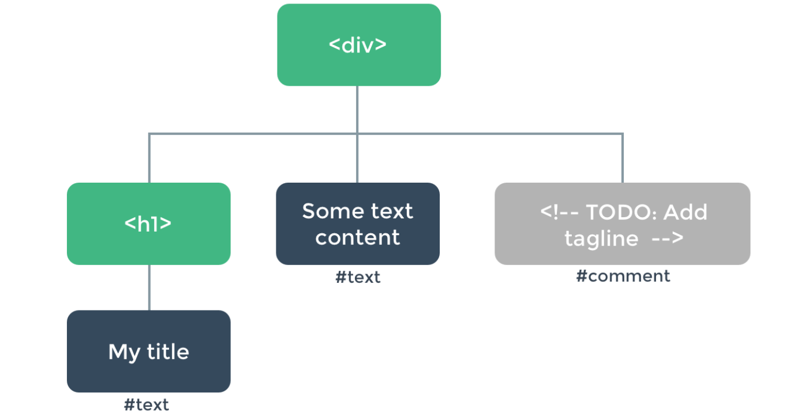

----

* [DOM节点树](#DOM节点树)
* [创建节点树](#创建节点树)
  * [模版方式](#模版方式)
  * [渲染函数](#渲染函数)
  * [数据对象](#数据对象)
  * [节点约束](#节点约束)
  * [模拟模版](#模拟模版)
  * [函数组件](#函数组件)

----

# DOM节点树

> 浏览器读取到如上代码时会建立如上的虚拟DOM树,每个元素都是一个节点,Vue会帮我们自动高效的更新节点信息

```html
<div>
  <h1>My title</h1>
  Some text content
  <!-- TODO: Add tagline -->
</div>
```



# 创建节点树

> 支持通过模版或渲染函数render来创建虚拟DOM节点数,节点树依赖的数据对象属性发生变更时会自动触发视图更新(节点树更新)

## 模版方式

> 略

## 渲染函数

> 组件render值必须为一个可接收用于创建虚拟DOM的方法的函数,方法名通常为create_element,此方法第一个参数为原生HTML标签或组件选项对象或异步函数,第二个参数为数据对象,第三个参数为子级虚拟节点,可为字符串或数组

```html
<!DOCTYPE html>
<html lang="en">
    <head>
        <meta charset="UTF-8">
        <meta name="viewport" content="width=device-width, initial-scale=1.0">
        <meta http-equiv="X-UA-Compatible" content="ie=edge">
        <!-- 开发环境版本，包含了有帮助的命令行警告 -->
        <script src="https://cdn.jsdelivr.net/npm/vue/dist/vue.js"></script>
        <!-- 生产环境版本，优化了尺寸和速度 -->
        <!--<script src="https://cdn.jsdelivr.net/npm/vue"></script>-->
        <title>Vue</title>
        <!-- 自定义的类样式 -->
        <style type="text/css">
            * {
                padding: 0;
                margin: 0;
            }
        </style>
    </head>
    <body>
        <div id="app">
            <demo></demo>
        </div>
        <script type="text/javascript">
            // 创建一个Vue组件
            Vue.component('demo', {
                // 渲染函数
                render: function(create_element){
                    // 通过create_element创建元素
                    return create_element(
                        // 顶部元素名
                        'div', 
                        // 元素的相关数据对象
                        {}, 
                        // 元素内部包含的子元素列表
                        [
                            // 支持递归创建
                            create_element('h1', {}, 'My title'),
                            // 文本节点可直接用字符串
                            'Some text content',
                        ]
                    )
                }
            });
            // 创建一个Vue实例
            let vm = new Vue({
                // 绑定元素
                el: '#app',
            });
        </script>
    </body>
</html>
```

## 数据对象

> 组件render值必须为一个可接收用于创建虚拟DOM的方法的函数,方法名通常为create_element,此方法第二个参数支持如下数据对象

| 名称        | 说明                                              |
| ----------- | ------------------------------------------------- |
| class       | 与:class用法一致,支持字符串,数组,对象             |
| style       | 与:style用法一致,支持字符串,对象数组,对象         |
| attrs       | 元素的所有HTML属性,仅支持对象                     |
| props       | 组件的props,仅支持对象                            |
| domProps    | 元素的所有DOM属性,仅支持对象                      |
| on          | 元素的所有事件监听,仅支持对象                     |
| nativeOn    | 组件的所有原生事件监听,仅支持对象                 |
| directives  | 元素/组件的所有指令,仅支持数组                    |
| scopedSlots | 组件所有作用域插槽,仅支持对象                     |
| key         | 元素或组件的唯一别名,仅支持字符串                 |
| ref         | 元素或组件的唯一引用别名,仅支持字符串             |
| refInFor    | 如果多个元素相同ref引用名则通过\$refs访问时为数组 |

```html
<!DOCTYPE html>
<html lang="en">
    <head>
        <meta charset="UTF-8">
        <meta name="viewport" content="width=device-width, initial-scale=1.0">
        <meta http-equiv="X-UA-Compatible" content="ie=edge">
        <!-- 开发环境版本，包含了有帮助的命令行警告 -->
        <script src="https://cdn.jsdelivr.net/npm/vue/dist/vue.js"></script>
        <!-- 生产环境版本，优化了尺寸和速度 -->
        <!--<script src="https://cdn.jsdelivr.net/npm/vue"></script>-->
        <title>Vue</title>
        <!-- 自定义的类样式 -->
        <style type="text/css">
            * {
                padding: 0;
                margin: 0;
            }
        </style>
    </head>
    <body>
        <div id="app">
            <demo :level="1" href="#">test</demo>
        </div>
        <script type="text/javascript">
            // 创建一个Vue组件
            Vue.component('demo', {
                // 将除了props中声明的对象都保存到$attrs中
                inheritAttrs: false,
                // 允许组件传递的数据对象
                props: {
                    level: {
                        type: Number,
                        required: true,
                    } 
                },
                // 渲染函数
                render: function(create_element){
                    // 从根元素开始创建
                    return create_element(
                        // 创建h1
                        'h' + this.level,
                        {},
                        [
                            // 创建a
                            create_element(
                                'a',
                                {
                                    // 再将$attrs指定属性给指定的内部元素,如这里a
                                    attrs: this.$attrs
                                },
                                // 创建文本节点
                                this.$slots.default,
                            )
                        ]
                    )
                }
            });
            // 创建一个Vue实例
            let vm = new Vue({
                // 绑定元素
                el: '#app',
            });
        </script>
    </body>
</html>
```

## 节点约束

> 组件树中所有的VNode必须保证唯一,也就是说必须通过create_element来分别创建,即使是相同节点

```html
<!DOCTYPE html>
<html lang="en">
    <head>
        <meta charset="UTF-8">
        <meta name="viewport" content="width=device-width, initial-scale=1.0">
        <meta http-equiv="X-UA-Compatible" content="ie=edge">
        <!-- 开发环境版本，包含了有帮助的命令行警告 -->
        <script src="https://cdn.jsdelivr.net/npm/vue/dist/vue.js"></script>
        <!-- 生产环境版本，优化了尺寸和速度 -->
        <!--<script src="https://cdn.jsdelivr.net/npm/vue"></script>-->
        <title>Vue</title>
        <!-- 自定义的类样式 -->
        <style type="text/css">
            * {
                padding: 0;
                margin: 0;
            }
            p {
                padding: 20px;
                border: solid 1px #EEEEEE;
            }
        </style>
    </head>
    <body>
        <div id="app">
            <demo>test</demo>
        </div>
        <script type="text/javascript">
            // 创建一个Vue组件
            Vue.component('demo', {
                // 渲染函数
                render: function(create_element){
                    // 从根元素开始创建
                    return create_element(
                        'div',
                        {},
                        // 创建多个相同元素
                        Array.apply(null, {length: 20}).map(function(c){
                            return create_element('p', {}, '');
                        })
                    )
                }
            });
            // 创建一个Vue实例
            let vm = new Vue({
                // 绑定元素
                el: '#app',
            });
        </script>
    </body>
</html>
```

## 模拟模版

> 可通过如上渲染函数配合数据对象参数来实现类似v-i/v-for/v-model/事件/事件修饰/按键修饰同样的效果,具体可参考[渲染函数](https://cn.vuejs.org/v2/guide/render-function.html)


## 函数组件

> 支持通过设置组件functional属性使其成为一个函数式组件,此类组件渲染函数会将组件的一切都以context参数传递,不常用,可用于如自定义模拟模版中\<component :is=""\>\<component\>实现动态组件切换,具体context支持如下属性

| 名称       | 说明                                                         |
| ---------- | ------------------------------------------------------------ |
| props      | 函数式组件的props声明的对象                                  |
| children   | 虚拟子节点数组,通常用于组件切换时顺便将其原有子节点传递给动态新组件 |
| slots      | 函数式组件的slots插槽对象                                    |
| data       | 函数式组件的整个数据对象                                     |
| parent     | 函数式组件对父组件的引用                                     |
| listeners  | 函数式组件的所有事件侦听对象,其实是data.on的别名属性         |
| injections | 函数式组件被注入的属性                                       |

```html
<!DOCTYPE html>
<html lang="en">
    <head>
        <meta charset="UTF-8">
        <meta name="viewport" content="width=device-width, initial-scale=1.0">
        <meta http-equiv="X-UA-Compatible" content="ie=edge">
        <!-- 开发环境版本，包含了有帮助的命令行警告 -->
        <script src="https://cdn.jsdelivr.net/npm/vue/dist/vue.js"></script>
        <!-- 生产环境版本，优化了尺寸和速度 -->
        <!--<script src="https://cdn.jsdelivr.net/npm/vue"></script>-->
        <title>Vue</title>
        <!-- 自定义的类样式 -->
        <style type="text/css">
            * {
                padding: 0;
                margin: 0;
            }
        </style>
    </head>
    <body>
        <div id="app">
            <button @click="change_component('image')">图像</button>
            <button @click="change_component('video')">视频</button>
            <polymorphic-component :component_data="component_data"></polymorphic-component>
        </div>
        <script type="text/javascript">
            // 图片组件选项
            let base_image = {
                // 允许组件实例传递进来的对象
                props: {
                    component_data: {
                        type: Object,
                        required: true,
                    }
                },
                // 将组件实例除了props中的属性放到$attrs中
                inheritAttrs: false,
                // 渲染函数
                render: function(create_element){
                    return create_element(
                        'img',
                        {
                            attrs: this.$attrs,
                        }
                    )
                }
            };
            // 视频组件徐选项
            let base_video = {
                // 允许组件实例传递进来的对象
                props: {
                    component_data: {
                        type: Object,
                        required: true,
                    }
                },
                // 将组件实例除了props中的属性放到$attrs中
                inheritAttrs: false,
                // 渲染函数
                render: function(create_element){
                    return create_element(
                        'video',
                        {
                            attrs: this.$attrs
                        }
                    )
                }
            };
            // 创建一个Vue组件
            Vue.component('polymorphic-component', {
                // 设置组件为函数式组件,组件需要的一切都将传递给render的第二个参数context
                functional: true,
                // 允许组件实例传递进来的对象
                props: {
                    component_data: {
                        type: Object,
                        required: true
                    }
                },
                // 渲染函数,模拟<component :is="">的切换效果
                render: function(create_element, context){
                    // 获取组件选项作为create_element的第一个参数
                    function get_options(){
                        switch(context.props.component_data.type){
                            case 'image':
                                return base_image;
                            case 'video':
                                return base_video;
                        }
                    };
                    // 创建元素
                    return create_element(
                        get_options(),
                        // 将组件实例的数据对象传递给目标组件
                        context.data,
                        // 将组件实例的子元素也传递给目标组件
                        context.children
                    );
                    
                }
            })
            // 创建一个Vue实例
            let vm = new Vue({
                // 绑定元素
                el: '#app',
                // 方法对象
                methods: {
                    // 改变组件类型
                    change_component: function(type){
                        this.component_data.type = type;
                    }
                },
                // 数据对象
                data: {
                    // 组件切换依赖的数据
                    component_data: {
                        // 当前组件类型
                        type: 'image',
                    }
                }
            });
        </script>
    </body>
</html>
```

