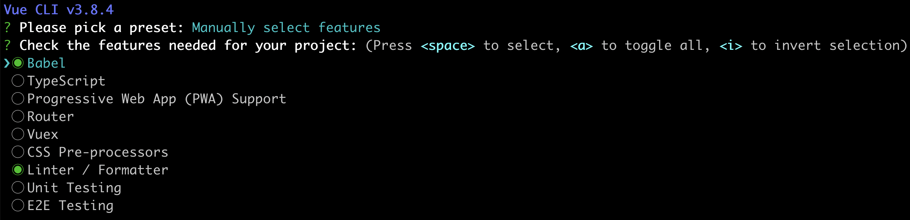
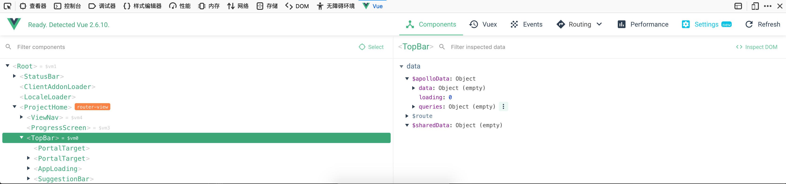
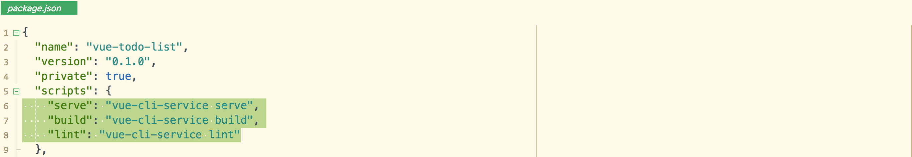

----

* [简单介绍](#简单介绍)
* [环境依赖](#环境依赖)
* [相关组件](#相关组件)
  * [@vue/cli](#@vue/cli)
  * [@vue/cli-service](#@vue/cli-service)
  * [@vue/cli-service-global](#@vue/cli-service-global)
  * [@vue/cli-plugin-\<name\>](#@vue/cli-plugin-\<name\>)
  * [@vue-cli-plugin-\<name\>](#@vue-cli-plugin-\<name\>)
* [创建项目](#创建项目)
  * [命令方式](#命令方式)
  * [图形方式](#图形方式)
* [原型开发](#原型开发)
  * [vue serve](#vue serve)
  * [vue build](#vue build)
* [插件管理](#插件管理)
  * [内置插件](#内置插件)
  * [社区插件](#社区插件)
* [服务管理](#服务管理)

----

# 简单介绍

> 为保证基于Vue.js应用环境搭建及开发顺利进行而提供的工作平台,通称为Vue脚手架

* 支持[Babel](https://www.babeljs.cn/),[TypeScript](https://www.tslang.cn/),[ESLint](https://cn.eslint.org/),[PostCSS](https://www.postcss.com.cn/),[PWA](https://developers.google.com/web/progressive-web-apps/),单元测试,端到端测试
* 支持插件系统
* 支持命令行和图形化配置管理项目
* 支持一键构建出原生ES2015代码或组件

# 环境依赖

| 软件 | 版本   | 查看方法       | 安装方式                |
| ---- | ------ | -------------- | ----------------------- |
| node | \>=8.9 | node --version | brew install node       |
| vue  | \>=3   | vue --version  | npm install -g @vue/cli |


# 相关组件

## @vue/cli

> 全局安装, 提供终端命令行工具,需要手动安装

## @vue/cli-service

> 局部安装, 提供开发环境依赖支持,创建项目时会自动被安装

## @vue/cli-service-global

> 全局安装, 提供快速原型开发支持,需要手动安装

## @vue/cli-plugin-\<name\>

> 局部安装, 提供内建插件支持,需要选择安装

## @vue-cli-plugin-\<name\>

> 局部安装, 提供社区插件支持,需要手动安装

# 创建项目

## 命令方式

```bash
# 创建Vue项目,支持默认或手动选择内置插件支持
vue create vue-todo-list

用法：create [options] <app-name>

创建一个由 `vue-cli-service` 提供支持的新项目

选项：

  -p, --preset <presetName>       忽略提示符并使用已保存的或远程的预设选项
  -d, --default                   忽略提示符并使用默认预设选项
  -i, --inlinePreset <json>       忽略提示符并使用内联的 JSON 字符串预设选项
  -m, --packageManager <command>  在安装依赖时使用指定的 npm 客户端
  -r, --registry <url>            在安装依赖时使用指定的 npm registry
  -g, --git [message]             强制 / 跳过 git 初始化，并可选的指定初始化提交信息
  -n, --no-git                    跳过 git 初始化
  -f, --force                     覆写目标目录可能存在的配置
  -c, --clone                     使用 git clone 获取远程预设选项
  -x, --proxy                     使用指定的代理创建项目
  -b, --bare                      创建项目时省略默认组件中的新手指导信息
  -h, --help                      输出使用帮助信息
```




## 图形方式

```bash
# 使用图形化创建和管理Vue项目,推荐顺便安装devtools调试工具
vue ui
```




# 原型开发

```bash
# 全局安装VUE-CLI
npm install -g @vue/cli
# 全局安装快速原型的开发扩展,可使用vue serve和vue build来对单个.vue文件进行快速原型开发
npm install -g @vue/cli-service-global
```

## vue serve

> 默认从当前目录自动推导入口文件,入口文件可以是main.js,index.js,App.vue,app.vue,当然也可以显式指定入口文件

```bash
Usage: serve [options] [entry]

在开发环境模式下零配置为 .js 或 .vue 文件启动一个服务器

Options:
  -o, --open  打开浏览器
  -c, --copy  将本地 URL 复制到剪切板
  -h, --help  输出用法信息
```


## vue build

> 按照vue create时项目的默认配置将目标文件构建成生产环境的包来部署

```bash
Usage: build [options] [entry]

在生产环境模式下零配置构建一个 .js 或 .vue 文件


Options:
  -t, --target <target>  构建目标 (app | lib | wc | wc-async, 默认值：app)
  -n, --name <name>      库的名字或 Web Components 组件的名字 (默认值：入口文件名)
  -d, --dest <dir>       输出目录 (默认值：dist)
  -h, --help             输出用法信息
```

# 插件管理

## 内置插件

```bash
# 普通插件,等同于vue add @vue/typescript
vue add @vue/cli-plugin-typescript
# 特殊插件
vue add router
vue add vuex
# 卸载插件,--save-dev表示同步删除package.json里面的devDependencies中的包的信息,其它插件生成的文件或目录以及依赖信息需要手动删除
npm uninstall @vue/cli-plugin-typescript --save-dev
```

## 社区插件

```bash
# 普通插件,等同于vue add apollo
vue add vue-cli-plugin-apollo
# 卸载插件,--save-dev表示同步删除package.json里面的devDependencies中的包的信息,其它插件生成的文件或目录以及依赖信息需要手动删除
npm uninstall vue-cli-plugin-apollo --save-dev
```

# 服务管理

> 项目创建后自动安装@vue-cli-service并自动在package.json的scripts段声明,用以扩展npm run命令



* npm run serve, 启动开发环境
* npm run build, 构建为原生前端代码
* npm run lint, 检查代码是否错误

